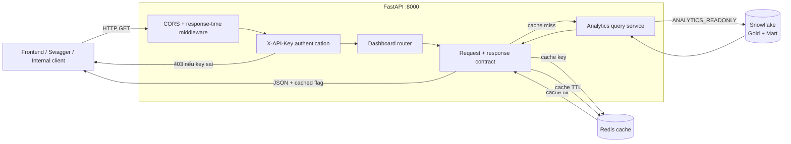
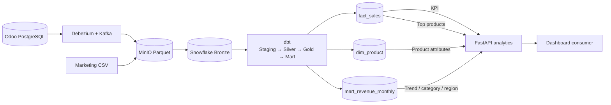
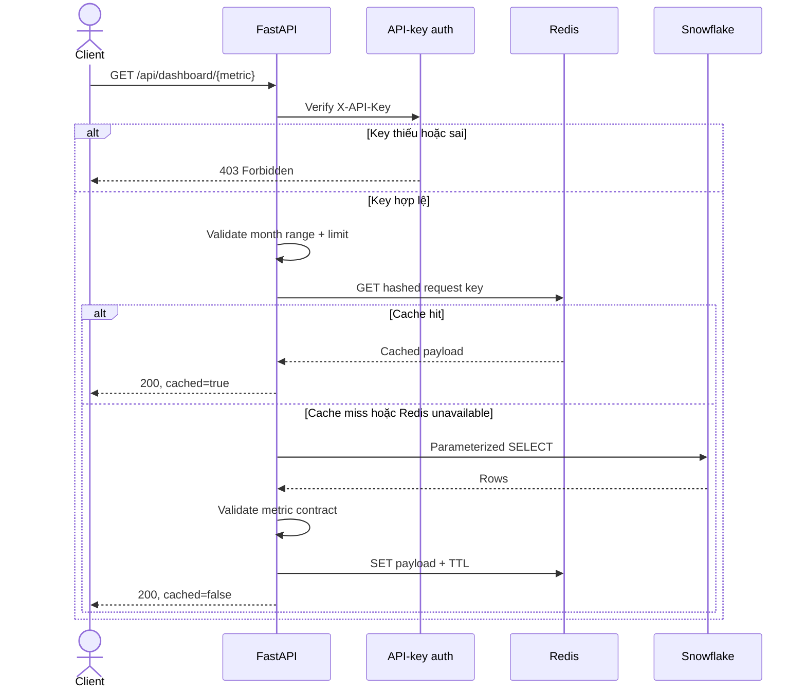
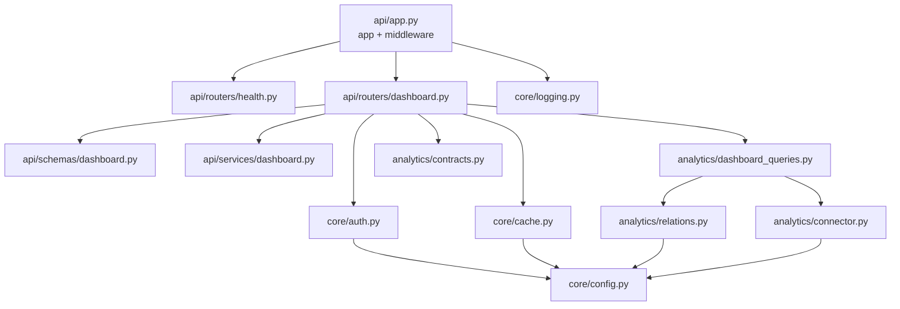
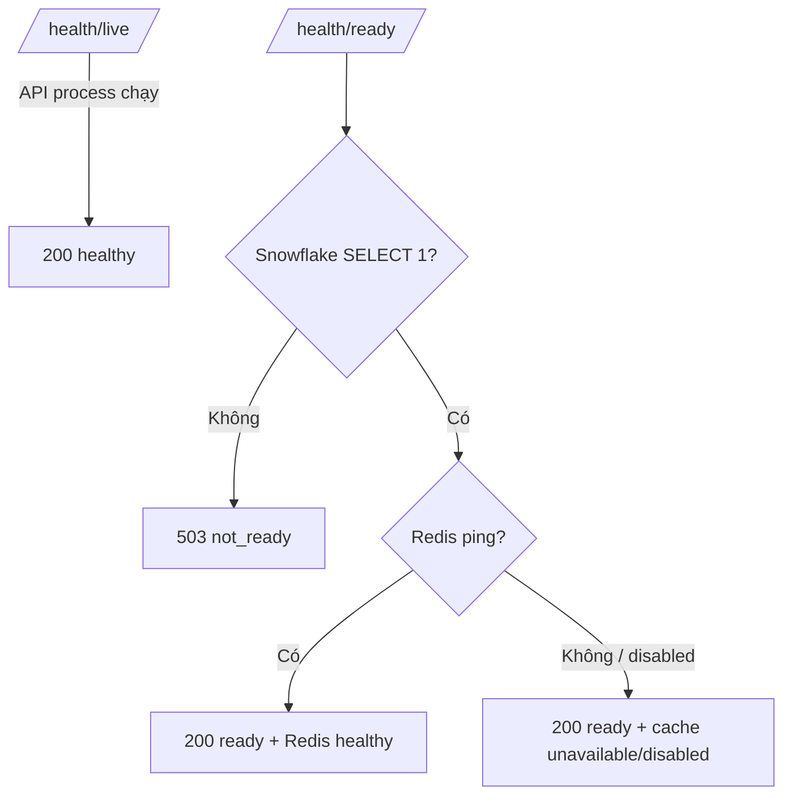

# API System Architecture & Lineage

API cung cấp dữ liệu phân tích read-only từ Snowflake cho frontend và internal client.
Mọi dashboard endpoint yêu cầu `X-API-Key`; Redis chỉ tăng tốc và không phải nguồn dữ liệu.

## 1. Kiến trúc tổng thể

## 2. Data lineage

| API metric | Snowflake source |
|---|---|
| `kpi` | `ANALYTIC_LAYER_GOLD_LAYER.fact_sales` |
| `revenue-trend` | `ANALYTIC_LAYER_MART_LAYER.mart_revenue_monthly` |
| `by-category` | `ANALYTIC_LAYER_MART_LAYER.mart_revenue_monthly` |
| `by-region` | `ANALYTIC_LAYER_MART_LAYER.mart_revenue_monthly` |
| `top-products` | `ANALYTIC_LAYER_GOLD_LAYER.fact_sales` + `dim_product` |

## 3. Luồng xử lý một request

Redis hoạt động theo cơ chế fail-open: nếu Redis lỗi, API vẫn truy vấn Snowflake. Snowflake
là dependency bắt buộc; lỗi kết nối hoặc contract trả `502` cho metric.

## 4. Cấu trúc module

## 5. Health và quyền truy cập

- Snowflake user: `SUPERSTORE_API_USER`.
- Snowflake role: `ANALYTICS_READONLY`.
- Role chỉ có `USAGE` và `SELECT` trên Gold/Mart; không có quyền ghi.
- API key được so sánh an toàn và không truyền qua query string.
- SQL sử dụng parameter binding; tên database/schema/table được kiểm tra trước khi ghép.
- Kết quả bị giới hạn bởi `SNOWFLAKE_MAX_ROWS` và query timeout.

Hướng dẫn cài đặt, smoke test và quality gate: [operation.md](operation.md).
