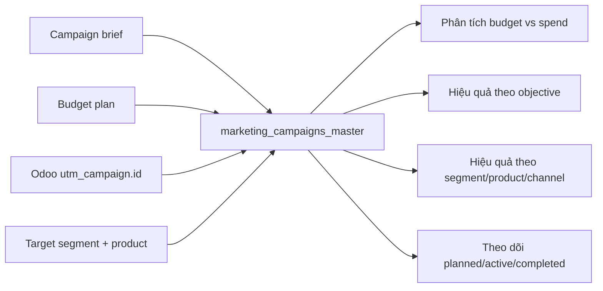
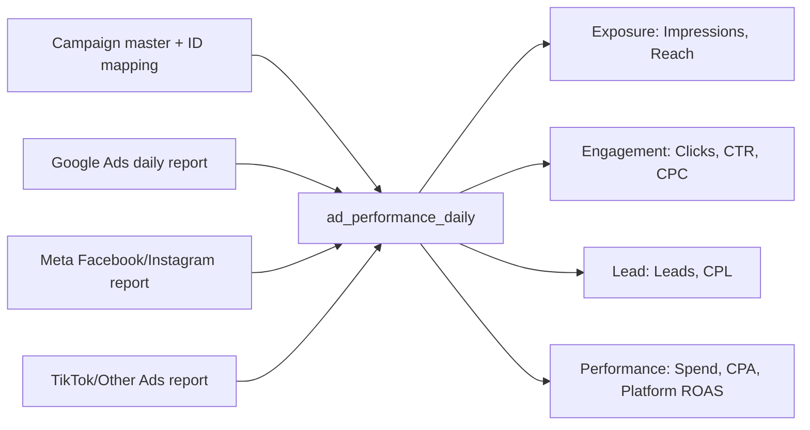
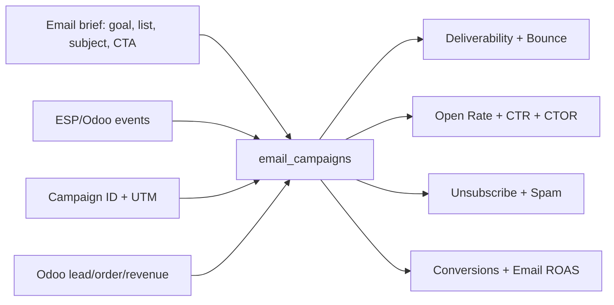
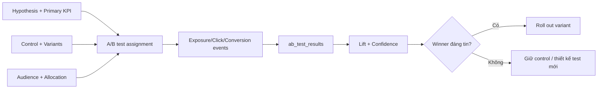
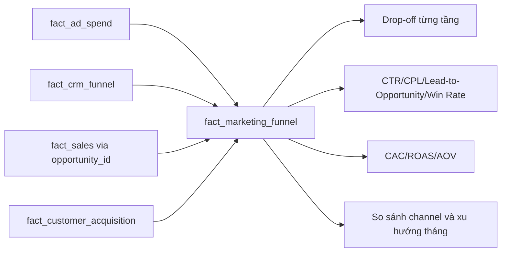
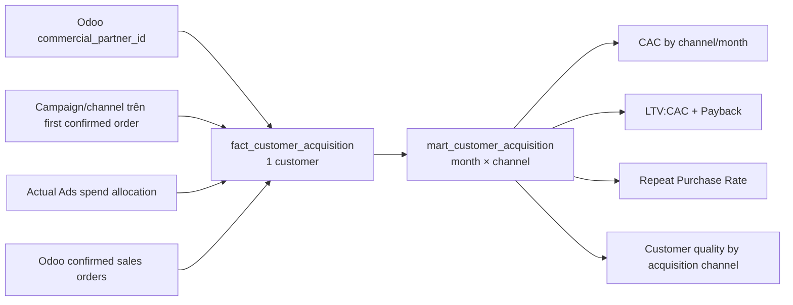
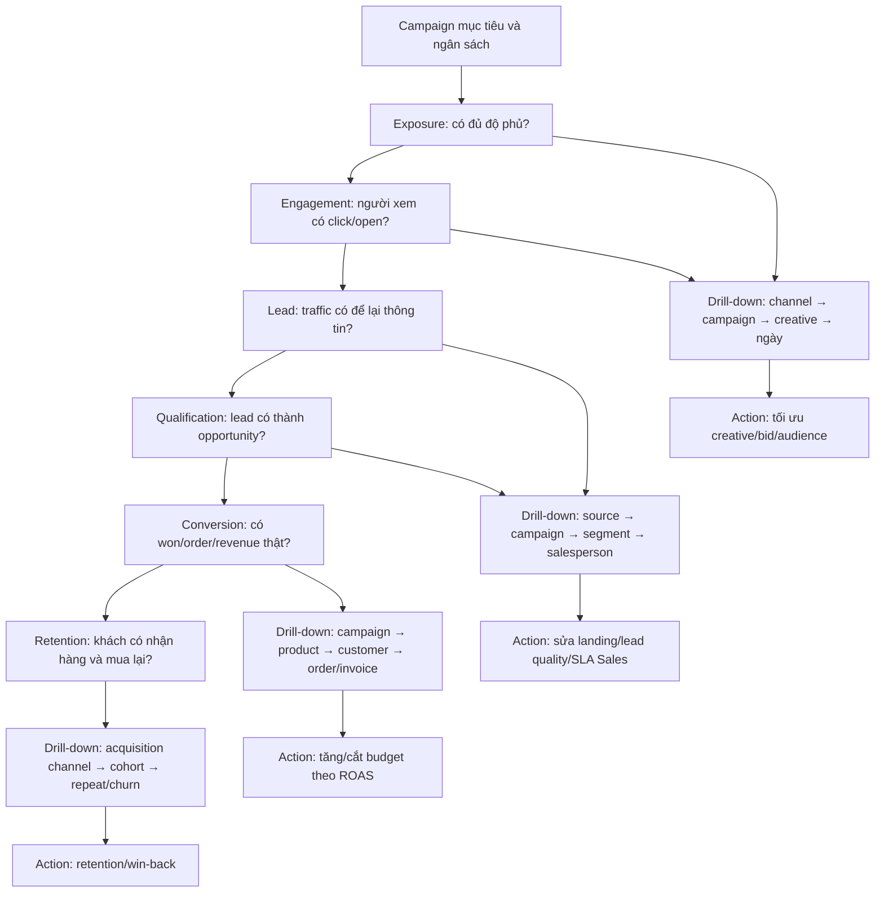

# Hướng dẫn thu thập và phân tích dữ liệu CRM/Marketing

> Phạm vi: các bảng trong `odoo_dev/CRM_Marketing_source`<br>
> Framework phân tích: Phễu Chuyển Đổi End-to-End trong `docs/analysis/marketing.md`<br>
> Đối tượng sử dụng: Marketing Manager, Digital Marketing, CRM, Sales, Data Analyst và các bên phụ trách dữ liệu.

---

## 1. Mục đích của tài liệu

Tài liệu này hướng dẫn **cần thu thập dữ liệu marketing nào, ai chịu trách nhiệm, thu thập vào thời điểm nào và dùng dữ liệu đó để phân tích điều gì**. Trọng tâm là phục vụ quyết định marketing, không phải mô tả hạ tầng kỹ thuật.

Flow:

```
Campaign ──► Người dùng thấy quảng cáo ──► Click ──► Thành Lead ──► Thành cơ hội bán hàng ──► Mua hàng ──► Tạo doanh thu
──► Quay lại mua tiếp ──► Phân tích từ tổng quan xuống chi tiết (tăng / giữ / tối ưu / cắt ngân sách)
```

Bộ dữ liệu nguồn hiện có gồm bốn bảng CSV:

1. `marketing_campaigns_master.csv`
2. `ad_performance_daily.csv`
3. `email_campaigns.csv`
4. `ab_test_results.csv`

- Bốn bảng trên chứa dữ liệu cần thu thập từ hoạt động marketing.
- `fact_marketing_funnel` là output dbt, được tính từ Ads, Odoo CRM, linked Sales và Customer Acquisition; không phải file đầu vào.
- Luồng `fact_customer_acquisition` → `mart_customer_acquisition` được tính trực tiếp từ Odoo Sales, customer dimension và Ads spend, không cần CSV acquisition riêng.
- Hai workbook Excel trong thư mục là worksheet hỗ trợ xác định câu hỏi, KPI và dashboard; chúng không phải bảng dữ liệu đầu vào.

---

## 2. Framework phân tích theo phễu chuyển đổi

```text
1. Exposure
   Impressions, Reach
        │
        ▼
2. Engagement
   Clicks, Sessions, CTR, CPC
        │
        ▼
3. Lead Generation
   Leads, CPL
        │
        ▼
4. Qualification
   Qualified Leads, Opportunities,
   Lead-to-Opportunity Rate
        │
        ▼
5. Conversion / Won
   Won Deals, Win Rate, Revenue,
   CPA/CAC, ROAS, AOV
        │
        ▼
6. Fulfillment & Retention
   Delivery Success, Repeat Purchase,
   CLV, Churn, LTV:CAC, Payback Period
```

### 2.1 Bảng nào phục vụ giai đoạn nào?

| Bảng                          | 1. Exposure | 2. Engagement |                   3. Lead | 4. Opportunity |              5. Won/Revenue |     6. Retention |
| ----------------------------- | ----------: | ------------: | ------------------------: | -------------: | --------------------------: | ---------------: |
| `marketing_campaigns_master`  |    Bối cảnh |      Bối cảnh |                  Bối cảnh |       Bối cảnh |               Budget/Target |         Bối cảnh |
| `ad_performance_daily`        |       Chính |         Chính | Lead do platform ghi nhận |              — | Platform conversion/revenue |                — |
| `email_campaigns`             |   Delivered |    Open/Click |          Email conversion |              — |               Email revenue |      Unsubscribe |
| `ab_test_results`             |      Có thể |        Có thể |                    Có thể |         Có thể |                      Có thể |           Có thể |
| `fact_marketing_funnel`       |       Chính |         Chính |                     Chính |          Chính |                       Chính |                — |
| Odoo `crm_lead`               |           — |             — |                     Chính |          Chính |                    Won/Lost |                — |
| Odoo Sales/Accounting         |           — |             — |                         — |      Quotation |                       Chính |   AOV/CLV/Repeat |
| Odoo Inventory                |           — |             — |                         — |              — |                           — | Delivery Success |

### 2.2 Mức độ đầy đủ của bộ CSV hiện tại

Quy ước trạng thái:

- **Fixed**: đã có logic trong pipeline và test bảo vệ.
- **Partial**: đã sửa phần có đủ dữ liệu; vẫn còn đầu việc Open.
- **Open**: chưa thể hoàn tất nếu chưa có nguồn dữ liệu, identity mapping hoặc quyết định nghiệp vụ.

| Giai đoạn     | Trạng thái  | Phần đã xử lý trong project                                                                                                                                                                                                                                                                                | Open — cần bổ sung                                                                                                                                                                                   |
| ------------- | ----------- | ---------------------------------------------------------------------------------------------------------------------------------------------------------------------------------------------------------------------------------------------------------------------------------------------------------- | ---------------------------------------------------------------------------------------------------------------------------------------------------------------------------------------------------- |
| Exposure      | **Partial** | `reach` ngày được giữ để phân tích daily; `fact_marketing_funnel` không coi tổng daily reach là monthly unique reach và chủ động để `reach = NULL`.                                                                                                                                                | Kết nối Ads API và lấy unique reach trực tiếp theo grain tháng × campaign/channel; `source_daily_reach_sum` chỉ dùng để audit.                                                                    |
| Engagement    | **Partial** | Clicks, CTR, CPC và email engagement đã có. Email đã có `campaign_id`/`sent`; A/B test đã có `campaign_id`/`variant_id`, các ID được test quan hệ với Odoo UTM. Mart chủ đích để `sessions = NULL`.                                                                                                        | Kết nối GA4/Web tracking cho `sessions`, landing page, form submission và web events cùng UTM. Production cần sample size theo visitor và statistical significance cho A/B test.                     |
| Lead          | **Partial** | CDC `crm_lead` đã được dedup về current state; mart đối chiếu platform-reported leads với CRM leads theo tháng/campaign.                                                                                                                                                                                   | Chốt quy tắc nhận diện và loại spam/test/internal lead; bổ sung bridge nếu platform campaign ID không trùng Odoo `utm_campaign.id`.                                                                  |
| Qualification | **Partial** | Đã có `fact_crm_funnel` với lead, qualified, opportunity, won/lost và thời gian chuyển đổi. Generator mới ghi `date_conversion`, `date_closed` và `sale_order.opportunity_id`; lệnh `python odoo_dev/source/superstore_data_generator.py --repair-crm` chỉ repair dữ liệu demo cũ, không sinh thêm record. | Chạy lệnh repair khi đã backup DB và sẵn sàng backfill snapshot Odoo hiện tại. Muốn tính time-in-stage đầy đủ phải xây stage history từ chuỗi CDC, không chỉ current state.                          |
| Won/Revenue   | **Fixed**   | `fact_customer_invoice` chỉ lấy invoice/credit note khách hàng đã posted, credit note mang dấu âm; mart dùng doanh thu thật theo `account_move.campaign_id`, không dùng revenue mô phỏng làm actual ROAS.                                                                                                  | Nếu production có nhiều tiền tệ, bổ sung quy đổi về reporting currency trước khi tính ROAS.                                                                                                          |
| Retention     | **Partial** | `mart_customer_retention`, `fact_customer_acquisition` và `mart_customer_acquisition` tính repeat, lifetime sales value, payback và CAC phân bổ từ Odoo/Ads, gom contact con theo `commercial_partner_id`.                                                                                                  | Nếu cần ghép lịch sử identity website, phải tạo bridge đã xác minh với `partner_id`. Chốt ngưỡng churn theo chu kỳ mua của doanh nghiệp.                                                             |

### 2.3 Kiểm tra liên kết với Odoo

Trước khi nạp CSV, người quản lý campaign cần xác nhận `campaign_id` đã tồn tại trong Odoo UTM. Pipeline không còn bước đối soát riêng trước khi nạp; dbt kiểm tra `campaign_sk` và quan hệ với `dim_campaign` sau khi biến đổi. Nếu test thất bại, sửa khóa nguồn rồi chạy lại pipeline, không tự động tạo campaign hoặc ép volume platform–Odoo bằng nhau.

### 2.4 Ghép nguồn marketing với Odoo trong kho dữ liệu

```text
Google/Meta/TikTok/ESP/A-B source
                │
                ▼
         Bốn bảng raw marketing
                │
        validate campaign_id
                │
                ▼
      CSV loader → MinIO → Snowflake
                │
                ├── campaign_id ──► utm_campaign.id
                │
                ▼
       dbt kết hợp CRM/Sales/Accounting actuals

Odoo core ──► Debezium/Kafka ──► MinIO/Snowflake
```

Dữ liệu quảng cáo, email và A/B test không cần nằm trong Odoo. Odoo chỉ giữ
thực thể nghiệp vụ lõi; việc ghép hai nguồn được thực hiện trong dbt bằng
`campaign_id = utm_campaign.id`. Vì vậy không có luồng ghi metric marketing
ngược vào Odoo và không có bản sao thứ hai cần đồng bộ.

Quy tắc sở hữu dữ liệu:

| Nhóm dữ liệu                          | Source of truth                        | Cách dùng                                             |
| ------------------------------------- | -------------------------------------- | ----------------------------------------------------- |
| Spend, impression, click, email, A/B  | Marketing platform                     | Nạp thẳng Bronze/Silver; giữ tiền tố `platform_`      |
| Campaign chuẩn để join                | Odoo `utm_campaign.id`                 | Mọi source phải map về khóa này                       |
| Lead/opportunity                      | Odoo `crm_lead`                        | Không tạo lead giả từ số tổng hợp platform            |
| Customer/order/invoice/revenue actual | Odoo business models                   | Dùng cho won, actual revenue, ROAS và retention       |
| Website identity                      | Identity provider + bridge đã xác minh | Chỉ join `res.partner` khi có mapping được kiểm chứng |

---

## 3. Vai trò chung trong quy trình

| Vai trò                          | Trách nhiệm                                                                                    |
| -------------------------------- | ---------------------------------------------------------------------------------------------- |
| Marketing Manager                | Duyệt mục tiêu, ngân sách, thời gian, phân khúc; sử dụng kết quả để phân bổ ngân sách          |
| Digital Marketing Specialist     | Tạo và vận hành campaign trên Google/Meta/TikTok; bảo đảm UTM đúng; kiểm tra số liệu quảng cáo |
| CRM/Lifecycle Marketing          | Tạo và vận hành email campaign; quản lý danh sách, bounce, unsubscribe và engagement           |
| Sales/CRM Team                   | Xử lý lead, cập nhật qualification, opportunity, won/lost và nguyên nhân lost trong Odoo       |
| Finance/Accounting               | Xác nhận doanh thu thực tế, refund, credit note và kỳ ghi nhận doanh thu                       |
| Warehouse/Operations             | Cập nhật giao hàng hoàn tất, hủy hoặc thất bại                                                 |
| Data Engineer/Analytics Engineer | Tự động lấy dữ liệu, ghép khóa, tạo bảng tổng hợp và chạy kiểm tra dữ liệu                     |
| Data Analyst                     | Xác nhận logic KPI, đối soát dữ liệu, phân tích nguyên nhân và đưa ra khuyến nghị              |

### 3.1 Phân biệt người tạo, người lấy, người chạy và người dùng

- **Người tạo dữ liệu**: người hoặc hệ thống làm phát sinh dữ liệu, ví dụ Digital Marketing chạy quảng cáo hoặc Sales cập nhật CRM.
- **Người lấy dữ liệu**: người chịu trách nhiệm bảo đảm dữ liệu từ nguồn được đưa vào bộ phân tích.
- **Người chạy xử lý**: người/hệ thống ghép các nguồn và tạo KPI, thường là Data Engineer hoặc lịch chạy tự động.
- **Người sử dụng**: người đọc dashboard và ra quyết định, chủ yếu là Marketing Manager, Sales Manager, CRM Team và Data Analyst.

---

## 4. Vòng đời thu thập dữ liệu của một campaign

| Thời điểm                            | Việc cần làm                                                              | Ai tạo dữ liệu?            | Ai lấy/chạy?                             | Bảng được cập nhật              |
| ------------------------------------ | ------------------------------------------------------------------------- | -------------------------- | ---------------------------------------- | ------------------------------- |
| Trước chạy 7–14 ngày                 | Duyệt brief, mục tiêu, audience, budget, thời gian và sản phẩm            | Marketing Manager          | Marketing Operations                     | `marketing_campaigns_master`    |
| Trước chạy 1–3 ngày                  | Tạo UTM campaign trong Odoo; tạo campaign trên platform; kiểm tra mapping | Digital Marketing          | Marketing Operations/Data                | Campaign master và mapping ID   |
| Ngày bắt đầu                         | Kiểm tra trạng thái, UTM, landing page, tracking event                    | Digital Marketing/Web Team | Data Analyst kiểm tra                    | Campaign master, tracking log   |
| Mỗi ngày D+1                         | Lấy spend, impressions, reach, clicks, leads, conversions                 | Ad platform                | Lịch tự động; Digital Marketing đối soát | `ad_performance_daily`          |
| Sau mỗi lần gửi email                | Lấy delivered, bounce, open, click, unsubscribe, conversion               | ESP/Odoo Email Marketing   | CRM Marketing/Data                       | `email_campaigns`               |
| Trong thời gian chạy test            | Lấy exposure và kết quả từng variant                                      | Công cụ A/B test           | Digital Marketing/Data Analyst           | `ab_test_results`               |
| Liên tục                             | Sales cập nhật lead → opportunity → won/lost                              | Sales/CRM Team             | Odoo + Data team                         | `crm_lead` và bảng funnel       |
| Hằng tuần                            | Review pace ngân sách, CTR, CPL, lead quality, conversion                 | Các hệ thống nguồn         | Data Analyst                             | Dashboard campaign              |
| Kết thúc campaign D+1–D+7            | Đóng delivery metrics và đánh giá sơ bộ                                   | Marketing/Data             | Data Analyst                             | Ba bảng campaign/ads/email/test |
| Sau D+30 hoặc hết attribution window | Chốt conversion, actual revenue, ROAS và CAC                              | Odoo + Finance             | Data Analyst/Finance                     | Funnel và customer acquisition  |
| Hằng tháng/quý                       | Đánh giá repeat purchase, CLV và churn                                    | Odoo Sales/Accounting      | Data Analyst/CRM                         | Customer acquisition/retention  |

> Không chốt ROAS ngay ngày campaign kết thúc nếu conversion còn cập nhật trong attribution window.

---

## 5. Hướng dẫn cho từng bảng

### 5.1 `marketing_campaigns_master.csv`

#### Mục đích và role của bảng

Đây là **bảng danh mục campaign trung tâm**. Mỗi dòng đại diện cho một campaign đã được phê duyệt. Bảng không chỉ dùng để lưu tên campaign mà còn cung cấp bối cảnh để phân tích: campaign chạy vì mục tiêu gì, cho nhóm khách hàng nào, sản phẩm nào, trong thời gian nào và với ngân sách bao nhiêu.

| Thuộc tính          | Quy định                                                                 |
| ------------------- | ------------------------------------------------------------------------ |
| Grain               | Một dòng = một campaign                                                  |
| Khóa chính          | `campaign_id`, liên kết với `utm_campaign.id` trong Odoo                 |
| Người tạo dữ liệu   | Marketing Manager/Marketing Operations                                   |
| Người thu thập      | Marketing Operations                                                     |
| Người chạy cập nhật | Marketing Operations khi campaign thay đổi; Data team đồng bộ định kỳ    |
| Người sử dụng       | Marketing Manager, Digital Marketing, Data Analyst, Finance              |
| Thời điểm cập nhật  | Khi duyệt campaign, khi thay đổi budget/status/date và khi đóng campaign |

#### Input để tạo bảng

- Campaign brief đã được duyệt.
- Mục tiêu marketing và KPI mục tiêu.
- Kế hoạch ngân sách.
- Danh sách sản phẩm/nhóm sản phẩm cần quảng bá.
- Phân khúc khách hàng mục tiêu.
- Thời gian chạy.
- `utm_campaign.id` được tạo trong Odoo.
- ID campaign trên Google/Meta/TikTok nếu campaign chạy paid media.

#### Các trường cần thu thập

| Trường                   | Thu thập hay tính?   | Ai cung cấp?              | Ý nghĩa phân tích                                       |
| ------------------------ | -------------------- | ------------------------- | ------------------------------------------------------- |
| `campaign_id`            | Thu thập             | Odoo UTM                  | Khóa join sang ads, lead, sale order và doanh thu       |
| `campaign_name`          | Thu thập             | Marketing Operations      | Tên hiển thị cho dashboard                              |
| `objective`              | Thu thập             | Marketing Manager         | Awareness, lead, conversion hoặc retention              |
| `target_segment`         | Thu thập             | Marketing Manager         | Phân tích hiệu quả theo Consumer/Corporate/Home Office  |
| `product_focus`          | Thu thập             | Product/Marketing         | Sản phẩm hoặc category được quảng bá                    |
| `channels`               | Thu thập             | Digital Marketing         | Kênh được dùng trong campaign                           |
| `start_date`, `end_date` | Thu thập             | Marketing Manager         | Cửa sổ phân tích campaign                               |
| `total_budget_usd`       | Thu thập             | Marketing Manager/Finance | So sánh budget với actual spend                         |
| `status`                 | Thu thập/cập nhật    | Marketing Operations      | `planned`, `active`, `paused`, `completed`, `cancelled` |
| `notes`                  | Thu thập             | Campaign owner            | Ghi chú thay đổi, sự kiện hoặc nguyên nhân bất thường   |
| `year`                   | Tính từ `start_date` | Data                      | Filter theo năm                                         |
| `duration_days`          | Tính                 | Data                      | So sánh hiệu quả campaign có độ dài khác nhau           |
| `budget_multiplier`      | Tính hoặc kế hoạch   | Marketing                 | Phân tích mùa vụ và mức tăng ngân sách                  |
| `is_underperformer`      | Tính                 | Data Analyst              | Cờ dựa trên ROAS/CAC/CTR, không nhập thủ công           |
| `campaign_owner`         | Nên bổ sung          | Marketing Manager         | Xác định người chịu trách nhiệm                         |
| `currency_code`          | Nên bổ sung          | Finance/Platform          | Tránh ngầm định mọi tài khoản đều dùng USD              |

#### Cách thu thập khi chạy một campaign

1. Marketing Manager hoàn tất campaign brief và phê duyệt ngân sách.
2. Marketing Operations tạo một campaign trong Odoo UTM và lấy `campaign_id`.
3. Digital Marketing dùng cùng campaign code/UTM khi tạo quảng cáo trên từng platform.
4. Trước ngày chạy, Data Analyst kiểm tra campaign có đủ objective, segment, product, budget, date và owner.
5. Khi thay đổi budget, pause hoặc kéo dài campaign, Marketing Operations cập nhật ngay; không đợi cuối tháng.
6. Khi kết thúc, campaign chỉ chuyển `completed` sau `end_date`; campaign chưa bắt đầu phải là `planned`.

#### Sơ đồ input → bảng → output phân tích



#### Output và KPI có thể phân tích

- Budget plan theo campaign, channel, objective và tháng.
- Actual spend so với budget, burn rate và forecast overspend.
- ROAS/CAC theo objective, segment, product focus và owner.
- Campaign nào đang active nhưng thiếu dữ liệu hằng ngày.
- Campaign nào underperform để giảm ngân sách hoặc tối ưu nội dung.

#### Kiểm tra trước khi sử dụng

- `campaign_id` không được trùng hoặc rỗng.
- Không join campaign bằng `campaign_name`.
- `start_date <= end_date`.
- Campaign paid phải có budget và platform mapping.
- Campaign chưa đến ngày chạy không được mang status `active`.

---

### 5.2 `ad_performance_daily.csv`

#### Mục đích và role của bảng

Đây là **bảng hiệu suất quảng cáo theo ngày**, phục vụ hai tầng đầu của phễu và theo dõi chi phí. Nó giúp trả lời campaign đang được phân phối đến bao nhiêu người, có tạo tương tác không, tiêu tiền đúng pace không và tạo lead/conversion với chi phí bao nhiêu.

| Thuộc tính        | Quy định                                                    |
| ----------------- | ----------------------------------------------------------- |
| Grain hiện tại    | Một dòng = ngày × campaign × channel                        |
| Khóa ứng viên     | `(date, campaign_id, channel)`                              |
| Người tạo dữ liệu | Google Ads, Meta Ads, TikTok Ads hoặc nền tảng quảng cáo    |
| Người thu thập    | Data Engineer tự động; Digital Marketing xuất file dự phòng |
| Người chạy        | Lịch hằng ngày D+1                                          |
| Người xác nhận    | Digital Marketing đối soát với màn hình platform            |
| Người sử dụng     | Marketing Manager, Digital Marketing, Data Analyst          |

#### Input để tạo bảng

- Campaign đang chạy trong `marketing_campaigns_master`.
- Platform campaign ID và mapping sang `campaign_id` của Odoo.
- Báo cáo theo ngày từ từng tài khoản quảng cáo.
- Attribution setting của platform.
- Currency và timezone của tài khoản.

#### Các trường cần thu thập

| Nhóm             | Trường                                                                              | Nguồn                          | Dùng để phân tích                        |
| ---------------- | ----------------------------------------------------------------------------------- | ------------------------------ | ---------------------------------------- |
| Ngày và khóa     | `date`, `campaign_id`, `campaign_name`                                              | Master + platform              | Trend và join campaign                   |
| Phân kênh        | `channel`, `channel_label`, `channel_type`                                          | Mapping channel                | So sánh paid/owned và từng platform      |
| Chi phí          | `spend_usd`                                                                         | Platform                       | CPC, CPL, CPA, ROAS, budget pace         |
| Exposure         | `impressions`, `reach`                                                              | Platform                       | Độ phủ và tần suất hiển thị              |
| Engagement       | `clicks`                                                                            | Platform                       | CTR và lưu lượng từ quảng cáo            |
| Lead/Conversion  | `leads`, `conversions`                                                              | Platform, sau đó đối soát Odoo | CPL, CPA và chất lượng chuyển đổi        |
| Platform revenue | `revenue_usd`                                                                       | Platform                       | Chỉ dùng làm platform-attributed revenue |
| Chất lượng       | `lead_quality_score`                                                                | CRM/Data                       | So sánh volume lead với chất lượng lead  |
| Thời gian        | `year`, `month`, `quarter`                                                          | Tính từ `date`                 | Filter và aggregate                      |
| Tỷ lệ            | `ctr`, `cpc_usd`, `cpm_usd`, `frequency`, `conv_rate`, `cpa_usd`, `cpl_usd`, `roas` | Tính lại                       | KPI, không coi là số gốc                 |
| Cờ               | `is_underperformer`                                                                 | Tính theo KPI threshold        | Cảnh báo campaign/channel                |

Nên bổ sung các ID gốc: `source_system`, `ad_account_id`, `platform_campaign_id`, `adset_id`, `ad_id` và `currency_code`. Các trường này cho phép drill-down khi campaign tổng thể kém nhưng chỉ một ad set hoặc creative gây vấn đề.

#### Cách thu thập trong quá trình campaign chạy

1. Ngày D0 kiểm tra impression/click đầu tiên và UTM có đi tới đúng landing page.
2. Mỗi sáng lấy toàn bộ số liệu của ngày D-1 theo campaign và channel.
3. Trong 7–30 ngày sau đó, lấy lại các ngày gần nhất vì conversion/revenue có thể cập nhật muộn.
4. Digital Marketing đối chiếu tổng spend theo ngày với platform.
5. Data Analyst kiểm tra campaign chưa map, dữ liệu ngày tương lai, spend âm, clicks lớn hơn impressions hoặc conversion bất thường.
6. Không khóa kết quả campaign ngay ngày cuối; chờ hết attribution window.

#### Sơ đồ input → bảng → output phân tích



#### Output và KPI có thể phân tích

| Giai đoạn  | KPI                           | Câu hỏi phân tích                                             |
| ---------- | ----------------------------- | ------------------------------------------------------------- |
| Exposure   | Impressions, Reach, Frequency | Campaign có phân phối đủ rộng hay đang bão hòa cùng audience? |
| Engagement | Clicks, CTR, CPC              | Creative/channel nào thu hút người xem tốt nhất?              |
| Lead       | Leads, CPL                    | Kênh nào tạo lead với chi phí hợp lý?                         |
| Conversion | Conversions, CPA              | Click có tạo hành động kinh doanh hay chỉ tạo traffic?        |
| Finance    | Spend, Platform ROAS          | Nền tảng đang tự ghi nhận hiệu quả như thế nào?               |

Phân tích nên đi từ tổng đến chi tiết: tổng paid → channel → campaign → ad set → ad/creative → ngày.

#### Kiểm tra trước khi sử dụng

- Khóa ngày × campaign × channel không trùng.
- Mọi `campaign_id` tồn tại trong campaign master.
- `spend`, `impressions`, `clicks`, `leads`, `conversions` không âm.
- CTR, CPC, CPM, CVR, CPL, CPA và ROAS được tính lại từ số gốc.
- Không cộng daily reach để tạo monthly unique reach.
- Tách platform revenue khỏi actual revenue của Odoo.

---

### 5.3 `email_campaigns.csv`

#### Mục đích và role của bảng

Đây là **bảng hiệu suất từng lần gửi email**, dùng để đánh giá khả năng gửi tới hộp thư, mức độ người nhận quan tâm, hành động sau khi đọc và dấu hiệu mệt mỏi/churn của danh sách.

| Thuộc tính        | Quy định                                                                 |
| ----------------- | ------------------------------------------------------------------------ |
| Grain             | Một dòng = một lần gửi email campaign                                    |
| Khóa              | `email_id`                                                               |
| Người tạo dữ liệu | Odoo Email Marketing hoặc ESP như SendGrid/Mailchimp/Brevo               |
| Người thu thập    | CRM/Lifecycle Marketing và Data Engineer                                 |
| Người chạy        | Sau mỗi lần gửi; cập nhật lại sau 24h, 72h và khi hết attribution window |
| Người sử dụng     | CRM Marketing, Marketing Manager, Content Team, Data Analyst             |

#### Input để tạo bảng

- Email campaign brief: goal, audience, content và CTA.
- Danh sách người nhận đã được phép liên hệ.
- Subject line, template, thời điểm gửi.
- Event do ESP ghi nhận: delivered, bounce, open, click, unsubscribe, spam và conversion.
- Campaign/UTM dùng trong đường link email.

#### Các trường cần thu thập

| Nhóm         | Trường                                                                                        | Thu thập/tính          | Ý nghĩa                                        |
| ------------ | --------------------------------------------------------------------------------------------- | ---------------------- | ---------------------------------------------- |
| Khóa         | `email_id`                                                                                    | Thu thập               | Định danh lần gửi                              |
| Liên kết     | `campaign_id`                                                                                 | **Cần bổ sung**        | Nối email với campaign, lead, order và revenue |
| Thời gian    | `send_date`, `year`, `month`, `quarter`                                                       | Ngày thu thập; kỳ tính | Phân tích trend và thời điểm gửi               |
| Nội dung     | `email_type`, `goal`, `list_name`, `subject_line`                                             | Thu thập               | So sánh loại email, audience và nội dung       |
| Delivery     | `list_size`, `delivered`, `bounced_total`, `hard_bounce`, `soft_bounce`                       | Thu thập               | Chất lượng danh sách và khả năng gửi           |
| Engagement   | `opens`, `unique_opens`, `clicks`, `unique_clicks`                                            | Thu thập               | Quan tâm và hành động                          |
| Churn signal | `unsubscribes`, `spam_reports`                                                                | Thu thập               | Rủi ro làm mệt danh sách                       |
| Conversion   | `conversions`, `revenue_usd`, `cost_usd`                                                      | Thu thập rồi đối soát  | Hiệu quả kinh doanh của email                  |
| Tỷ lệ        | `deliverability`, `open_rate`, `ctr`, `ctor`, `unsubscribe_rate`, `roas`, `revenue_per_email` | Tính                   | KPI phân tích                                  |

Nên bổ sung `sent`, vì `list_size` là quy mô danh sách chứ không phải lúc nào cũng bằng số email thực gửi. Cũng nên có `send_timestamp`, `timezone`, `source_campaign_id` và `subject_variant_id`.

#### Cách thu thập cho một lần gửi email

1. CRM Marketing tạo email và gắn `campaign_id`/UTM đúng chuẩn.
2. Trước khi gửi, lưu goal, audience/list, subject, CTA, send time và expected KPI.
3. Ngay sau gửi, ghi nhận `sent`, delivered và bounce.
4. Sau 24 giờ và 72 giờ, cập nhật unique open, unique click, unsubscribe và spam.
5. Sau attribution window, cập nhật conversion và revenue; đối chiếu với lead/order Odoo.
6. Với A/B subject hoặc send time, ghi `test_id`/`variant_id` để nối sang `ab_test_results`.

#### Sơ đồ input → bảng → output phân tích



#### Output và KPI có thể phân tích

- Deliverability và bounce rate để đánh giá sức khỏe danh sách.
- Open rate theo subject line, email type, audience, ngày và giờ gửi.
- CTR và CTOR để đánh giá CTA/nội dung sau khi người nhận mở email.
- Unsubscribe/spam rate để kiểm soát tần suất và chất lượng nội dung.
- Conversion, revenue per email và ROAS theo campaign.
- So sánh newsletter, promotion, welcome, abandoned cart và re-engagement.

#### Kiểm tra trước khi sử dụng

- `email_id` không trùng.
- Có `campaign_id` nếu muốn attribution sang lead/order/revenue.
- `delivered <= sent`; hard bounce + soft bounce không vượt số gửi.
- Unique open không vượt delivered; unique click không vượt delivered.
- Rate được tính lại từ số đếm, không nhập tay.
- Không dùng open rate đơn lẻ để kết luận thành công; phải xem thêm click, conversion và unsubscribe.

---

### 5.4 `ab_test_results.csv`

#### Mục đích và role của bảng

Đây là **bảng kết quả thử nghiệm marketing**, giúp xác định thay đổi nào thực sự cải thiện KPI thay vì quyết định theo cảm tính. Test có thể áp dụng cho creative, CTA, landing page, subject line, audience, ưu đãi hoặc thời điểm gửi.

| Thuộc tính          | Quy định                                                                 |
| ------------------- | ------------------------------------------------------------------------ |
| Grain hiện tại      | Một dòng = một test × một variant                                        |
| Khóa ứng viên       | `(test_id, variant_name)`; production nên dùng `variant_id`              |
| Người tạo dữ liệu   | Digital Marketing/CRM Marketing và công cụ A/B testing                   |
| Người thiết kế test | Data Analyst + campaign owner                                            |
| Người thu thập/chạy | Công cụ test/Data Engineer; Data Analyst chốt kết quả                    |
| Người sử dụng       | Marketing Manager, Content/Creative, Digital Marketing, Product/Web Team |

#### Input để tạo bảng

- Câu hỏi/hypothesis cần kiểm chứng.
- KPI chính duy nhất của test.
- Control và các variant.
- Audience đủ điều kiện, traffic allocation và minimum sample size.
- Thời gian bắt đầu/kết thúc và nguyên tắc dừng test.
- Event exposure, click, conversion và revenue của từng variant.

#### Các trường cần thu thập

| Nhóm          | Trường                                                                                    | Ý nghĩa phân tích                      |
| ------------- | ----------------------------------------------------------------------------------------- | -------------------------------------- |
| Định danh     | `test_id`, `test_name`, `variant_name`                                                    | Nhận diện test và phương án            |
| Bối cảnh      | `channel`, `campaign_id` nên bổ sung                                                      | Biết test thuộc channel/campaign nào   |
| Thời gian     | `start_date`, `end_date`, `duration_days`                                                 | Kiểm soát cửa sổ test                  |
| Chi phí       | `budget_usd`                                                                              | Hiệu quả và quy mô từng variant        |
| Kết quả gốc   | `impressions`, `clicks`, `conversions`, `revenue_usd`                                     | Tử số/mẫu số để tính metric            |
| Metric        | `ctr`, `conv_rate`, `roas`, `cpa_usd`                                                     | Hiệu quả của từng variant              |
| Quyết định    | `is_winner`, `insight`                                                                    | Kết luận và bài học                    |
| Thiết kế test | `hypothesis`, `primary_metric`, `allocation_pct` nên bổ sung                              | Bảo đảm test có mục tiêu và phân bổ rõ |
| Thống kê      | `sample_size`, `baseline_value`, `lift_pct`, `confidence_interval`, `p_value` nên bổ sung | Kiểm tra winner có đáng tin hay không  |

#### Cách thu thập và chạy một A/B test

1. Campaign owner nêu một hypothesis cụ thể, ví dụ “CTA Get Quote tăng conversion rate so với Shop Now”.
2. Data Analyst chốt primary metric, sample size, duration và điều kiện dừng trước khi test chạy.
3. Platform phân bổ ngẫu nhiên audience cho control/variant; không thay đổi creative giữa chừng.
4. Hằng ngày chỉ kiểm tra lỗi tracking và sample ratio; không tuyên bố winner quá sớm.
5. Khi đạt sample size và hết thời gian, lấy số exposure/click/conversion/revenue của từng variant.
6. Data Analyst tính lift và độ tin cậy, sau đó mới gắn `is_winner`.
7. Lưu insight và quyết định rollout/không rollout để tái sử dụng cho campaign sau.

#### Sơ đồ input → bảng → output phân tích



#### Output và KPI có thể phân tích

- Lift của CTR, CVR, CPA hoặc ROAS so với control.
- Winner theo channel, loại test và campaign objective.
- Test nào inconclusive do thiếu sample hoặc chạy quá ngắn.
- Tỷ lệ test tạo cải thiện thực sự và tác động doanh thu ước tính.
- Knowledge base: loại creative/CTA/subject nào thường hiệu quả theo segment.

#### Kiểm tra trước khi sử dụng

- Mỗi test có primary metric được định nghĩa trước.
- Variant có ID và sample size; tổng allocation hợp lệ.
- Không dùng `is_winner` nếu thiếu mức độ tin cậy.
- Không so sánh variant dùng audience hoặc thời gian khác nhau.
- Doanh thu và conversion phải cùng attribution window giữa các variant.

---

### 5.5 `fact_marketing_funnel`

#### Mục đích và role của bảng

Đây là **Gold Fact phễu theo tháng và channel**, do dbt tổng hợp từ các Fact thực. Bảng không có CSV staging riêng.

| Thuộc tính            | Quy định                                                          |
| --------------------- | ----------------------------------------------------------------- |
| Grain hiện tại        | Một dòng = `month_date_key × channel_sk`                           |
| Khóa ứng viên         | `(month_date_key, channel_sk)`                                     |
| Người tạo dữ liệu gốc | Ads platform và Odoo CRM/Sales                                    |
| Người thu thập        | Data Engineer                                                     |
| Người chạy tạo bảng   | Analytics Engineer theo lịch hằng ngày cho MTD và chốt hằng tháng |
| Người xác nhận        | Data Analyst + Marketing Manager + Sales Manager                  |
| Người sử dụng         | Marketing Manager, Sales Manager, Data Analyst, Management        |

#### Input để tạo bảng

| Input                       | Dữ liệu lấy vào                                                | Vai trò trong phễu                         |
| --------------------------- | -------------------------------------------------------------- | ------------------------------------------ |
| `fact_ad_spend`             | Impressions, daily reach audit, clicks, platform leads, spend | Exposure, Engagement và cost               |
| `fact_crm_funnel`           | CRM lead, opportunity, won, open month và channel             | Lead, Qualification và cohort              |
| `fact_sales`                | Confirmed order, `opportunity_id`, order revenue              | Conversion và revenue gắn về CRM lead      |
| `fact_customer_acquisition` | First order và khách hàng mới                                 | New customer và mẫu số CAC                 |
| `dim_date`, `dim_channel`   | Chuẩn hóa tháng và channel                                    | Khóa dimension và nhãn báo cáo             |

#### Các trường cần có

| Nhóm              | Trường                                                                                                     | Nguồn/cách hiểu                                             |
| ----------------- | ---------------------------------------------------------------------------------------------------------- | ----------------------------------------------------------- |
| Khóa              | `fact_funnel_sk`, `month_date_key`, `channel_sk`, `channel_code`                                         | dbt + dimensions                                            |
| Exposure          | `impressions`, `reach`, `source_daily_reach_sum`                                                          | `reach = NULL`; daily reach sum chỉ dùng audit               |
| Engagement        | `clicks`, `ctr`                                                                                             | Ads; CTR tính lại từ tổng                                   |
| Platform          | `platform_leads`, `platform_conversions`                                                                   | Số do Ads platform báo cáo, không đồng nghĩa CRM/order       |
| CRM               | `leads`, `opportunities`, `won_opportunities`                                                              | Cohort theo tháng mở lead                                   |
| Sales/Acquisition | `conversions`, `confirmed_orders`, `new_customers`, `revenue_amount`                                      | Linked bằng `fact_sales.opportunity_id`                      |
| Cost              | `spend_amount`, `cac_amount`, `cpl_amount`, `cpc_amount`, `cpm_amount`                                    | Chi phí Ads và các ratio tính lại                           |
| Funnel rate       | `click_to_lead_pct`, `lead_to_opportunity_pct`, `win_pct`, `lead_to_order_pct`, `end_to_end_pct`, `roas` | Tính từ tổng tử số/mẫu số bằng `nullif`                      |

`conversions` là số CRM lead trong cohort có ít nhất một confirmed order. `platform_conversions`, `won_opportunities` và `confirmed_orders` được giữ riêng để không trộn định nghĩa.

#### Cách tạo bảng mỗi tháng

1. Tổng hợp Ads theo calendar month và channel.
2. Đếm CRM lead/opportunity/won theo tháng mở lead và channel.
3. Gom Sales Order đã xác nhận, nối về CRM bằng `opportunity_id` rồi quy về cùng lead cohort.
4. Nối first order của `fact_customer_acquisition` để đếm khách hàng mới theo cohort.
5. Hợp nhất các component theo `month_date_key × channel_sk`.
6. Tính lại toàn bộ KPI từ tổng tử số/mẫu số; không lấy trung bình ratio nguồn.

#### Sơ đồ input → bảng → output phân tích



#### Output và KPI có thể phân tích

```text
Impressions
  └─ CTR ─► Clicks
              └─ Click-to-Lead ─► Valid Leads
                                      └─ Lead-to-Opportunity ─► Opportunities
                                                                    └─ Win Rate ─► Won/Orders
                                                                                       └─ Revenue
```

- Funnel drop-off lớn nhất nằm ở bước nào?
- Channel có CTR tốt nhưng lead quality kém là channel nào?
- Channel có CPL thấp nhưng CAC cao do không chuyển thành order là channel nào?
- Paid ROAS có đạt 3,0× và từng channel có đạt 2,0× không?
- Paid leads có đạt 120/tháng không?
- Lead-to-order có đạt 25% không?
- Revenue tăng do volume order hay AOV tăng?

#### Kiểm tra trước khi sử dụng

- Cùng timezone, cùng attribution model và cùng attribution window giữa các nguồn.
- Lead, opportunity và order dùng cùng cohort hoặc ghi rõ cách tính.
- Không dùng platform revenue thay actual revenue nhưng vẫn gọi chung là ROAS.
- Reach không được sum qua các ngày nếu cần unique reach tháng.
- Tháng chưa đóng phải có cờ MTD/partial.

---

### 5.6 `fact_customer_acquisition` → `mart_customer_acquisition`

#### Mục đích và role của bảng

Đây là luồng phân tích chi phí thu hút và giá trị khách hàng. `fact_customer_acquisition` giữ chi tiết một khách hàng; `mart_customer_acquisition` tổng hợp theo tháng thu hút và channel. Dữ liệu được tính từ khách hàng, đơn bán đã xác nhận và chi phí Ads; không nhập từ CSV legacy.

| Thuộc tính            | Quy định                                                  |
| --------------------- | --------------------------------------------------------- |
| Grain Fact            | Một dòng = một `commercial_partner_id` đã có đơn xác nhận |
| Grain Mart            | Một dòng = một tháng thu hút × một channel                 |
| Khóa production       | `partner_id` từ `res_partner.id`; không dùng `CUST000001` |
| Người tạo dữ liệu gốc | Website/CRM, Odoo Sales/Accounting và Ads platforms       |
| Người thu thập        | Data Engineer                                             |
| Người chạy tạo bảng   | Analytics Engineer theo lịch hằng ngày/tuần               |
| Người xác nhận        | Data Analyst, CRM Manager và Finance                      |
| Người sử dụng         | Marketing Manager, CRM/Retention, Finance, Management     |

#### Input để tạo bảng

- Customer identity mapping sang `res_partner.id`.
- First-touch/last-touch campaign, source và medium.
- First confirmed/completed order.
- Actual revenue hoặc gross margin từ invoice/order.
- Repeat order history.
- Acquisition spend được phân bổ theo channel/campaign/cohort.
- Ngày chốt phân tích `as_of_date`.

#### Các trường cần thu thập hoặc tính

| Nhóm        | Trường hiện tại                                                       | Điều chỉnh đề xuất                                                     | Ý nghĩa                                 |
| ----------- | --------------------------------------------------------------------- | ---------------------------------------------------------------------- | --------------------------------------- |
| Khóa        | `customer_id`                                                         | Thay bằng `partner_id`; có thể giữ source customer ID riêng            | Nối lịch sử khách hàng Odoo             |
| Acquisition | `acquisition_date`, `acquisition_channel`, `acquisition_channel_type` | Bổ sung `campaign_id`, `source_id`, `medium_id`, `attribution_model`   | Biết ai/kênh nào được ghi công          |
| Customer    | `customer_segment`                                                    | Lấy từ customer dimension theo thời điểm                               | Phân tích chất lượng khách theo segment |
| First value | `first_order_value_usd`                                               | Lấy từ first qualified order/invoice                                   | Đo giá trị ban đầu                      |
| Cost        | `cac_usd`                                                             | Tính từ acquisition cost / new customers cùng scope                    | Hiệu quả thu hút                        |
| LTV         | `ltv_to_date_usd`                                                     | Dùng realized LTV; predicted LTV đặt cột riêng                         | Giá trị khách hàng đến ngày chốt        |
| Ratio       | `ltv_cac_ratio`                                                       | Tính                                                                   | So sánh giá trị dài hạn và chi phí      |
| Tenure      | `months_active`                                                       | Tính theo `as_of_date`                                                 | So sánh khách hàng cùng độ tuổi         |
| Frequency   | `est_orders_per_year`                                                 | Tách actual orders/year và predicted frequency                         | Chất lượng/khả năng mua lại             |
| Payback     | `payback_period_days`                                                 | Tính theo cumulative margin/revenue                                    | Thời gian hoàn vốn CAC                  |
| Profit flag | `is_profitable_acq`                                                   | Tính theo ngưỡng được Finance duyệt                                    | Cờ hành động                            |
| Retention   | Chưa có                                                               | `order_count`, `last_order_date`, `repeat_customer_flag`, `churn_flag` | KPI giai đoạn 6                         |

#### Cách tạo bảng và cập nhật

1. Chỉ tạo record phân tích khi customer đã có `partner_id` và phát sinh qualifying order.
2. Xác định acquisition date theo first qualifying order hoặc quy tắc được business duyệt.
3. Dùng last-click theo `marketing.md` để gắn campaign/channel; lưu version của attribution rule.
4. Phân bổ acquisition spend xuống khách hàng bằng quy tắc công khai; ví dụ campaign spend / số khách mới attributed cùng kỳ.
5. Tính first order value, order count, actual revenue và realized LTV đến `as_of_date`.
6. Xác định repeat customer khi có ít nhất hai completed orders.
7. Xác định churn theo ngưỡng không mua, ví dụ 90/180 ngày sau khi business phê duyệt.
8. Cập nhật LTV, repeat và churn định kỳ vì các metric này thay đổi theo thời gian.

#### Sơ đồ input → bảng → output phân tích



#### Output và KPI có thể phân tích

- CAC theo channel, campaign, segment và cohort tháng.
- LTV:CAC để nhận biết kênh tạo khách có giá trị, không chỉ kênh có đơn rẻ.
- Payback period để đánh giá tốc độ hoàn vốn marketing.
- First order value và AOV theo acquisition source.
- Repeat purchase rate, purchase frequency và historical CLV.
- Cohort retention và churn theo kênh thu hút ban đầu.
- Kênh có CAC thấp nhưng LTV kém hoặc churn cao.

#### Kiểm tra trước khi sử dụng

- `partner_id` tồn tại và không dùng email/phone làm khóa kỹ thuật.
- Acquisition date không được nằm sau first order date.
- Cùng scope giữa acquisition cost và số new customers.
- Tách realized LTV và predicted LTV.
- Direct/organic có paid media cost bằng 0 không đồng nghĩa tổng acquisition cost luôn bằng 0.
- Mọi metric thay đổi theo thời gian phải có `as_of_date`.

---

## 6. KPI Framework hoàn chỉnh và input/output

| Giai đoạn                | Input bắt buộc                                                      | Bảng sử dụng                                 | KPI output                                                  | Phân tích/Quyết định                                                         |
| ------------------------ | ------------------------------------------------------------------- | -------------------------------------------- | ----------------------------------------------------------- | ---------------------------------------------------------------------------- |
| 1. Exposure              | Impressions, reach, campaign, channel, date                         | Ads daily + campaign master                  | Impressions, Reach, Frequency, CPM                          | Có phân phối đủ không? Audience có bão hòa? Channel nào tạo độ phủ hiệu quả? |
| 2. Engagement            | Impressions, clicks, sessions, spend                                | Ads daily + Web/GA4 + email                  | Clicks, Sessions, CTR, CPC, Open Rate, Email CTR            | Nội dung/creative/CTA nào thu hút? Landing page nào làm rơi traffic?         |
| 3. Lead                  | Valid leads, campaign/source/medium, spend                          | Odoo CRM + ads + email                       | Lead Count, CPL, Click-to-Lead Rate                         | Kênh nào tạo lead tốt? Lead có thực sự hợp lệ?                               |
| 4. Qualification         | Lead cohort, type, stage, conversion date, owner                    | Odoo `crm_lead`                              | Opportunities, Lead-to-Opportunity Rate, Time-to-Qualify    | Sales xử lý lead có kịp không? Kênh nào tạo lead chất lượng?                 |
| 5. Won/Revenue           | Won/lost opportunity, order, invoice, refund, spend                 | CRM + Sales + Accounting + funnel            | Win Rate, Orders, Actual Revenue, CPA/CAC, ROAS, AOV        | Có tạo doanh thu thật không? Nên tăng hay cắt ngân sách?                     |
| 6. Fulfillment/Retention | Delivery, customer history, order count, last order, revenue/margin | Inventory + Sales + Accounting + acquisition | Delivery Success, Repeat Rate, CLV, Churn, LTV:CAC, Payback | Kênh nào tạo khách trung thành? Cần win-back nhóm nào?                       |

### 6.1 Công thức KPI thống nhất

| KPI                      | Công thức                                                                      | Nguồn chính          |
| ------------------------ | ------------------------------------------------------------------------------ | -------------------- |
| CTR                      | `Clicks / Impressions × 100`                                                   | Ads/Email            |
| CPC                      | `Marketing Spend / Clicks`                                                     | Ads daily            |
| CPM                      | `Marketing Spend / Impressions × 1.000`                                        | Ads daily            |
| CPL                      | `Marketing Spend / Valid Leads`                                                | Ads + Odoo CRM       |
| Lead-to-Opportunity Rate | `Lead cohort converted to Opportunity / Lead cohort × 100`                     | Odoo CRM             |
| Win Rate                 | `Won Opportunities / (Won + Lost Opportunities) × 100`                         | Odoo CRM             |
| CPA/CPS                  | `Marketing Spend / Attributed Won Orders`                                      | Ads + Sales          |
| Actual Revenue           | Posted customer invoices − posted credit notes/refunds                         | Odoo Accounting      |
| ROAS                     | `Attributed Actual Revenue / Marketing Spend`                                  | Accounting + Ads     |
| AOV                      | `Actual Revenue / Completed Orders`                                            | Sales/Accounting     |
| Delivery Success Rate    | `Completed outbound deliveries / Non-cancelled outbound deliveries × 100`      | Inventory            |
| Repeat Purchase Rate     | `Customers with ≥2 completed orders / Customers with ≥1 completed order × 100` | Sales/Accounting     |
| Historical CLV           | Tổng actual revenue hoặc gross margin theo `partner_id` đến `as_of_date`       | Accounting           |
| Churn Rate               | `Customers vượt inactivity threshold / Customer base được theo dõi × 100`      | Customer history     |
| LTV:CAC                  | `LTV / CAC`                                                                    | Customer acquisition |
| Payback Period           | Thời gian để cumulative margin/revenue bù acquisition cost                     | Customer acquisition |

### 6.2 Ngưỡng theo dõi hiện tại

| KPI               | Mục tiêu/Cảnh báo                                  | Người nhận hành động                  |
| ----------------- | -------------------------------------------------- | ------------------------------------- |
| Paid Leads        | ≥ 120 lead/tháng                                   | Marketing Manager + Sales Manager     |
| Tổng Paid ROAS    | ≥ 3,0×                                             | Marketing Manager                     |
| ROAS từng channel | ≥ 2,0×; dưới ngưỡng hai tháng liên tiếp cần review | Marketing Manager + Digital Marketing |
| CAC               | Mục tiêu ≤ 85 USD; > 120 USD review ngay           | Marketing Manager + Finance           |
| Email Open Rate   | ≥ 22%                                              | CRM/Content Team                      |
| Email CTR         | ≥ 3,5%                                             | CRM/Content Team                      |
| Lead-to-Order     | ≥ 25%                                              | Marketing + Sales                     |

---

## 7. Luồng phân tích từ tổng quan đến hành động



### 7.1 Ba tầng phân tích

| Tầng              | Câu hỏi                                                    | Ví dụ output                                                                |
| ----------------- | ---------------------------------------------------------- | --------------------------------------------------------------------------- |
| Overview          | Sức khỏe tổng thể có đạt mục tiêu không?                   | Paid ROAS, CAC, leads, revenue, funnel conversion so với target và kỳ trước |
| Breakdown         | Vấn đề hoặc cơ hội nằm ở đâu?                              | Theo channel, campaign, segment, objective, product, cohort                 |
| Detail/Root cause | Chính xác campaign/ngày/creative/lead/customer nào gây ra? | Bảng chi tiết và drill-through về record nguồn                              |

### 7.2 Ví dụ mạch insight đúng

```text
WHAT
Paid ROAS tháng này = 1,8×, thấp hơn mục tiêu 3,0×
    │
    ▼
WHERE
Meta Instagram ROAS = 0,9× trong khi Google Search = 3,8×
    │
    ▼
WHY
Instagram CTR vẫn tốt nhưng Lead-to-Opportunity thấp:
creative thu hút click nhưng audience không đúng nhu cầu
    │
    ▼
ACTION
Giảm 30% budget Instagram, loại ad set chất lượng lead thấp,
chuyển ngân sách sang Search và chạy A/B audience mới trong 2 tuần
    │
    ▼
MONITOR
Theo dõi CPL, Lead-to-Opportunity và ROAS sau 14–30 ngày
```

---

## 8. Checklist cho một campaign mới

### Trước khi chạy

- [ ] Campaign đã có `campaign_id` trong Odoo UTM.
- [ ] Objective, segment, product focus, owner, start/end date và budget đã được duyệt.
- [ ] Platform campaign ID đã map với `campaign_id`.
- [ ] Link quảng cáo/email có campaign, source và medium đúng.
- [ ] Landing page, form và conversion event đã test.
- [ ] Primary KPI và KPI phụ đã được chốt.
- [ ] Nếu chạy A/B test: hypothesis, variant, sample size và duration đã chốt trước.

### Trong khi chạy

- [ ] Ads daily có dữ liệu D-1 và spend khớp platform.
- [ ] Email được cập nhật sau 24h/72h.
- [ ] Lead mới đi vào Odoo có UTM và campaign.
- [ ] Sales cập nhật lead/opportunity/won/lost đúng thời điểm.
- [ ] Theo dõi budget pace, CTR, CPL và lead quality; không chỉ nhìn click.
- [ ] Ghi chú các thay đổi lớn về budget, audience, creative hoặc thời gian.

### Khi kết thúc

- [ ] Chốt delivery metrics và actual spend.
- [ ] Chờ hết attribution window trước khi chốt conversion/ROAS.
- [ ] Đối soát platform conversions với Odoo lead/order/invoice.
- [ ] Tách platform revenue và actual revenue.
- [ ] Chốt A/B test bằng lift và độ tin cậy.
- [ ] Ghi lesson learned và action cho campaign tiếp theo.

### Sau campaign

- [ ] Theo dõi repeat purchase, CLV và churn theo acquisition cohort.
- [ ] Đo lại hiệu quả action sau 14/30/90 ngày.
- [ ] Cập nhật campaign playbook: audience, creative, channel và offer hiệu quả.

---

## 9. Vai trò của hai worksheet Excel

`superstore_da_worksheet.xlsx` và `superstore_da_worksheet_v3.xlsx` là tài liệu làm việc của Data Analyst. Chúng nên được dùng để ghi:

- Stakeholder và câu hỏi kinh doanh.
- BRD/FRD trace.
- Data source map.
- KPI definition và threshold.
- Dashboard blueprint.
- Hypothesis, insight, action và kết quả đo lại.

Quy trình sử dụng:

```text
Marketing/Sales đặt câu hỏi
        │
        ▼
Data Analyst ghi vào Question Registry
        │
        ▼
Map câu hỏi → KPI → bảng input → chart/dashboard
        │
        ▼
Phân tích WHAT → WHERE → WHY
        │
        ▼
Đề xuất action + owner + deadline
        │
        ▼
Đo lại KPI và cập nhật Analysis Log
```

Ưu tiên dùng bản `superstore_da_worksheet_v3.xlsx` nếu đó là phiên bản đã được cập nhật mới nhất. Worksheet không thay thế dữ liệu trong các CSV/Odoo và không được dùng làm nguồn tính KPI.

---

## 10. Điều kiện để dữ liệu đủ dùng cho phân tích

Một kỳ dữ liệu chỉ được dùng để ra quyết định khi:

- Campaign có ID và mapping thống nhất giữa platform, web và Odoo.
- Không thiếu ngày chạy campaign; spend đã đối soát với platform.
- Lead paid có campaign/source/medium; spam/test lead đã được loại.
- Sales đã cập nhật opportunity và won/lost đủ theo SLA.
- Actual revenue đến từ chứng từ Odoo phù hợp, không lấy doanh thu mô phỏng làm doanh thu thật.
- Tháng chưa hoàn tất được gắn MTD/partial; không so trực tiếp với tháng đầy đủ mà không điều chỉnh.
- Rate được tính lại từ số đếm gốc.
- Mọi KPI có cùng timezone, currency, attribution model và attribution window.
- Insight luôn dẫn đến một action có owner, deadline, expected outcome và thời điểm đo lại.

Tóm lại, sáu bảng không nên được phân tích tách rời. Campaign master cung cấp bối cảnh; ads, email và A/B test cho biết hoạt động marketing đã tạo exposure/engagement như thế nào; Odoo CRM/Sales/Accounting xác nhận lead, opportunity, won và doanh thu thật; funnel và customer acquisition kết nối toàn bộ hành trình để Marketing Manager quyết định nên tăng, giữ, tối ưu hay cắt ngân sách.
