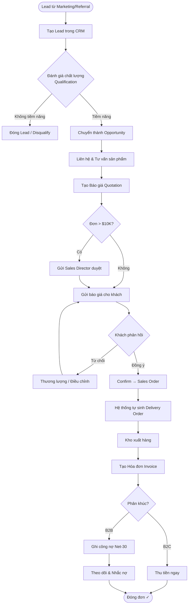

# FRD-01 — YÊU CẦU CHỨC NĂNG: KINH DOANH & CRM
## Superstore ERP · Phòng Sales & CRM · Phiên bản 1.0 · 2026

---

## 1. Tổng quan phòng ban

**Sứ mệnh:** Chuyển đổi mọi khách hàng tiềm năng thành doanh thu thực, đồng thời duy trì mối quan hệ khách hàng dài hạn để tối đa hóa giá trị vòng đời khách hàng (Customer Lifetime Value).

**Nhân sự:**
- 1 Sales Director (David Okafor) — quản lý toàn đội, duyệt chiết khấu > 15%
- 4 Regional Sales Manager — mỗi người phụ trách 1 vùng (West/East/Central/South)
- 6 Inside Sales Representative — xử lý đơn inbound, báo giá, chăm sóc khách
- 1 Customer Service Specialist — hậu mãi, khiếu nại, đổi trả

**Phân khúc khách hàng (Customer Segment):**
- **Consumer (B2C):** khách lẻ, mua online hoặc phone, giá niêm yết, thanh toán ngay
- **Corporate (B2B):** doanh nghiệp lớn, có sales phụ trách, hưởng chiết khấu volume, Net-30
- **Home Office (B2B nhỏ):** văn phòng tại gia, ở giữa hai phân khúc trên

**KPI phòng:**

| KPI | Mục tiêu | Đo theo |
|---|---|---|
| Doanh thu tháng | Theo plan phân bổ vùng | Tháng |
| Tỷ lệ chuyển đổi Lead → SO | ≥ 25% | Tháng |
| Average Order Value (AOV) | ≥ $450/đơn | Tháng |
| On-time order fulfillment | ≥ 92% | Tháng |
| Số lead mới | ≥ 120 lead/tháng | Tháng |
| Tỷ lệ khách hàng quay lại (repeat) | ≥ 40% | Quý |

---

## 2. Sơ đồ luồng nghiệp vụ (Flowchart)

---

## 3. SOP — Quy trình chuẩn từng bước

| Bước | Ai | Hành động | Trên Odoo | Bảng DB ghi | Kết quả |
|---|---|---|---|---|---|
| 1 | Inside Sales / Marketing | Tạo lead từ form, email, cuộc gọi | CRM → Leads → New | `crm_lead` INSERT | Lead state = `new` |
| 2 | Regional Sales Mgr | Đánh giá, phân công cho rep | CRM → assign salesperson | `crm_lead.user_id` UPDATE | Lead có người phụ trách |
| 3 | Sales Rep | Liên hệ khách, ghi notes, cập nhật stage | CRM → Opportunity → Log call | `crm_lead`, `mail_message` | Stage tiến lên |
| 4 | Sales Rep | Tạo báo giá từ opportunity | CRM → Opportunity → New Quotation | `sale_order` INSERT (state=draft) | SO draft |
| 5 | Sales Rep | Thêm sản phẩm, số lượng, chiết khấu | SO → Add Product | `sale_order_line` INSERT | Lines tạo |
| 6 | Sales Director (nếu > $10K) | Duyệt chiết khấu | SO → Approve | `sale_order.state` UPDATE | Approved |
| 7 | Sales Rep | Gửi báo giá cho khách | SO → Send by Email | `mail_message` | PDF email gửi |
| 8 | Sales Rep | Xác nhận đơn | SO → Confirm | `sale_order.state` = `sale` | Tự sinh `stock_picking` + `stock_move` |
| 9 | Customer Service | Theo dõi giao hàng | SO → Delivery tab | `stock_picking.state` | Xem trạng thái kho |
| 10 | Customer Service | Tạo hóa đơn sau giao | SO → Create Invoice | `account_move` INSERT (out_invoice) | HĐ draft |
| 11 | Accounting | Ghi sổ hóa đơn | Invoice → Confirm (Post) | `account_move_line` INSERT | Nợ 131 / Có 511+3331 |
| 12 | Accounting | Ghi nhận thanh toán | Invoice → Register Payment | `account_payment` | `amount_residual` → 0 |

---

## 4. Quy tắc nghiệp vụ (Business Rules)

| Mã | Quy tắc | Chi tiết |
|---|---|---|
| BR-SAL-01 | Chiết khấu theo bậc | 5% (>$2K), 10% (>$5K), 15% (>$10K), 20% (>$25K — Director duyệt) |
| BR-SAL-02 | Giới hạn tối đa chiết khấu | Không vượt 20% trong mọi trường hợp |
| BR-SAL-03 | Duyệt đơn lớn | SO tổng > $10K cần Sales Director xác nhận trước khi gửi |
| BR-SAL-04 | Điều khoản B2B | Corporate/Home Office: Net-30; Consumer: thanh toán ngay |
| BR-SAL-05 | Credit hold | Khách B2B quá hạn > 15 ngày → khóa tín dụng → đơn mới cần prepay |
| BR-SAL-06 | Campaign tracking | Mọi SO phải gắn campaign_id/source_id nếu có nguồn lead từ marketing |
| BR-SAL-07 | Sản phẩm Furniture | Kiểm tra tồn kho trước confirm; nếu < qty đặt → thông báo cho kho sản xuất |
| BR-SAL-08 | Đơn B2C | Không cần quotation; tạo SO thẳng; ship mode mặc định Standard Class |

---

## 5. Điểm bàn giao (Handoff Matrix)

| Nhận từ | Giao cho | Trigger | Dữ liệu chuyển |
|---|---|---|---|
| Marketing | Sales/CRM | Lead đủ điều kiện từ chiến dịch | `crm_lead` với campaign_id |
| Sales | Warehouse | SO confirmed | `stock_picking` + `stock_move` tự sinh |
| Sales | Accounting | Hàng đã giao | `sale_order.invoice_status` = `to invoice` |
| Warehouse | Sales | Delivery validated | `stock_picking.state` = `done` |
| Accounting | Sales | Hóa đơn đã post | `account_move.state` = `posted` |

---

## 6. Luồng ngoại lệ (Exception Flows)

**Ngoại lệ 1 — Khách hủy đơn sau confirm:**
SO confirmed → Khách yêu cầu hủy → Sales Rep liên hệ Warehouse kiểm tra đã xuất chưa → Nếu chưa: hủy picking, đặt SO về cancel → Ghi lý do hủy trên chatter. Nếu đã xuất: tạo Return picking, nhập hàng lại kho.

**Ngoại lệ 2 — Khách yêu cầu thay đổi đơn sau confirm:**
Không được sửa SO đã confirm → Phải tạo SO mới hoặc tạo Credit Note (hóa đơn điều chỉnh). Sales Rep thông báo Accounting.

**Ngoại lệ 3 — Hết hàng khi confirm:**
SO confirm nhưng tồn kho không đủ → `stock_move.state` = `waiting` → Kho thông báo Sales → Sales liên hệ khách, chọn: chờ sản xuất/chờ nhập hàng/chia giao nhiều lần (partial delivery).

**Ngoại lệ 4 — Chiết khấu vượt quá quy định:**
Sales Rep nhập discount > 15% → Hệ thống hiển thị cảnh báo → Sales Director phải vào duyệt trước khi gửi báo giá. Nếu Director không duyệt trong 24h → escalate CEO.

**Ngoại lệ 5 — Khách B2B quá hạn xin đặt thêm:**
Hệ thống kiểm tra `amount_residual` trên các HĐ cũ → Nếu có HĐ quá hạn > 15 ngày → SO mới tự chuyển sang `prepayment required` → CS thông báo khách.

---

## 7. Data Footprint (Bảng dữ liệu phòng sở hữu)

| Bảng DB | Vai trò | Loại dữ liệu |
|---|---|---|
| `crm_lead` | Lead & Opportunity | Transaction |
| `crm_stage` | Giai đoạn pipeline | Master |
| `sale_order` | Đơn bán hàng (header) | Transaction |
| `sale_order_line` | Chi tiết đơn bán (line) | Transaction → **fact_sales** |
| `res_partner` | Khách hàng (customer_rank) | Master → **dim_customer** |
| `utm_campaign` / `utm_source` / `utm_medium` | Theo dõi marketing | Master |

**Nguồn phân tích downstream:**
- `sale_order_line` → `fact_sales` (Gold layer Snowflake)
- Phân tích: doanh thu theo kênh/vùng/segment/sản phẩm, RFM, AOV, conversion funnel
