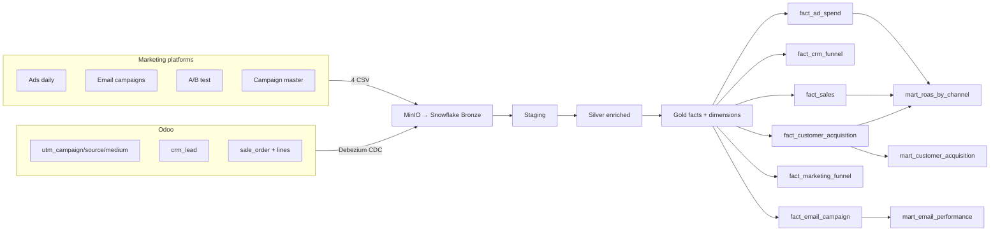
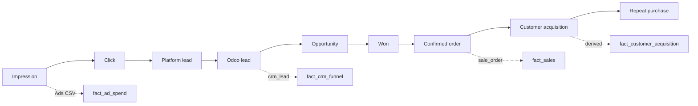
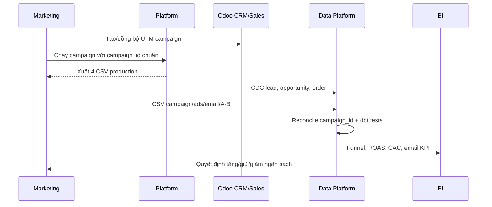

# FRD-02 — Marketing

## 1. Mục tiêu và phạm vi

Marketing cần trả lời ba câu hỏi:

1. Kênh nào tạo được lead và khách hàng mới?
2. Chi phí bỏ ra có tạo đủ doanh thu không?
3. Campaign/email/A-B test nào cần tăng, giữ hoặc giảm ngân sách?

Phạm vi hiện tại gồm UTM trong Odoo và bốn file marketing production. Không dùng dữ liệu
email từ module `mass_mailing`; không ingest hai file synthetic
`customer_acquisition`/`marketing_funnel_monthly`.

## 2. Bức tranh dữ liệu

Khóa dùng để nối campaign là `campaign_id` của CSV = `utm_campaign.id` trong Odoo. Tên
campaign chỉ để hiển thị, không dùng làm khóa.

## 3. Phễu chuyển đổi

`platform_leads` và Odoo `leads` được giữ riêng vì khác định nghĩa và grain. Không ép hai
số này bằng nhau.

## 4. Vai trò và bàn giao

| Vai trò | Trách nhiệm | Bàn giao |
|---|---|---|
| Marketing Manager | Phê duyệt campaign, ngân sách và quyết định tối ưu | Campaign plan, KPI target |
| Digital Specialist | Chạy Ads/email/A-B test, gắn UTM, xuất file | 4 CSV đúng schema và đúng lịch |
| Sales/CRM | Xử lý lead, chuyển opportunity, xác nhận đơn | `crm_lead`, `sale_order.opportunity_id` |
| Data Engineer | Ingest, kiểm tra khóa, vận hành dbt | Gold/Mart đã qua test |
| Data Analyst | Phân tích funnel, ROAS, CAC, email | Dashboard và khuyến nghị |

## 5. Hợp đồng dữ liệu nguồn

| File | Grain | Khóa | Nội dung chính | Người tạo |
|---|---|---|---|---|
| `marketing_campaigns_master.csv` | 1 campaign | `campaign_id` | tên, kênh, mục tiêu, trạng thái | Marketing Manager |
| `ad_performance_daily.csv` | 1 campaign × date × channel | `campaign_id,date,channel` | spend, impression, reach, click, lead, conversion | Digital Specialist |
| `email_campaigns.csv` | 1 email blast | `email_id` | delivered, open, click, bounce, revenue, cost | Digital Specialist |
| `ab_test_results.csv` | 1 variant | `variant_id` | budget, impression, click, conversion, winner | Digital Specialist |

Quy tắc nạp:

- File phải đầy đủ khóa, không trùng grain và không rỗng.
- Ingest lại file giống hệt được bỏ qua bằng file hash.
- Khi nội dung thay đổi, `_source_batch_id`, `_source_loaded_at` và `record_hash` tạo version mới.
- Airflow kiểm tra toàn bộ `campaign_id` tồn tại trong Odoo trước khi nạp.

## 6. KPI và nguồn tính

| KPI | Công thức | Model chuẩn |
|---|---|---|
| CTR | clicks / impressions | `fact_marketing_funnel` |
| Lead → Opportunity | opportunities / leads | `fact_marketing_funnel` |
| Win rate | won opportunities / opportunities | `fact_marketing_funnel` |
| Lead → Order | converted leads / leads | `fact_marketing_funnel` |
| ROAS | attributed revenue / ad spend | `mart_roas_by_channel` |
| CAC | ad spend / new customers | `mart_roas_by_channel` |
| LTV/CAC | total LTV / total CAC | `mart_customer_acquisition` |
| Email open rate | unique opens / delivered | `mart_email_performance` |
| Email click rate | unique clicks / delivered | `mart_email_performance` |

`reach` tháng để `NULL` vì daily reach không cộng được thành monthly unique reach;
`source_daily_reach_sum` chỉ dùng audit.

## 7. Business rules

| Mã | Quy tắc |
|---|---|
| BR-MKT-01 | Paid lead/order phải có campaign, source và medium hợp lệ. |
| BR-MKT-02 | `sale_order.opportunity_id` phải trỏ đúng CRM lead của cùng partner. |
| BR-MKT-03 | Revenue attribution dùng channel/campaign của first confirmed order cho acquisition. |
| BR-MKT-04 | KPI ratio phải tính lại từ tổng tử số/mẫu số; không lấy trung bình ratio từng dòng. |
| BR-MKT-05 | Campaign name không phải candidate key; chỉ dùng ID đã reconcile. |
| BR-MKT-06 | Dữ liệu platform và Odoo được so sánh nhưng không giả định cùng định nghĩa lead/conversion. |

## 8. Ngoại lệ và cách xử lý

| Ngoại lệ | Xử lý |
|---|---|
| Campaign ID không có trong Odoo | Dừng DAG trước ingest; Marketing sửa mapping. |
| File đổi schema/thiếu khóa/trùng grain | Dừng loader; không ghi đè batch hợp lệ trước đó. |
| Order không có medium | Gắn `direct`/`organic`/`referral` đúng nghiệp vụ; không tự đoán paid channel. |
| Lead không nối được order | Giữ ở CRM funnel; không tính là conversion ERP. |
| Spend có nhưng chưa có doanh thu | Giữ group với ROAS thấp/0; không loại khỏi Mart. |

## 9. Tiêu chí nghiệm thu

- 100% campaign ID trong bốn file tồn tại ở `utm_campaign`.
- Không có campaign FK mồ côi ở `crm_lead`, `sale_order`, `account_move`.
- Confirmed order có `medium_id` và `opportunity_id`; opportunity khớp partner.
- Fact giữ đúng grain, không duplicate sau join.
- Funnel, ROAS, CAC và email Mart vượt toàn bộ dbt tests trước khi refresh BI.
