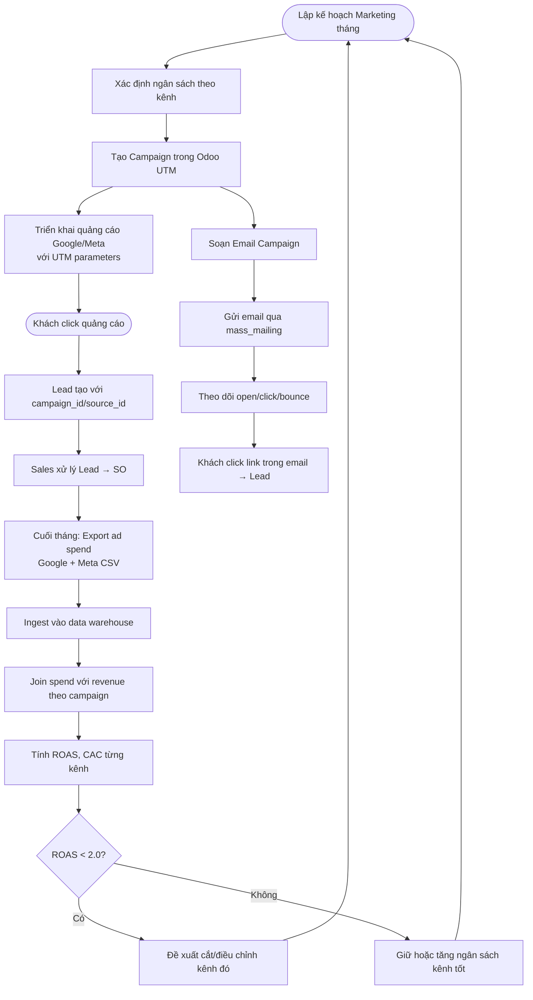

# FRD-02 — YÊU CẦU CHỨC NĂNG: MARKETING
## Superstore ERP · Phòng Marketing · Phiên bản 1.0 · 2026

---

## 1. Tổng quan phòng ban

**Sứ mệnh:** Thu hút khách hàng tiềm năng chất lượng cao với chi phí thấp nhất, đo lường hiệu quả từng kênh để phân bổ ngân sách tối ưu, và nuôi dưỡng khách cũ tái mua hàng.

**Nhân sự:**
- 1 Marketing Manager (Anna Kowalski) — chiến lược, ngân sách, phê duyệt chiến dịch
- 1 Digital Marketing Specialist — vận hành Google Ads, Meta, email campaign

**Kênh hoạt động:**
- **Google Ads** — tìm kiếm trả phí (Search) nhắm từ khóa sản phẩm văn phòng
- **Meta Ads** — Facebook/Instagram nhắm doanh nghiệp nhỏ và home office
- **Email Marketing** — bản tin tháng + chiến dịch khuyến mãi theo mùa
- **Organic/Direct** — khách quay lại, giới thiệu — không trả phí, theo dõi qua UTM = none/direct
- **Referral/Events** — hội chợ thương mại, đối tác giới thiệu

**KPI phòng:**

| KPI | Mục tiêu | Chu kỳ |
|---|---|---|
| Số lead tạo ra / tháng | ≥ 120 lead | Tháng |
| ROAS (Return on Ad Spend) | ≥ 3.0× trên tổng paid | Tháng |
| ROAS tối thiểu từng kênh | ≥ 2.0× (dưới cắt ngân sách) | Tháng |
| CAC (Chi phí thu hút 1 khách mới) | ≤ $85 | Tháng |
| Tỷ lệ mở email (Email Open Rate) | ≥ 22% | Chiến dịch |
| Tỷ lệ click email (CTR) | ≥ 3.5% | Chiến dịch |
| Tỷ lệ chuyển đổi Lead → SO | ≥ 25% (phối hợp Sales) | Tháng |

---

## 2. Kiến trúc tracking dữ liệu marketing

Superstore dùng mô hình **multi-source tracking**: dữ liệu từ 2 nguồn riêng biệt, kết hợp trong data warehouse để tính ROAS và CAC đầy đủ.

**Nguồn 1 — UTM trong Odoo (internal):**
Mọi lead và sales order có cột `campaign_id`, `source_id`, `medium_id` (từ bảng `utm_campaign`, `utm_source`, `utm_medium`). Khi rep nhập lead từ chiến dịch nào → gắn campaign. Khi khách click link quảng cáo → UTM tự điền vào form web → lead tạo kèm UTM.

**Nguồn 2 — Ad Spend data (external CSV/API):**
Google Ads và Meta ghi `impressions`, `clicks`, `spend` hằng ngày theo `campaign_id`. File export từ Google Ads Console / Meta Ads Manager → ingest vào data warehouse riêng (không vào Odoo). Join với revenue từ Odoo theo `campaign_id` và `date` → tính ROAS.

```
Google Ads / Meta Ads
        │ daily export (CSV)
        ▼
   MinIO / Staging
        │ dbt model
        ▼
   fact_ad_spend (Snowflake)
        │
        ├── JOIN fact_sales ON campaign_id
        ▼
   mart_roas_by_channel (Power BI)
```

---

## 3. Sơ đồ luồng nghiệp vụ



---

## 4. SOP — Quy trình chuẩn từng bước

| Bước | Ai | Hành động | Trên Odoo / Tool | Bảng DB ghi | Kết quả |
|---|---|---|---|---|---|
| 1 | Marketing Mgr | Lập kế hoạch ngân sách tháng theo kênh | Spreadsheet nội bộ | — | Budget plan |
| 2 | Marketing Mgr | Tạo campaign trong Odoo | Marketing → UTM → Campaigns → New | `utm_campaign` INSERT | Campaign có ID |
| 3 | Digital Specialist | Cấu hình UTM links cho Google/Meta | Google Ads / Meta Ads Manager | — | Links có `?utm_source=google&utm_campaign=xxx` |
| 4 | Digital Specialist | Kích hoạt chiến dịch, thiết lập targeting | Google Ads Console / Meta Ads Manager | External | Quảng cáo chạy |
| 5 | CRM tự động / Sales Rep | Lead tạo kèm UTM khi khách điền form | CRM → Leads (auto từ web form) | `crm_lead` với campaign_id | Lead tracked |
| 6 | Digital Specialist | Soạn và lên lịch email campaign | Email Marketing → Campaigns → New | `mass_mailing`, `mailing_list` | Email scheduled |
| 7 | Hệ thống tự động | Gửi email, ghi nhận open/click/bounce | — | `mass_mailing_stats` | Engagement tracked |
| 8 | Digital Specialist | Cuối tháng: export spend từ Google/Meta | Google Ads → Reports; Meta → Ads Manager | CSV file | Ad spend data |
| 9 | Data Analyst | Ingest CSV vào data warehouse | MinIO → dbt staging | `stg_ad_spend` Snowflake | Dữ liệu warehouse |
| 10 | Data Analyst | Chạy dbt model tính ROAS, CAC | dbt run `mart_roas_by_channel` | `mart_roas` Snowflake | Dashboard sẵn sàng |
| 11 | Marketing Mgr | Review ROAS/CAC từng kênh | Power BI Dashboard | — | Quyết định phân bổ ngân sách |

---

## 5. Quy tắc nghiệp vụ (Business Rules)

| Mã | Quy tắc | Chi tiết |
|---|---|---|
| BR-MKT-01 | Bắt buộc gắn campaign | Mọi lead từ paid channel phải có campaign_id; nếu thiếu → hệ thống cảnh báo |
| BR-MKT-02 | Ngưỡng cắt kênh | ROAS < 2.0 liên tiếp 2 tháng → Marketing Mgr đề xuất tạm dừng kênh đó |
| BR-MKT-03 | CAC ceiling | Nếu CAC > $120 bất kỳ kênh nào → review ngay, không chờ cuối tháng |
| BR-MKT-04 | Email frequency | Tối đa 2 email campaign/tháng đến cùng 1 danh sách; tránh spam |
| BR-MKT-05 | Mùa vụ | Tăng ngân sách 30–50% trong Aug–Sep (back-to-school) và Nov–Dec (year-end) |
| BR-MKT-06 | Phân tích attribution | Dùng last-click attribution (nguồn cuối cùng trước khi mua được ghi công) |
| BR-MKT-07 | Dữ liệu riêng biệt | Ad spend data KHÔNG lưu trong Odoo — chỉ trong data warehouse. Tránh làm nặng Odoo |

---

## 6. Handoff Matrix

| Nhận từ | Giao cho | Trigger | Dữ liệu chuyển |
|---|---|---|---|
| External (Google/Meta) | Marketing (Data) | Cuối tháng | CSV ad spend: campaign, date, spend, clicks, impressions |
| Marketing | Sales/CRM | Lead đủ điều kiện (qualified lead) | `crm_lead` với campaign_id, source_id, score |
| Sales | Marketing | SO confirmed từ lead marketing | `sale_order.campaign_id` → revenue attribution |
| Data Analyst | Marketing Mgr | Dashboard ROAS/CAC sẵn sàng | Power BI report link |

---

## 7. Exception Flows

**Ngoại lệ 1 — UTM bị thiếu trên lead:**
Sales rep nhập lead thủ công không gắn campaign → cuối tháng có "Unknown" source trong báo cáo. Giải pháp: Data Ops tạo data quality rule cảnh báo `crm_lead` không có source_id trong tháng hoạt động chiến dịch.

**Ngoại lệ 2 — Google/Meta thay đổi cấu trúc export CSV:**
Column names thay đổi → dbt staging model lỗi. Giải pháp: Schema test trong dbt; alert khi model fail.

**Ngoại lệ 3 — Email campaign bounce rate cao > 10%:**
Danh sách email cũ/không hợp lệ. Hành động: xóa unsubscribe & hard bounce khỏi mailing list; báo cáo tình trạng danh sách cho Marketing Mgr.

---

## 8. Data Footprint

| Bảng / Nguồn | Vai trò | Loại |
|---|---|---|
| `utm_campaign` | Danh mục chiến dịch | Master |
| `utm_source` | Nguồn (Google, Facebook, Email...) | Master |
| `utm_medium` | Kênh (cpc, email, organic...) | Master |
| `crm_lead.campaign_id` | Gắn lead vào chiến dịch | Transaction |
| `sale_order.campaign_id` | Gắn doanh thu vào chiến dịch | Transaction |
| `mass_mailing` | Email campaign | Transaction |
| `mass_mailing_stats` | Engagement email (open, click, bounce) | Transaction |
| `stg_ad_spend` (Snowflake) | Chi tiêu quảng cáo hằng ngày (external) | Transaction |
| `mart_roas_by_channel` | ROAS/CAC đã tính (Gold layer) | Mart |

**Phân tích downstream:**
- Marketing funnel: Impressions → Clicks → Leads → SO → Revenue
- ROAS, CAC theo kênh × tháng × category
- Email engagement trend
- Mùa vụ quảng cáo (seasonal campaign effectiveness)
