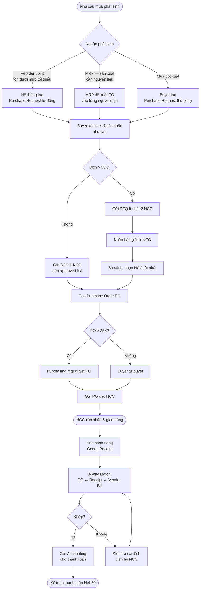

# FRD-03 — YÊU CẦU CHỨC NĂNG: MUA HÀNG (PURCHASING)
## Superstore ERP · Phòng Purchasing · Phiên bản 1.0 · 2026

---

## 1. Tổng quan phòng ban

**Sứ mệnh:** Đảm bảo nguyên vật liệu cho nhà máy và hàng thương mại cho 4 kho luôn đủ, đúng chất lượng, đúng giá — mua từ nhà cung cấp được duyệt, thanh toán sau khi đối chiếu 3 chứng từ.

**Nhân sự:**
- 1 Purchasing Manager (Priya Sharma) — chiến lược NCC, duyệt PO > $5.000, quan hệ NCC
- 2 Buyer — xử lý RFQ, PO, theo dõi giao hàng, đối chiếu hóa đơn

**Hai loại mua hàng:**
- **Mua nguyên vật liệu (Raw Materials):** phục vụ nhà máy sản xuất Furniture. Trigger từ MRP (kế hoạch sản xuất) hoặc reorder point tồn kho nguyên liệu.
- **Mua hàng thương mại (Finished Goods):** Technology và Office Supplies phân phối lại. Trigger từ reorder point tồn thành phẩm tại các kho.

**KPI phòng:**

| KPI | Mục tiêu | Chu kỳ |
|---|---|---|
| Purchase Order fill rate (NCC giao đủ) | ≥ 95% | Tháng |
| On-time delivery từ NCC | ≥ 90% đơn giao đúng hạn | Tháng |
| 3-way match rate | 100% hóa đơn NCC phải qua 3-way match | Tháng |
| Cost saving vs last price | ≥ 2% reduction hằng năm qua đàm phán | Năm |
| Số NCC active trên approved list | Duy trì 15–25 NCC hoạt động | Quý |
| Thời gian xử lý PO (từ request đến PO sent) | ≤ 2 ngày làm việc | Tháng |

---

## 2. Sơ đồ luồng nghiệp vụ (Procure-to-Pay)

---

## 3. SOP — Quy trình chuẩn từng bước

| Bước | Ai | Hành động | Trên Odoo | Bảng DB ghi | Kết quả |
|---|---|---|---|---|---|
| 1 | Hệ thống / Buyer | Phát sinh nhu cầu mua | Purchase → Replenishment hoặc MRP → Scheduler | `purchase_requisition` / `stock_warehouse_orderpoint` | Nhu cầu ghi nhận |
| 2 | Buyer | Tạo RFQ (Request for Quotation) | Purchase → Orders → Requests for Quotation → New | `purchase_order` INSERT (state=draft) | RFQ số PO-xxx |
| 3 | Buyer | Thêm sản phẩm, số lượng, ngày cần | RFQ → Add Product line | `purchase_order_line` INSERT | Lines tạo |
| 4 | Buyer | Gửi RFQ cho NCC | RFQ → Send by Email | `mail_message` | Email gửi NCC |
| 5 | Buyer | Nhận báo giá, cập nhật giá | RFQ → Update price_unit | `purchase_order_line.price_unit` UPDATE | Giá cập nhật |
| 6 | Purchasing Mgr (nếu > $5K) | Duyệt PO | PO → Approve | `purchase_order.state` UPDATE | state = `purchase` |
| 7 | Buyer | Confirm PO, gửi NCC | PO → Confirm | `purchase_order.state` = `purchase` | Tự sinh `stock_picking` (Receipt) |
| 8 | Warehouse | Nhận hàng, scan/đếm | Inventory → Receipts → Validate | `stock_move.state` = `done` | `stock_quant` tăng; `qty_received` cập nhật |
| 9 | Buyer | Tạo vendor bill từ PO | PO → Create Bill | `account_move` INSERT (in_invoice, draft) | Hóa đơn NCC draft |
| 10 | Buyer | 3-way match: PO vs Receipt vs Bill | So sánh qty/price trong PO, Receipt và Bill | — | Xác nhận khớp |
| 11 | Purchasing Mgr | Xác nhận match OK, chuyển Accounting | Bill → Approve for payment | `account_move.state` = checked | Chờ thanh toán |
| 12 | Accounting | Ghi sổ và thanh toán | Invoice → Post → Register Payment | `account_payment`, `account_move_line` | Nợ 331 / Có 112 |

---

## 4. Quy tắc nghiệp vụ

| Mã | Quy tắc | Chi tiết |
|---|---|---|
| BR-PUR-01 | Approved supplier list | Chỉ mua từ NCC trong danh sách approved. NCC mới phải qua vetting: chất lượng + tài chính |
| BR-PUR-02 | Yêu cầu RFQ nhiều NCC | PO > $5.000 → ít nhất 2 RFQ trước khi chọn NCC |
| BR-PUR-03 | Duyệt PO | Buyer tự duyệt đến $5.000; Mgr duyệt > $5.000 |
| BR-PUR-04 | 3-way match bắt buộc | 100% vendor bill phải so khớp với PO và goods receipt trước khi chuyển sang thanh toán |
| BR-PUR-05 | Điều khoản thanh toán NCC | Mặc định Net-30; tận dụng early payment discount (2/10 Net 30) khi cash flow cho phép |
| BR-PUR-06 | Tồn an toàn nguyên liệu | Reorder point = 3 tuần tiêu thụ dự báo cho nhà máy; thành phẩm theo SKU từng kho |
| BR-PUR-07 | Không thanh toán trước receipt | Tuyệt đối không tạo vendor bill / payment trước khi kho đã validate goods receipt |

---

## 5. Handoff Matrix

| Nhận từ | Giao cho | Trigger | Dữ liệu chuyển |
|---|---|---|---|
| Manufacturing (MRP) | Purchasing | Kế hoạch SX cần nguyên liệu | Danh sách nguyên liệu + qty + ngày cần |
| Inventory (reorder) | Purchasing | Tồn dưới reorder point | Product, qty thiếu, kho cần |
| NCC | Purchasing | Hàng đến cổng kho | Packing list, số PO |
| Purchasing | Warehouse | PO confirmed | `stock_picking` (Receipt) tự sinh |
| Purchasing | Accounting | 3-way match OK | `account_move` (in_invoice) ready to pay |

---

## 6. Exception Flows

**Ngoại lệ 1 — NCC giao thiếu số lượng:**
`qty_received` < `product_qty` trên PO line → Tạo backorder (giao lại lần sau) hoặc liên hệ NCC yêu cầu giao bổ sung → 3-way match chỉ khớp phần đã nhận → tách vendor bill theo phần đã nhận.

**Ngoại lệ 2 — NCC giao hàng lỗi/sai sản phẩm:**
Kho ghi nhận hàng nhưng đánh dấu chất lượng không đạt → Tạo Return picking → Hàng trả về NCC → Liên hệ NCC yêu cầu giao lại hoặc credit note → Không thanh toán vendor bill cho phần hàng lỗi.

**Ngoại lệ 3 — Giá hóa đơn NCC khác PO:**
3-way match phát hiện price mismatch → Buyer liên hệ NCC giải thích → Nếu NCC sai: yêu cầu credit note → Nếu PO sai (giá tăng đã thỏa thuận): tạo PO amendment → Purchasing Mgr duyệt lại.

**Ngoại lệ 4 — NCC giao trễ hạn:**
Ngày giao thực tế > `date_planned` trên PO → Nhà máy thiếu nguyên liệu → Mua khẩn cấp (emergency purchase) từ NCC thay thế → Ghi nhận lead time thực tế để điều chỉnh reorder point.

---

## 7. Data Footprint

| Bảng DB | Vai trò | Loại |
|---|---|---|
| `purchase_order` | Đơn mua (header) | Transaction |
| `purchase_order_line` | Chi tiết đơn mua | Transaction → **fact_purchase** |
| `res_partner` | Nhà cung cấp (supplier_rank) | Master → **dim_supplier** |
| `stock_picking` | Phiếu nhận hàng (Receipt) | Transaction |
| `stock_move` | Chuyển động nhận nguyên liệu/hàng | Transaction |
| `account_move` | Hóa đơn NCC (in_invoice) | Transaction |

**Phân tích downstream:**
- `purchase_order_line` → `fact_purchase` (chi phí theo NCC, sản phẩm, ngày)
- Phân tích: On-time delivery NCC, giá mua trend, chi phí nguyên liệu theo lô SX
- 3-way match audit: `purchase_order_line.qty_received` vs `account_move_line.quantity`
