# FRD-04 — YÊU CẦU CHỨC NĂNG: KHO VẬN & LOGISTICS
## Superstore ERP · Phòng Warehouse & Logistics · Phiên bản 1.0 · 2026

---

## 1. Tổng quan phòng ban

**Sứ mệnh:** Biết chính xác hàng đang ở đâu, bao nhiêu, lúc nào — và di chuyển hàng đúng nơi đúng lúc với chi phí logistics thấp nhất.

**Nhân sự (12 người, 4 kho):**
- 4 Warehouse Supervisor (1/kho): điều hành vận hành kho, xử lý sự cố
- 8 Warehouse Operator (2/kho): nhận, cất, soạn, đóng gói, giao

**4 kho vùng:**

| Kho | Vị trí | Vùng phục vụ | Diện tích | Đặc điểm |
|---|---|---|---|---|
| WH-WEST | Los Angeles, CA | West Region | 12.000 m² | Kết hợp nhà máy; kho chính |
| WH-EAST | Newark, NJ | East Region | 6.500 m² | Kho phân phối thuần |
| WH-CENTRAL | Chicago, IL | Central Region | 6.000 m² | Kho phân phối thuần |
| WH-SOUTH | Houston, TX | South Region | 5.500 m² | Kho phân phối thuần |

**Triết lý vận hành kho:** Tồn kho không phải số lưu sẵn — tồn kho là **kết quả tổng hợp của mọi stock move đã done**. Mọi biến động hàng hóa đều ghi thành move để truy vết đầy đủ.

**KPI phòng:**

| KPI | Mục tiêu | Chu kỳ |
|---|---|---|
| Order fill rate từ kho vùng | ≥ 95% | Tháng |
| On-time delivery theo SLA ship mode | ≥ 92% | Tháng |
| Inventory accuracy (kiểm kê) | Sai lệch < 2% | Quý |
| Thời gian soạn đơn (pick & pack) | ≤ 4 giờ cho Standard; ≤ 1 giờ cho Same Day | Tháng |
| Tỷ lệ giao sai / thiếu | < 0.5% | Tháng |
| Inventory turnover | 6–8 lần/năm | Năm |

---

## 2. Sơ đồ luồng nghiệp vụ

```mermaid
flowchart TD
    subgraph IN["NHẬN HÀNG VÀO KHO"]
        A([Hàng đến cổng kho]) --> B[Đối chiếu Packing List vs PO]
        B --> C{Đúng PO?}
        C -->|Có| D[Validate Receipt\nstock_move: Vendor → WH/Stock]
        C -->|Không| E[Từ chối nhận / Báo Purchasing]
        D --> F[Putaway: cất vào vị trí kệ]
        F --> G[stock_quant cập nhật tự động]
    end

    subgraph OUT["XUẤT HÀNG ĐI"]
        H([SO confirmed → Delivery Order sinh ra]) --> I[Supervisor assign cho Operator]
        I --> J[Pick: soạn hàng theo Delivery]
        J --> K[Pack: đóng gói, dán nhãn]
        K --> L[Validate Delivery\nstock_move: WH/Stock → Customer]
        L --> M[stock_quant giảm tự động]
        M --> N[Giao cho carrier / Same Day courier]
    end

    subgraph TRANSFER["CHUYỂN KHO NỘI BỘ"]
        O([Kho A thiếu hàng, Kho B dư]) --> P[Tạo Internal Transfer]
        P --> Q[Validate tại kho gửi\nstock_move: WH-A/Stock → Transit]
        Q --> R[Validate tại kho nhận\nstock_move: Transit → WH-B/Stock]
    end

    subgraph COUNT["KIỂM KÊ ĐỊNH KỲ"]
        S([Lịch kiểm kê hàng quý]) --> T[Tạo Physical Inventory]
        T --> U[Đếm thực tế từng vị trí]
        U --> V{Khớp hệ thống?}
        V -->|Có| W[Xác nhận không sai lệch]
        V -->|Không| X[Tạo Inventory Adjustment\nstock_move: WH/Stock → Inventory Loss]
        X --> Y[Ghi nhận nguyên nhân sai lệch]
    end
```

---

## 3. SOP — Quy trình chuẩn từng bước

### 3.1. Nhận hàng (Goods Receipt)

| Bước | Ai | Hành động | Trên Odoo | Bảng DB ghi | Kết quả |
|---|---|---|---|---|---|
| 1 | Operator | Nhận thông báo hàng đến từ Purchasing | Inventory → Receipts → filter PO | `stock_picking` đang waiting | Chuẩn bị nhận |
| 2 | Operator | Kiểm đếm hàng, đối chiếu packing list | — | — | Phát hiện thiếu/thừa/hỏng |
| 3 | Operator | Nhập số lượng thực nhận | Receipt → Quantity/Done | `stock_move.quantity` | Số lượng thực hiện cập nhật |
| 4 | Supervisor | Validate Receipt | Receipt → Validate | `stock_move.state` = `done` | `stock_quant` tăng |
| 5 | Operator | Cất hàng vào vị trí kệ (putaway) | Inventory → Move → Put in location | `stock_move` internal | Đúng vị trí |

### 3.2. Xuất hàng (Delivery)

| Bước | Ai | Hành động | Trên Odoo | Bảng DB ghi | Kết quả |
|---|---|---|---|---|---|
| 1 | Hệ thống | Delivery Order tự sinh khi SO confirm | — | `stock_picking` (OUT) | Lệnh xuất có sẵn |
| 2 | Supervisor | Phân công Operator soạn hàng | Delivery → Assign | `stock_picking.user_id` | Có người phụ trách |
| 3 | Operator | Soạn hàng theo Delivery Order | Inventory → Deliveries → chọn đơn | — | Hàng soạn xong |
| 4 | Operator | Đóng gói, dán nhãn carrier | — | — | Sẵn sàng giao |
| 5 | Supervisor | Validate Delivery | Delivery → Validate | `stock_move.state` = `done` | `stock_quant` giảm; SO `qty_delivered` tăng |
| 6 | Operator | Bàn giao cho carrier | — | — | Hàng rời kho |

### 3.3. Chuyển kho nội bộ

| Bước | Ai | Hành động | Trên Odoo | Bảng DB ghi | Kết quả |
|---|---|---|---|---|---|
| 1 | Supervisor | Tạo Internal Transfer | Inventory → Transfers → New (Internal) | `stock_picking` (Internal) | Phiếu chuyển kho |
| 2 | Operator kho gửi | Validate xuất | Transfer → Validate bên gửi | `stock_move`: WH-A → Transit | Tồn A giảm |
| 3 | Operator kho nhận | Validate nhận | Transfer → Validate bên nhận | `stock_move`: Transit → WH-B | Tồn B tăng |

---

## 4. Quy tắc nghiệp vụ

| Mã | Quy tắc | Chi tiết |
|---|---|---|
| BR-WH-01 | Không giao khi chưa có SO | Mọi xuất hàng cho khách phải có Delivery Order từ SO confirmed |
| BR-WH-02 | Giao từ kho vùng khách | Delivery mặc định từ kho vùng gần khách nhất (West/East/Central/South theo địa chỉ giao) |
| BR-WH-03 | Partial delivery | Nếu tồn không đủ: giao phần có, tạo backorder cho phần còn thiếu — thông báo Sales |
| BR-WH-04 | Kiểm kê quý | Cycle count toàn bộ 4 kho mỗi quý; fast-movers (top 20% SKU) kiểm hàng tháng |
| BR-WH-05 | FIFO (First In First Out) | Xuất hàng nhập trước trước. Đặc biệt quan trọng với hàng có hạn dùng |
| BR-WH-06 | Transfer threshold | Chuyển kho khi sai lệch tồn giữa 2 kho > 30% và kho đích đang thiếu; phải có Supervisor approve |
| BR-WH-07 | SLA cảnh báo | Same Day: soạn trong 1h; First Class: trong 4h; Standard: trong ngày làm việc |

---

## 5. Handoff Matrix

| Nhận từ | Giao cho | Trigger | Dữ liệu chuyển |
|---|---|---|---|
| Purchasing | Warehouse | PO confirmed → Receipt sinh | `stock_picking` (IN) |
| Sales | Warehouse | SO confirmed → Delivery sinh | `stock_picking` (OUT) |
| Manufacturing | Warehouse | MO finished → Thành phẩm nhập kho | `stock_picking` (IN từ nhà máy) |
| Warehouse | Sales | Delivery validated | `stock_picking.state` = `done` → SO cập nhật |
| Warehouse | Accounting | Hàng đã giao → kích hoạt hóa đơn | `sale_order.invoice_status` = `to invoice` |

---

## 6. Exception Flows

**Ngoại lệ 1 — Kho vùng hết hàng, kho khác còn:**
Delivery Order created → `stock.move.state` = `waiting` (thiếu tồn) → Supervisor kiểm tra tồn 3 kho còn lại → Quyết định chuyển kho nội bộ hoặc giao thẳng từ kho có hàng (ship from different region, +$15–30 phí) → Thông báo Sales về ngày giao mới.

**Ngoại lệ 2 — Hàng giao sai:**
Khách báo sai hàng → CS tạo Return Order → Kho nhận hàng về, validate Return → Kiểm tra hàng → Nếu ok: nhập lại kho; nếu hỏng: điều chỉnh inventory loss → Giao đúng hàng bằng Delivery mới.

**Ngoại lệ 3 — Sai lệch kiểm kê:**
Đếm thực tế ≠ tồn kho Odoo → Tạo Inventory Adjustment → `stock_move` loại `inventory`: WH/Stock → WH/Inventory Loss (nếu thiếu) hoặc ngược lại (nếu dư) → Ghi nhận nguyên nhân (mất mát, ghi sai trước đó, hàng hỏng) → Báo cáo cho Accounting để điều chỉnh chi phí.

---

## 7. Data Footprint

| Bảng DB | Vai trò | Loại |
|---|---|---|
| `stock_warehouse` | 4 kho (master) | Master |
| `stock_location` | Vị trí trong kho (cây phân cấp) | Master |
| `stock_picking` | Phiếu nhận/xuất/chuyển (header) | Transaction |
| `stock_move` | Từng lần di chuyển hàng | Transaction → **fact_inventory_movement** |
| `stock_quant` | Tồn kho thực tế hiện tại (derived) | Snapshot |
| `stock_valuation_layer` | Số lượng và giá trị tồn theo valuation layer | Transaction → **fact_inventory_valuation** |
| `delivery_carrier` | Phương thức/carrier của phiếu giao | Master → enrich **fact_inventory_movement** |

**Phân tích downstream:**
- `stock_move` (done) → `fact_inventory_movement`
- `stock_quant` → snapshot hằng ngày `fact_inventory_balance`
- `stock_valuation_layer` → `fact_inventory_valuation`
- Phân tích: tồn kho theo kho × SKU × ngày, giá trị tồn còn lại và biến động kho
- Delivery performance: ngày giao thực tế vs ngày hẹn (SLA breach analysis)
- Inter-warehouse transfer frequency (kho nào thường xuyên thiếu/dư)
