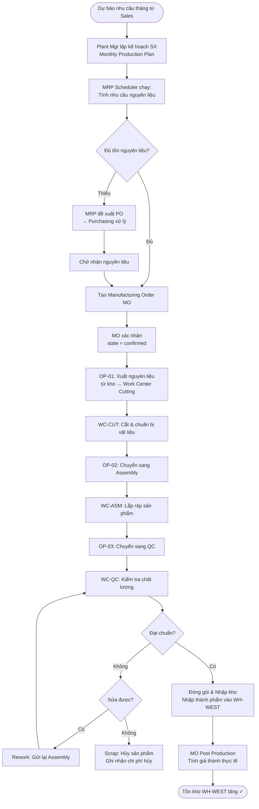

# FRD-05 — YÊU CẦU CHỨC NĂNG: SẢN XUẤT (MANUFACTURING)
## Superstore ERP · Phòng Manufacturing · Phiên bản 1.0 · 2026

---

## 1. Tổng quan phòng ban

**Sứ mệnh:** Sản xuất dòng nội thất SS Workspace đúng chất lượng, đúng kế hoạch, với chi phí tối ưu — đảm bảo kho WH-WEST luôn có thành phẩm sẵn sàng cho Sales.

**Nhân sự (9 người):**
- 1 Plant Manager (Elena Rodriguez) — lập kế hoạch sản xuất, quản lý nhà máy
- 1 Production Planner — lập MO, theo dõi tiến độ, điều phối với Purchasing
- 6 Assembly Worker — vận hành 3 work center
- 1 QC Inspector — kiểm tra chất lượng thành phẩm

**Chiến lược sản xuất:** Make-to-Stock (MTS) — sản xuất theo dự báo nhu cầu tháng, lưu kho tại WH-WEST, không sản xuất theo từng đơn bán lẻ.

**Sản phẩm sản xuất (SS Workspace Furniture line):**
- Tables: Standard Desk, Standing Desk, Meeting Table
- Chairs: Task Chair, Executive Chair, Visitor Chair
- Bookcases: Open Bookcase, Cabinet Bookcase
- Furnishings: Desk Lamp, Ergonomic Footrest

---

## 2. Cấu trúc sản xuất (Manufacturing Structure)

### 2.1. Work Centers (Trạm sản xuất)

| Work Center | Mã | Chức năng | Công suất | Ca làm việc |
|---|---|---|---|---|
| Cutting Station | WC-CUT | Cắt tấm gỗ, cắt khung thép theo kích thước BOM | 2 công nhân | 1 ca, 8h/ngày, 5 ngày/tuần |
| Assembly Line | WC-ASM | Lắp ráp các bộ phận thành thành phẩm | 3 công nhân | 1 ca, 8h/ngày |
| Quality Control | WC-QC | Kiểm tra chất lượng, đóng gói, nhập kho thành phẩm | 1 QC Inspector | 1 ca, 8h/ngày |

### 2.2. Routing (Quy trình sản xuất — áp dụng chung cho tất cả Furniture)

| Công đoạn (Operation) | Work Center | Thời gian chuẩn (Duration) | Mô tả |
|---|---|---|---|
| OP-01: Material Preparation | WC-CUT | 45 phút/lô | Cắt và chuẩn bị vật liệu theo BOM |
| OP-02: Assembly | WC-ASM | 90–180 phút/sản phẩm (tùy loại) | Lắp ráp hoàn chỉnh |
| OP-03: QC & Packaging | WC-QC | 30 phút/sản phẩm | Kiểm tra, đóng gói, gán nhãn |

### 2.3. BOM (Bill of Materials — Định mức nguyên liệu)

**Ví dụ BOM cho Standard Desk (1 sản phẩm):**

| Thành phần | Mã NVL | Số lượng | Đơn vị | Loại |
|---|---|---|---|---|
| Tabletop Panel (72"×30") | RM-WOOD-001 | 1 | tấm | Raw Material |
| Steel Frame Set | RM-STEEL-001 | 1 | bộ | Raw Material |
| Hardware Kit (ốc, vít, linh kiện) | RM-HW-001 | 1 | bộ | Raw Material |
| Edge Banding Strip | RM-EDGE-001 | 3.5 | mét | Raw Material |
| Packaging Box | PKG-DESK-001 | 1 | hộp | Consumable |

**Ví dụ BOM cho Task Chair (1 sản phẩm):**

| Thành phần | Mã NVL | Số lượng | Đơn vị |
|---|---|---|---|
| Seat Cushion Assembly | RM-FOAM-001 | 1 | bộ |
| Backrest Frame | RM-STEEL-002 | 1 | cái |
| Armrest Set | RM-ARM-001 | 1 | cặp |
| Pneumatic Cylinder | RM-PNEU-001 | 1 | cái |
| Star Base (5-caster) | RM-BASE-001 | 1 | cái |
| Upholstery Fabric (0.8m²) | RM-FABR-001 | 0.8 | m² |

---

## 3. Sơ đồ luồng nghiệp vụ (Plan-to-Produce)

---

## 4. SOP — Quy trình chuẩn từng bước

| Bước | Ai | Hành động | Trên Odoo | Bảng DB ghi | Kết quả |
|---|---|---|---|---|---|
| 1 | Plant Mgr | Lập kế hoạch SX tháng | Manufacturing → Planning | — | Plan file |
| 2 | Production Planner | Chạy MRP Scheduler | Manufacturing → MRP → Run Scheduler | `mrp_production` (draft) đề xuất | Danh sách MO đề xuất |
| 3 | Production Planner | Duyệt và tạo MO chính thức | MRP → Confirm Manufacturing Orders | `mrp_production.state` = `confirmed` | MO số MO-xxx |
| 4 | Production Planner | Kiểm tra tồn nguyên liệu | MO → Check Availability | `stock_move` (component) check | Thiếu/đủ |
| 5 | Purchasing | Mua nguyên liệu còn thiếu | (→ FRD-03 Purchasing) | `purchase_order` | NVL về kho |
| 6 | Assembly Worker | Ghi nhận Work Order OP-01 bắt đầu | Manufacturing → Work Orders → WC-CUT → Set Done | `mrp_workorder.state` = `progress` | Công đoạn cắt bắt đầu |
| 7 | Hệ thống | Xuất nguyên liệu từ kho theo BOM | MO → Produce → Component consumption | `stock_move` (WH-WEST/Stock → Production) | NVL rời kho |
| 8 | Assembly Worker | Hoàn thành OP-01, chuyển OP-02 | Work Order → Mark Done | `mrp_workorder.state` = `done` | OP-01 xong |
| 9 | Assembly Worker | Vận hành OP-02 Assembly | WC-ASM → Work Order | `mrp_workorder` | Lắp ráp |
| 10 | QC Inspector | Kiểm tra chất lượng OP-03 | WC-QC → Work Order | `mrp_workorder` | Pass/Fail |
| 11 | QC Inspector | Đóng gói và validate sản xuất | MO → Produce → Qty Produced → Validate | `stock_move` (Production → WH-WEST/Stock) | Thành phẩm vào kho |
| 12 | Production Planner | Đóng MO, tính giá thành | MO → Mark as Done | `mrp_production.state` = `done` | Giá thành ghi nhận |

---

## 5. Quy tắc nghiệp vụ

| Mã | Quy tắc | Chi tiết |
|---|---|---|
| BR-MFG-01 | Make-to-Stock | Sản xuất theo kế hoạch tháng, không theo từng SO. Sales không trigger trực tiếp MO |
| BR-MFG-02 | BOM bắt buộc | Mọi Furniture SKU phải có BOM được duyệt trước khi tạo MO |
| BR-MFG-03 | Routing 3 công đoạn | Mọi MO phải đi qua đủ 3 work order: Cutting → Assembly → QC |
| BR-MFG-04 | QC 100% | Tất cả thành phẩm phải qua QC Inspector trước khi nhập kho; không skip |
| BR-MFG-05 | Tỷ lệ lỗi | Mục tiêu defect rate < 1,5%. Tháng nào > 2% → Plant Mgr điều tra nguyên nhân |
| BR-MFG-06 | Scrap tracking | Sản phẩm hủy (scrap) phải ghi nhận trong Odoo kèm lý do và chi phí nguyên liệu đã dùng |
| BR-MFG-07 | Capacity planning | Nhà máy tối đa 1.100 sản phẩm/tháng (1 ca/ngày). MO vượt công suất → tăng ca hoặc dịch lịch |
| BR-MFG-08 | Giá thành thực tế | Giá thành = NVL thực dùng × giá NVL + giờ công × labor rate. Ghi nhận sau khi MO done |

---

## 6. Handoff Matrix

| Nhận từ | Giao cho | Trigger | Dữ liệu chuyển |
|---|---|---|---|
| Sales (dự báo) | Manufacturing | Dự báo nhu cầu tháng | Qty dự báo theo SKU |
| Purchasing | Manufacturing | Nguyên liệu về kho | `stock_quant` cập nhật → MO check availability OK |
| Manufacturing | Warehouse (WH-WEST) | MO validated | `stock_move`: Production → WH-WEST/Stock |
| Manufacturing | Purchasing | NVL thiếu (MRP đề xuất) | Danh sách nguyên liệu + qty + ngày cần |
| Manufacturing | Accounting | MO done → tính giá thành | `mrp_production` giá thành → bút toán giá vốn |

---

## 7. Exception Flows

**Ngoại lệ 1 — Hết nguyên liệu giữa chừng MO:**
Work Order bắt đầu → phát hiện NVL thiếu (BOM sai hoặc hao hụt cao hơn dự kiến) → Dừng Work Order → Production Planner tạo emergency PO → Chờ NVL về tiếp tục → Cập nhật BOM nếu hao hụt thực tế khác định mức.

**Ngoại lệ 2 — Sản phẩm fail QC:**
QC Inspector đánh fail → Đánh giá có sửa được không → Nếu sửa được (rework): gửi lại Assembly, tạo thêm Work Order rework → Chi phí lao động tăng → Nếu không sửa được: tạo Scrap từ MO, ghi nhận qty scrap và chi phí NVL đã dùng.

**Ngoại lệ 3 — Máy móc hỏng tại Work Center:**
WC-ASM down → Tất cả Work Order tại WC-ASM chờ → Production Planner đánh giá downtime → Báo Plant Mgr → Sắp xếp sửa chữa (ghi vào maintenance log) → Điều chỉnh kế hoạch sản xuất tháng.

**Ngoại lệ 4 — Sản xuất dư kế hoạch:**
MO complete với qty > kế hoạch → Toàn bộ nhập kho → Inventory turnover giảm → Điều chỉnh kế hoạch tháng sau.

---

## 8. Data Footprint

| Bảng DB | Vai trò | Loại |
|---|---|---|
| `mrp_production` | Lệnh sản xuất MO (header) | Transaction |
| `mrp_workorder` | Công đoạn sản xuất Work Order | Transaction |
| `mrp_bom` | Định mức nguyên liệu BOM | Master |
| `mrp_workcenter` | Work Center master | Master |
| `mrp_workcenter_productivity` | Block thời gian làm việc/dừng máy | Transaction → **fact_manufacturing_oee** |
| `mrp_workcenter_productivity_loss` | Nhóm nguyên nhân thời gian | Master |
| `stock_move` | Xuất NVL vào SX, nhập thành phẩm | Transaction → **fact_inventory_movement** |
| `stock_scrap` | Sản phẩm hủy | Transaction → enrich Manufacturing/OEE facts |

**Phân tích downstream:**
- `mrp_production` → `fact_manufacturing` (planned/produced/scrap/cycle time)
- `mrp_workorder` → `fact_workorder`; productivity block → `fact_manufacturing_oee`
- `mart_oee_by_workcenter_monthly` tính Availability × Performance × Quality sau khi khử lặp quantity theo MO
- Phân tích: plan vs actual output, defect rate, cycle time, downtime và OEE theo work center
