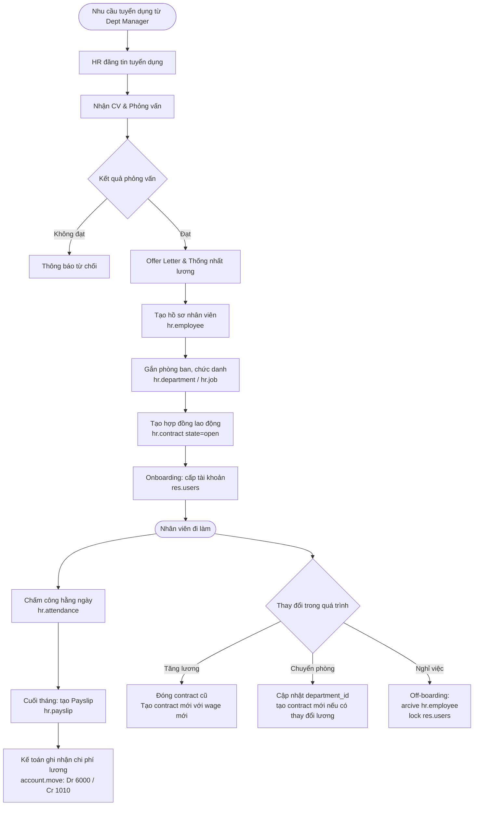
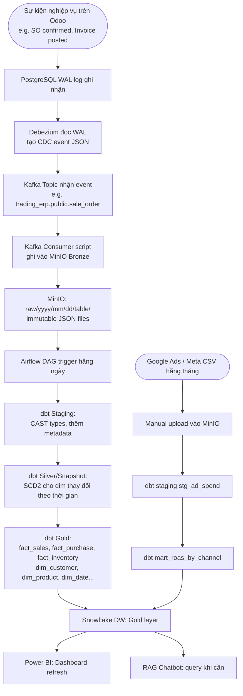

# FRD-07 — YÊU CẦU CHỨC NĂNG: NHÂN SỰ (HR)
## Superstore ERP · Phòng HR & Administration · Phiên bản 1.0 · 2026

---

## 1. Tổng quan phòng ban

**Sứ mệnh:** Duy trì hồ sơ nhân sự đầy đủ và chính xác cho 45 nhân viên; đảm bảo đúng người đúng chỗ với hợp đồng rõ ràng; hỗ trợ phân tích chi phí nhân sự và hiệu suất tổ chức.

**Nhân sự:** 1 HR Generalist — xử lý tuyển dụng, hợp đồng, onboarding, hồ sơ, off-boarding.

**Phạm vi module HR trong dự án này:**
- Quản lý hồ sơ nhân viên (hr.employee)
- Cơ cấu tổ chức (phòng ban, chức danh)
- Hợp đồng lao động và lịch sử thay đổi lương (hr.contract — nguồn dữ liệu SCD2!)
- Chấm công cơ bản (HR Attendance)
- Payslip đơn giản (lương cơ bản × số ngày công)

**KPI phòng:**

| KPI | Mục tiêu | Chu kỳ |
|---|---|---|
| Hồ sơ nhân viên cập nhật đầy đủ | 100% | Liên tục |
| Tỷ lệ biến động nhân sự (Turnover) | ≤ 15%/năm | Năm |
| Thời gian onboarding | ≤ 5 ngày làm việc từ ngày bắt đầu | Từng trường hợp |
| Hợp đồng hết hạn được gia hạn trước | 30 ngày trước hạn | Tháng |

---

## 2. Cấu trúc tổ chức trong Odoo

**Phòng ban (hr.department) — cây phân cấp:**
```
Superstore Inc.
├── Executive
├── Sales & CRM
│     └── West Region Sales
│     └── East Region Sales
│     └── Central Region Sales
│     └── South Region Sales
├── Marketing
├── Purchasing
├── Warehouse & Logistics
│     └── WH-WEST Team
│     └── WH-EAST Team
│     └── WH-CENTRAL Team
│     └── WH-SOUTH Team
├── Manufacturing
├── Accounting
├── HR & Administration
└── IT & Data
```

---

## 3. Sơ đồ luồng nghiệp vụ



---

## 4. SOP — Quy trình chuẩn

| Bước | Ai | Hành động | Trên Odoo | Bảng DB ghi | Kết quả |
|---|---|---|---|---|---|
| 1 | HR | Tạo hồ sơ nhân viên | HR → Employees → New | `hr_employee` INSERT | Hồ sơ tạo |
| 2 | HR | Gắn phòng ban & chức danh | Employee → Department / Job Position | `hr_employee.department_id`, `job_id` UPDATE | Vị trí xác định |
| 3 | HR | Tạo hợp đồng lao động | Employee → Contract → New | `hr_contract` INSERT (state=open) | Contract với wage |
| 4 | IT/Admin | Tạo tài khoản đăng nhập Odoo | Settings → Users → New | `res_users` INSERT | User gắn với employee |
| 5 | Supervisor | Chấm công hằng ngày | HR → Attendances → Check In/Out | `hr_attendance` INSERT | Giờ công ghi nhận |
| 6 | HR | Tạo payslip cuối tháng | HR → Payroll → Create Payslip Batch | `hr_payslip` INSERT | Lương draft |
| 7 | HR | Xác nhận payslip | Payslip → Confirm | `hr_payslip.state` = `done` | Lương đã duyệt |
| 8 | Accounting | Ghi sổ chi phí lương | (Journal entry từ payslip) | `account_move_line` | Dr 6000 Payroll / Cr 1010 |
| 9 | HR | Tăng lương: đóng contract cũ | Contract → Expiration date = ngày hôm nay | `hr_contract.state` = `close` | Contract cũ đóng |
| 10 | HR | Tạo contract mới | Contract → New với wage mới | `hr_contract` INSERT mới | Lịch sử lương SCD2 tự nhiên! |

---

## 5. Quy tắc nghiệp vụ

| Mã | Quy tắc | Chi tiết |
|---|---|---|
| BR-HR-01 | 1 nhân viên — nhiều contract | Tăng lương/chuyển phòng → đóng contract cũ, tạo mới — giữ toàn bộ lịch sử |
| BR-HR-02 | Contract trước khi làm | Nhân viên phải có contract active trước khi được tạo payslip |
| BR-HR-03 | Gia hạn trước 30 ngày | HR nhắc gia hạn contract 30 ngày trước khi hết hạn |
| BR-HR-04 | Lương tối thiểu | Không được tạo contract với wage < Federal Minimum Wage ($7.25/giờ) |
| BR-HR-05 | Archive khi nghỉ | Nhân viên nghỉ việc: archive hr.employee + lock res.users — dữ liệu lịch sử vẫn giữ |

---

## 6. Data Footprint

| Bảng DB | Vai trò | Loại |
|---|---|---|
| `hr_department` | Phòng ban | Master |
| `hr_job` | Chức danh | Master |
| `hr_employee` | Hồ sơ nhân viên | Master |
| `hr_contract` | Hợp đồng lao động (SCD2 tự nhiên!) | Transaction |
| `hr_attendance` | Chấm công | Transaction |
| `hr_payslip` | Phiếu lương | Transaction |

**Ghi chú SCD2:** Chuỗi `hr_contract` của một nhân viên qua các năm (thay đổi lương, ký lại HĐ) là ví dụ SCD2 (Slowly Changing Dimension Type 2) tự nhiên và đẹp nhất trong hệ thống — dùng để luyện `dbt snapshot`.

---
---

# FRD-08 — YÊU CẦU CHỨC NĂNG: DATA OPS & BI
## Superstore ERP · Phòng IT & Data · Phiên bản 1.0 · 2026

---

## 1. Tổng quan phòng ban

**Sứ mệnh:** Đảm bảo dòng dữ liệu từ ERP Odoo (PostgreSQL) chảy liên tục, chính xác và kịp thời đến data warehouse (Snowflake) và dashboard (Power BI) — biến dữ liệu vận hành thành insight cho ban lãnh đạo.

**Nhân sự:** 1 Data Analyst / Data Engineer (bạn — kiêm nhiệm IT + Data).

**Stack kỹ thuật:**

| Layer | Công nghệ | Vai trò |
|---|---|---|
| Source | Odoo 18 CE + PostgreSQL 16 | ERP + OLTP database |
| CDC | Debezium | Bắt mọi thay đổi DB theo thời gian thực |
| Message Queue | Apache Kafka | Trung chuyển CDC events |
| Data Lake (Bronze) | MinIO (S3-compatible) | Lưu raw events JSON — immutable |
| Orchestration | Apache Airflow | Lên lịch và điều phối pipeline |
| Transformation | dbt (data build tool) | Staging → Silver (SCD2) → Gold (Star Schema) |
| Data Warehouse | Snowflake | OLAP — lưu cleaned, modeled data |
| BI | Power BI | Dashboard cho ban lãnh đạo |
| RAG Chatbot | FastAPI + Qdrant + LLM | Chatbot trả lời câu hỏi nội bộ |
| Marketing External | MinIO (CSV ingest) | Ad spend data từ Google Ads / Meta |

---

## 2. Kiến trúc pipeline tổng thể

```
[Odoo/PostgreSQL] ──Debezium──► [Kafka] ──Consumer──► [MinIO Bronze]
                                                              │
                                                     [Airflow trigger]
                                                              │
                                                    ┌─────────────────┐
                                                    │  dbt pipeline   │
                                                    │ Staging (typed) │
                                                    │ Silver (SCD2)   │
                                                    │ Gold (Star)     │
                                                    └────────┬────────┘
                                                             │
                                                      [Snowflake DW]
                                                             │
                                              ┌──────────────┴──────────┐
                                              │                         │
                                        [Power BI]              [RAG Chatbot]
                                        Dashboard              Qdrant + LLM

[Google Ads / Meta CSV] ──ingest──► [MinIO] ──dbt──► [fact_ad_spend]
```

---

## 3. Sơ đồ luồng nghiệp vụ



---

## 4. SOP — Vận hành hằng ngày

| Thời điểm | Ai | Công việc | Công cụ | Kiểm tra |
|---|---|---|---|---|
| Liên tục | Hệ thống | Debezium → Kafka → MinIO chạy nền | Debezium connector | Kafka lag = 0; MinIO file count tăng |
| 02:00 AM hằng ngày | Airflow DAG | Trigger dbt run toàn bộ | Airflow scheduler | dbt run success; 0 test failures |
| Sáng sớm | Data Analyst | Kiểm tra Airflow dashboard | Airflow UI | Tất cả DAG runs = success |
| Sáng sớm | Data Analyst | Kiểm tra data quality alerts | dbt test + Slack | Không có test failure |
| Cuối tháng | Data Analyst | Ingest ad spend CSV từ Google/Meta | MinIO upload + dbt run | mart_roas cập nhật |
| Cuối tháng | Data Analyst | Refresh KPI Scorecard cho CFO/CEO | Power BI | Báo cáo tháng |
| Khi cần | Data Analyst | Tạo/sửa dbt model mới theo yêu cầu | VS Code + dbt | Model pass all tests |

---

## 5. Quy tắc Data Ops

| Mã | Quy tắc | Chi tiết |
|---|---|---|
| BR-DATA-01 | Bronze immutable | Không bao giờ sửa hoặc xóa file trong Bronze MinIO — đây là nguồn gốc sự thật |
| BR-DATA-02 | dbt test bắt buộc | Mọi model Gold phải có ít nhất: `not_null(PK)`, `unique(PK)`, `accepted_values(state)` |
| BR-DATA-03 | SCD2 cho dim thay đổi | dim_customer, dim_product price, dim_employee contract → dbt snapshot với dbt_valid_from/to |
| BR-DATA-04 | Gold layer: chỉ đọc | Không ai được sửa data trực tiếp trong Snowflake Gold. Mọi thay đổi qua nguồn Odoo |
| BR-DATA-05 | Alert khi pipeline fail | Airflow gửi Slack/email alert nếu DAG fail; on-call: Data Analyst xử lý trong 4h |
| BR-DATA-06 | Schema evolution | Khi Odoo cần upgrade hoặc custom thêm field → phải cập nhật dbt model tương ứng ngay |
| BR-DATA-07 | Không query trực tiếp Bronze | Analyst chỉ query Silver và Gold; Bronze chỉ dbt pipeline chạm vào |

---

## 6. Danh sách Dashboard Power BI

| Dashboard | Audience | Refresh | Nguồn dữ liệu chính |
|---|---|---|---|
| CEO Executive Scorecard | CEO, CFO | Hằng ngày | fact_sales, fact_journal_entries, fact_inventory_movement, fact_manufacturing, mart_executive_kpi |
| Sales Performance | Sales Director, Regional Mgr | Hằng ngày | fact_sales, dim_customer, dim_product ⚠️ (KHÔNG có crm_lead — bảng tồn tại nhưng 0 dòng, generator tạo thẳng sale_order không qua CRM lead/opportunity) |
| Inventory Overview | Warehouse Mgr | Hằng ngày | fact_inventory_movement, dim_warehouse, stock_quant, stock_warehouse_orderpoint |
| Manufacturing KPI **+ OEE** | Plant Manager, Production Planner | Hằng ngày | fact_manufacturing, **fact_manufacturing_oee**, dim_workcenter, stock_scrap |
| Marketing ROAS | Marketing Mgr | Hằng tháng | mart_roas_by_channel, fact_ad_spend, fact_sales, mailing_mailing/mailing_trace |
| Finance P&L | CFO, Chief Accountant | Hằng tháng | fact_journal_entries, account_account, account_journal |
| AR Aging | AR Specialist | Hằng ngày | **mart_ar_aging**, account_payment, account_move (out_invoice, posted) |
| HR Headcount | HR, CFO | Hàng tuần | dim_employee (SCD2), hr_department, hr_attendance, hr_payslip |

### 6.1. OEE — Gợi ý đánh giá hiệu quả sản xuất cho stakeholder

> Manufacturing KPI Dashboard bắt buộc phải tách riêng 3 chỉ số OEE (Availability × Performance × Quality) thay vì chỉ báo cáo Defect Rate/Plan Attainment chung chung — vì mỗi chỉ số trỏ đến 1 nguyên nhân gốc khác nhau, Plant Manager cần biết đang yếu ở đâu để hành động đúng chỗ.

| Chỉ số | Câu hỏi cho Plant Manager | Công thức | Nguồn | Ngưỡng cảnh báo |
|---|---|---|---|---|
| **Availability** | Máy có bị dừng vì sự cố (hỏng/chờ NVL/setup) không? | `SUM(duration) WHERE loss_type='productive'` ÷ `SUM(duration) WHERE loss_type IN ('productive','availability')` | `mrp_workcenter_productivity` (loss_type) | < 90% → điều tra work center |
| **Performance** | Khi chạy, có đúng tốc độ chuẩn không? | `MIN(duration_expected / duration, 1.0)`, cap 100% | `mrp_workorder` (duration, duration_expected) | < 85% → xem lại time_cycle_manual hoặc thao tác vận hành |
| **Quality** | Sản phẩm làm ra có đạt chuẩn không? | `(qty_produced − scrap_qty) / qty_produced` | `mrp_workorder` + `stock_scrap` | < 98.5% (defect > 1.5%) → điều tra ngay theo BR-MFG-05 |
| **OEE tổng** | Hiệu suất tổng thể so với world-class? | `Availability × Performance × Quality` | 3 nguồn trên | < 65% = Kém · 65–85% = Trung bình · ≥ 85% = World-class |

**Chart gợi ý cho dashboard**: 3 Gauge riêng biệt (Availability/Performance/Quality) + 1 Gauge OEE tổng theo Work Center (WC-CUT/WC-ASM/WC-QC) · Line trend OEE MoM · Bar Pareto nguyên nhân downtime (Material Availability/Equipment Failure/Setup and Adjustments) từ `mrp_workcenter_productivity_loss`.

⚠️ Bảng phế phẩm đúng tên là `stock_scrap` (model `stock.scrap`) — **KHÔNG phải `mrp_scrap`** (bảng này không tồn tại trong Odoo 18).

---

## 7. Data Footprint (Gold Layer Tables)

| Bảng Gold | Nguồn | Phục vụ Dashboard |
|---|---|---|
| `fact_sales` | `sale_order_line` | Sales Performance, CEO Scorecard |
| `fact_purchase` | `purchase_order_line` | Purchasing cost analysis |
| `fact_inventory_movement` | `stock_move` (done) | Inventory Overview |
| `fact_manufacturing` | `mrp_production`, `mrp_workorder` | Manufacturing KPI |
| `fact_manufacturing_oee` | `mrp_workcenter_productivity` (grain = 1 block, KHÔNG phải 1 work order) | Manufacturing KPI + OEE (mục 6.1) |
| `fact_journal_entries` | `account_move_line` | Finance P&L |
| `fact_ad_spend` | External CSV (Google/Meta) | Marketing ROAS |
| `dim_customer` | `res_partner` (SCD2) | Tất cả fact |
| `dim_product` | `product_product` + `product_template` | Tất cả fact |
| `dim_date` | Generated calendar | Tất cả fact |
| `dim_warehouse` | `stock_warehouse` | Inventory, Manufacturing |
| `dim_employee` | `hr_employee` + `hr_contract` (SCD2) | HR, Sales performance |
| `dim_workcenter` | `mrp_workcenter` | Manufacturing KPI + OEE |
| `mart_roas_by_channel` | fact_sales JOIN fact_ad_spend | Marketing |
| `mart_ar_aging` | Derived từ `fact_journal_entries` (`account_move`, `account_payment`) | AR Aging |
| `mart_executive_kpi` | Tổng hợp từ `fact_sales` + `fact_journal_entries` + `fact_inventory_movement` + `fact_manufacturing` | CEO Executive Scorecard |
