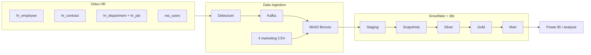
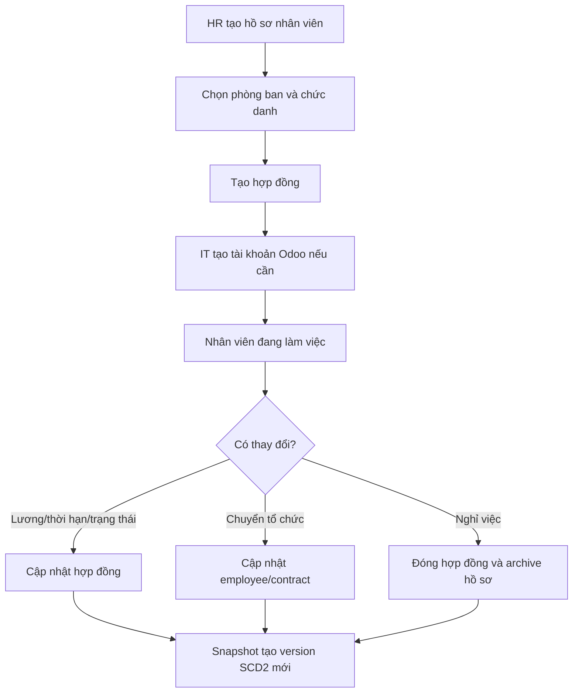
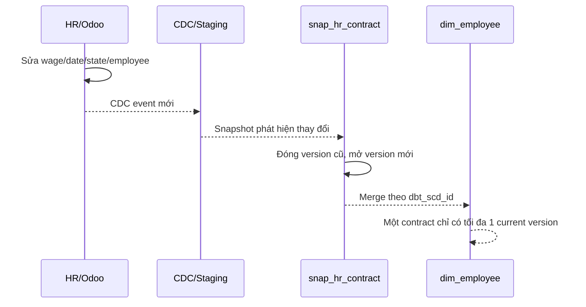
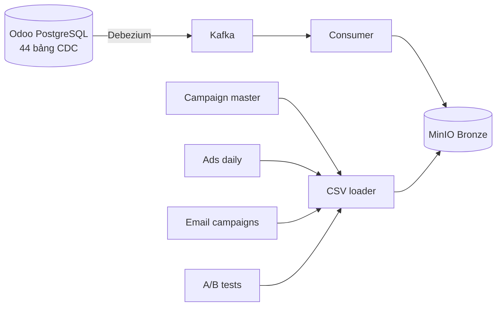

# FRD-07/08 — HR & DataOps

## 1. Mục tiêu

- HR quản lý đúng hồ sơ, tổ chức, tài khoản và lịch sử hợp đồng.
- DataOps đưa dữ liệu Odoo và marketing vào Snowflake mỗi ngày, có kiểm tra chất lượng
  trước khi BI sử dụng.
- Tài liệu này chỉ mô tả phạm vi **đã có trong pipeline hiện tại**.

## 2. Bức tranh tổng thể

## 3. HR — phạm vi và luồng nghiệp vụ

### 3.1 Vai trò

| Vai trò | Trách nhiệm |
|---|---|
| HR | Tạo/cập nhật `hr_employee`, `hr_contract`, phòng ban và chức danh. |
| Department Manager | Phê duyệt thay đổi vị trí hoặc hợp đồng. |
| IT/Admin | Tạo hoặc khóa `res_users`; không chia sẻ thông tin đăng nhập. |
| Data Engineer | Theo dõi CDC, Snapshot, Silver và Gold. |
| Data Analyst | Phân tích headcount, cơ cấu và lịch sử hợp đồng từ `dim_employee`. |

### 3.2 Dữ liệu HR hiện có

| Nguồn Odoo | Ý nghĩa | Đích phân tích |
|---|---|---|
| `hr_employee` | Hồ sơ nhân viên | Enrich `dim_employee` |
| `hr_contract` | Hợp đồng và thay đổi theo thời gian | `snap_hr_contract` → `dim_employee` SCD2 |
| `hr_department` | Phòng ban | Thuộc tính nhân viên |
| `hr_job` | Chức danh | Thuộc tính nhân viên |
| `res_users` | Liên kết user–employee | Khóa nối `user_id`; bí mật xác thực bị loại khỏi pipeline |

> Attendance và Payroll không nằm trong danh sách CDC hiện tại. Vì vậy dashboard không được
> công bố KPI chấm công hoặc payslip cho đến khi nguồn, model và test tương ứng được bổ sung.

### 3.3 Hợp đồng SCD2

Snapshot theo dõi: `employee_id`, `wage`, `date_start`, `date_end`, `state`, `is_deleted`.
Grain của `dim_employee` là **1 historical version của một `contract_id`**.

## 4. DataOps — pipeline production

### 4.1 Nguồn dữ liệu

- Odoo: 44 bảng nghiệp vụ theo allowlist trong `Debezium.py`.
- Marketing: 4 file CSV production; không dùng các file synthetic đã loại bỏ.
- Bronze ưu tiên append-only. Ngoại lệ bắt buộc: dữ liệu nhạy cảm cũ trong `res_users`
  được redact để xử lý sự cố bảo mật.

### 4.2 Thứ tự DAG hằng ngày

```mermaid
flowchart LR
    A[09:00 ICT] --> B[Configure Debezium]
    B --> C[Health check]
    C --> D[Reconcile campaign ID]
    D --> E[Load 4 CSV]
    E --> F[Kafka → MinIO]
    F --> G[MinIO → Snowflake Bronze]
    G --> H[dbt deps]
    H --> I[Staging + tests]
    I --> J[Snapshot + tests]
    J --> K[Silver + tests]
    K --> L[Gold + tests]
    L --> M[Mart + tests]
    M --> N[BI ready]
```

Nếu một bước hoặc test thất bại, các lớp sau không được chạy.

### 4.3 Trách nhiệm theo lớp

| Lớp | Làm gì | Quy tắc chính |
|---|---|---|
| Bronze | Giữ raw Parquet từ CDC/CSV | Có metadata nguồn; redaction bắt buộc cho secret. |
| Staging | Chuẩn hóa kiểu và metadata | Incremental append; deduplicate ở downstream. |
| Snapshot | Ghi lịch sử business entity | SCD2 cho partner, product template, HR contract. |
| Silver | Làm sạch, enrich, giữ version | Merge SCD2 theo version key; SCD1 dùng latest CDC. |
| Gold | Dimension và Fact đúng grain | Temporal join `[valid_from, valid_to)` bằng thời điểm Silver. |
| Mart | KPI sẵn dùng cho BI | Tính lại từ Fact/Dimension; không tham chiếu thẳng Staging/Silver. |

### 4.4 Sản phẩm phân tích hiện có

```mermaid
flowchart TB
    SALES[fact_sales] --> REV[mart_revenue_monthly]
    PURCHASE[fact_purchase] --> VENDOR[mart_vendor_performance]
    MOVE[fact_inventory_movement] --> DELIVERY[mart_delivery_performance]
    JE[fact_journal_entries] --> PNL[mart_pnl_monthly]
    INV[fact_customer_invoice] --> AR[mart_ar_aging]
    PAY[fact_payment_allocation] --> DSO[mart_dso_monthly]
    OEE[fact_manufacturing_oee] --> MOEE[mart_oee_by_workcenter_monthly]
    ADS[fact_ad_spend] --> ROAS[mart_roas_by_channel]
    SALES --> ROAS
    CAC[fact_customer_acquisition] --> ROAS
    EMAIL[fact_email_campaign] --> EMAILM[mart_email_performance]
```

| Nhóm báo cáo | Model chính |
|---|---|
| Sales | `fact_sales`, `mart_revenue_monthly` |
| Purchasing | `fact_purchase`, `mart_vendor_performance` |
| Inventory/Delivery | `fact_inventory_balance`, `fact_inventory_movement`, `mart_delivery_performance` |
| Manufacturing | `fact_manufacturing`, `fact_workorder`, `fact_manufacturing_oee`, `mart_oee_by_workcenter_monthly` |
| Finance | `fact_journal_entries`, `fact_customer_invoice`, `fact_payment_allocation`, `mart_pnl_monthly`, `mart_ar_aging`, `mart_dso_monthly` |
| Marketing | `fact_marketing_funnel`, `mart_roas_by_channel`, `mart_customer_acquisition`, `mart_email_performance` |
| HR | `dim_employee` SCD2 |

## 5. Quy tắc bắt buộc

| Mã | Quy tắc |
|---|---|
| BR-HR-01 | Không xóa lịch sử hợp đồng; thay đổi phải tạo/đóng version đúng hiệu lực. |
| BR-HR-02 | Mỗi `contract_id` và `user_id` chỉ có tối đa một current version. |
| BR-DATA-01 | Ghi nghiệp vụ qua Odoo UI/ORM; không ghi SQL trực tiếp vào Odoo. |
| BR-DATA-02 | Staging, Snapshot, Silver, Gold và Mart đều phải qua test trước khi BI refresh. |
| BR-DATA-03 | Fact giữ đúng grain; join dimension không được làm duplicate fact. |
| BR-DATA-04 | `gold_refreshed_at` chỉ là thời điểm pipeline, không phải hiệu lực business. |
| BR-DATA-05 | FastAPI dùng tài khoản PostgreSQL read-only và lấy `partner_id` từ JWT đã xác minh. |
| BR-DATA-06 | `res_users.password` và `totp_secret` bị chặn tại connector, consumer và loader. |

## 6. Xử lý ngoại lệ

| Tình huống | Hành động |
|---|---|
| Debezium/Kafka không healthy | Dừng ingest; sửa connector trước khi chạy dbt. |
| Campaign ID không tồn tại ở Odoo | Dừng trước bước CSV; Marketing sửa mapping. |
| dbt test thất bại | Không publish Mart; điều tra model hoặc nguồn. |
| SCD2 có nhiều current/overlap | Dừng Gold/Mart; sửa Snapshot/Silver và reprocess key bị ảnh hưởng. |
| Secret xuất hiện trong raw | Redact cả MinIO/Bronze cũ, xoay credential nếu cần và audit lại. |
| Snowflake không xác thực được | Không coi static parse là live success; sửa credential rồi chạy lại DAG. |

## 7. Tiêu chí nghiệm thu

- DAG chạy đúng 09:00 Asia/Ho_Chi_Minh và dừng khi upstream/test lỗi.
- 44 bảng CDC và 4 CSV đi đúng luồng đã mô tả.
- HR SCD2 không overlap, interval hợp lệ và tối đa một current version.
- Fact không duplicate sau join; Mart đúng grain và không đọc thẳng Staging/Silver.
- Không có `password` hoặc `totp_secret` trong dữ liệu phân tích.
- BI chỉ refresh sau khi toàn bộ dbt tests thành công.

## 8. Tài liệu vận hành chi tiết

- `docs/data_platform/operation.md`
- `docs/odoo/access_strategy.md`
- `docs/odoo/entity_map.md`
- `docs/data_platform/superstore-pipeline-3layer.drawio`
- `docs/data_platform/superstore_pipeline_lineage.drawio`
