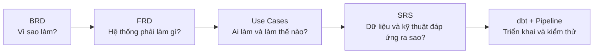
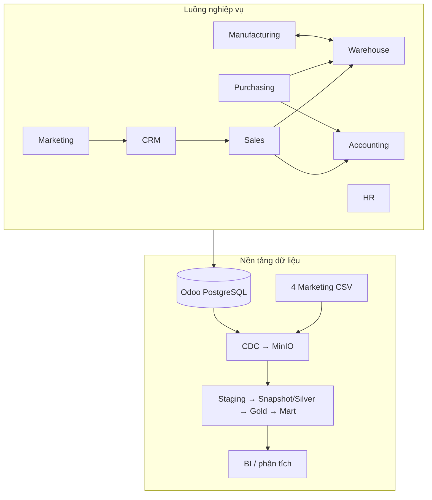

# Business Analysis — Bản đồ tài liệu

## Đọc từ đâu?

| Khi cần biết | Đọc tài liệu |
|---|---|
| Mục tiêu, phạm vi, stakeholder | `BRD-superstore.md` |
| Sales/CRM | `FRD-01-sales-crm.md` |
| Marketing | `FRD-02-marketing.md` |
| Purchasing | `FRD-03-purchasing.md` |
| Warehouse/Logistics | `FRD-04-warehouse.md` |
| Manufacturing/OEE | `FRD-05-manufacturing.md` |
| Accounting | `FRD-06-accounting.md` |
| HR và vận hành dữ liệu | `FRD-07-08-hr-dataops.md` |
| Luồng người dùng và kiểm thử tích hợp | `UC-superstore.md` |
| Phạm vi kỹ thuật, data contract, NFR | `SRS-superstore.md` |

## Dự án đang vận hành như thế nào?

## Bản đồ Business → Data Product

| Domain | Fact chính | Mart/KPI chính |
|---|---|---|
| Sales/CRM | `fact_sales`, `fact_crm_funnel` | `mart_revenue_monthly` |
| Marketing | `fact_ad_spend`, `fact_customer_acquisition`, `fact_marketing_funnel`, `fact_email_campaign` | `mart_roas_by_channel`, `mart_customer_acquisition`, `mart_email_performance` |
| Purchasing | `fact_purchase` | `mart_vendor_performance` |
| Warehouse | `fact_inventory_balance`, `fact_inventory_movement`, `fact_inventory_valuation` | `mart_delivery_performance` |
| Manufacturing | `fact_manufacturing`, `fact_workorder`, `fact_manufacturing_oee` | `mart_oee_by_workcenter_monthly` |
| Accounting | `fact_journal_entries`, `fact_customer_invoice`, `fact_payment_allocation` | `mart_pnl_monthly`, `mart_ar_aging`, `mart_dso_monthly` |
| HR | `dim_employee` SCD2 | Headcount và lịch sử hợp đồng |

## Quy ước đọc tài liệu

- Sơ đồ mô tả luồng chính; bảng ngay sau sơ đồ là các quy tắc và điểm kiểm soát.
- Tên `snake_case` là bảng hoặc model thật trong project.
- “Có trong Odoo” không đồng nghĩa “đã có trong pipeline”; Data Footprint của từng FRD mới là
  phạm vi dữ liệu đã được hỗ trợ.
- File Markdown là tài liệu BA đang được duy trì. Các file JSON cùng tên là bản xuất cũ và chỉ
  được dùng sau khi regenerate từ phiên bản Markdown hiện hành.
- Hai sơ đồ kỹ thuật chi tiết nằm tại:
  `docs/data_platform/superstore-pipeline-3layer.drawio` và
  `docs/data_platform/superstore_pipeline_lineage.drawio`.
