# SRS — ĐẶC TẢ YÊU CẦU HỆ THỐNG

## Superstore ERP & Data Platform · 2026

> **Chuẩn áp dụng:** IEEE 830-1998 Software Requirements Specification

---

## Thông tin tài liệu

| Thuộc tính    | Giá trị                                                  |
| ------------- | -------------------------------------------------------- |
| Tên tài liệu  | Software/System Requirements Specification (SRS)         |
| Dự án         | Superstore ERP & Data Platform                           |
| Ngày cập nhật | 2026                                                     |
| Audience      | Data Engineer, IT Admin, Developer, QA, System Architect |
| Trace về      | BRD (BO-01 → BO-08), FRD-01 → FRD-08                     |
| Tác giả       | BA/DE Team — Superstore Inc.                             |
| Trạng thái    | Draft / In Review                                        |

---

## Mục lục

1. Giới thiệu
2. Mô tả tổng thể hệ thống *(Sơ đồ 1 — System Architecture)*
3. Tính năng hệ thống — Yêu cầu chức năng
4. Yêu cầu giao diện ngoài
5. Yêu cầu phi chức năng
6. Ma trận truy vết

- Phụ lục A: Kiến trúc & Stack công nghệ
- Phụ lục B: Cấu hình Odoo chi tiết
- Phụ lục C: Data Dictionary *(Sơ đồ 2 — ERD, link `superstore-erd.drawio`)*
- Phụ lục D: Simulation Specification
- Phụ lục E: Data Pipeline Spec *(Sơ đồ 3 — Data Flow Bronze→Silver→Gold)*
- Phụ lục F: RAG Chatbot Spec
- Phụ lục G: Analytics & KPI Catalog (Sales · Customer · Production/OEE · Inventory · Accounting · HR)

---

## 1. Giới thiệu

### 1.1. Mục đích (Purpose)

Tài liệu này đặc tả đầy đủ các yêu cầu chức năng và phi chức năng của hệ thống **Superstore ERP & Data Platform** — một nền tảng tích hợp gồm ERP (Odoo 18), CDC Data Pipeline, Data Warehouse (Snowflake), BI Dashboard (Power BI), và RAG Chatbot.

Tài liệu nhắm đến các đối tượng sau:

- **Data Engineer / Developer:** Xây dựng pipeline, viết dbt models, tích hợp hệ thống
- **System Architect:** Thiết kế và đánh giá kiến trúc tổng thể
- **QA Engineer:** Viết test case dựa trên yêu cầu được đánh số
- **IT Admin:** Cấu hình, deploy, và vận hành hệ thống

### 1.2. Phạm vi (Scope)

**Tên hệ thống:** Superstore ERP & Data Platform

**Mô tả:** Hệ thống mô phỏng môi trường ERP production của một công ty bán lẻ B2B/B2C tại Mỹ (Superstore Inc.), kết hợp với data platform đầy đủ gồm: CDC pipeline, data warehouse lớp medallion, BI dashboard, và RAG chatbot nội bộ.

**Mục tiêu chính của hệ thống:**

- Vận hành toàn bộ chu trình kinh doanh (O2C, P2P, Manufacturing) trên Odoo 18
- Bắt toàn bộ thay đổi dữ liệu real-time từ PostgreSQL qua Debezium → Kafka
- Transform dữ liệu theo kiến trúc Medallion (Bronze → Staging → Silver → Gold)
- Cung cấp dashboard BI phục vụ phân tích CEO, Operations, Marketing
- Cung cấp RAG chatbot trả lời câu hỏi về chính sách, quy trình, sản phẩm

**Trong phạm vi (In Scope):**

- ERP: Sales, CRM, Marketing, Purchase, Inventory, Manufacturing, Accounting, HR
- CDC Pipeline: Debezium → Kafka → MinIO (Bronze)
- Data Transformation: Airflow + dbt (Staging → Silver → Gold → Mart)
- Data Warehouse: Snowflake
- BI: Power BI Desktop/Service
- AI: RAG Chatbot (Qdrant + sentence-transformers + Qwen 2.5)
- Data Generator: Script Python giả lập 4 năm dữ liệu lịch sử (2023–2026)

**Ngoài phạm vi (Out of Scope):**

- Ứng dụng mobile cho end-user
- Tích hợp với hệ thống thanh toán thực (real payment gateway)
- Triển khai ERP cho công ty thực tế (đây là môi trường portfolio/demo)
- Multi-language ERP (chỉ dùng English UI)

### 1.3. Định nghĩa và từ viết tắt

| Thuật ngữ / Viết tắt | Định nghĩa                                                                  |
| -------------------- | --------------------------------------------------------------------------- |
| ERP                  | Enterprise Resource Planning — Phần mềm quản lý nguồn lực doanh nghiệp      |
| CDC                  | Change Data Capture — Kỹ thuật bắt thay đổi dữ liệu real-time từ database   |
| WAL                  | Write-Ahead Log — Log ghi trước của PostgreSQL, nguồn dữ liệu cho Debezium  |
| O2C                  | Order-to-Cash — Chu trình từ tạo đơn hàng đến thu tiền                      |
| P2P                  | Procure-to-Pay — Chu trình từ đặt mua đến thanh toán nhà cung cấp           |
| MO                   | Manufacturing Order — Lệnh sản xuất trong Odoo                              |
| SO                   | Sales Order — Đơn hàng bán                                                  |
| PO                   | Purchase Order — Đơn hàng mua                                               |
| SCD2                 | Slowly Changing Dimension Type 2 — Kỹ thuật lưu lịch sử thay đổi dimension  |
| RRF                  | Reciprocal Rank Fusion — Thuật toán kết hợp kết quả tìm kiếm dense + sparse |
| RAG                  | Retrieval-Augmented Generation — Kỹ thuật kết hợp tìm kiếm văn bản với LLM  |
| BOM                  | Bill of Materials — Định mức nguyên vật liệu cho sản phẩm sản xuất          |
| OLTP                 | Online Transaction Processing — Database giao dịch (Odoo/PostgreSQL)        |
| OLAP                 | Online Analytical Processing — Database phân tích (Snowflake)               |
| COA                  | Chart of Accounts — Hệ thống tài khoản kế toán                              |
| ROAS                 | Return On Ad Spend — Hiệu quả chi tiêu quảng cáo                            |
| RFM                  | Recency, Frequency, Monetary — Framework phân khúc khách hàng               |
| Grain                | Mức độ chi tiết nhỏ nhất của một fact table (1 row tương ứng với gì)        |
| WH                   | Warehouse — Kho hàng                                                        |
| SKU                  | Stock Keeping Unit — Đơn vị lưu kho, mã sản phẩm                            |
| SLA                  | Service Level Agreement — Cam kết thời gian giao hàng                       |
| UTM                  | Urchin Tracking Module — Tham số tracking nguồn traffic marketing           |

### 1.4. Tài liệu tham chiếu

| Mã tài liệu | Tên tài liệu                                   | Phiên bản |
| ----------- | ---------------------------------------------- | --------- |
| BRD-SS      | Business Requirements Document — Superstore    | 1.0       |
| FRD-01      | Functional Requirements — Sales & CRM          | 1.0       |
| FRD-02      | Functional Requirements — Marketing & Campaign | 1.0       |
| FRD-03      | Functional Requirements — Purchase Management  | 1.0       |
| FRD-04      | Functional Requirements — Inventory Management | 1.0       |
| FRD-05      | Functional Requirements — Manufacturing        | 1.0       |
| FRD-06      | Functional Requirements — Accounting & Finance | 1.0       |
| FRD-07      | Functional Requirements — Human Resources      | 1.0       |
| FRD-08      | Functional Requirements — BI & Analytics       | 1.0       |
| UC-SS       | Use Case Document — Superstore                 | 1.0       |
| IEEE 830    | IEEE Recommended Practice for SRS              | 1998      |
| BABOK v3    | Business Analysis Body of Knowledge            | 3.0       |

### 1.5. Tổng quan tài liệu

Tài liệu được tổ chức theo chuẩn IEEE 830 gồm 6 phần chính:

- **Section 1** (Giới thiệu): Mục đích, phạm vi, định nghĩa, tài liệu tham chiếu
- **Section 2** (Mô tả tổng thể): Góc nhìn hệ thống, phân loại người dùng, môi trường vận hành, ràng buộc thiết kế
- **Section 3** (Tính năng hệ thống): Yêu cầu chức năng có đánh số, trace về FRD
- **Section 4** (Giao diện ngoài): UI, hardware, software, communications
- **Section 5** (Yêu cầu phi chức năng): Performance, Security, Scalability, Availability, Data Quality
- **Section 6** (Traceability Matrix): Bảng truy vết BRD → FRD → SRS
- **Phụ lục A–F**: Đặc tả kỹ thuật chi tiết (config, schema, pipeline spec)
- **Phụ lục G**: Catalog KPI phân tích đầy đủ 7 mảng (Sales, Customer/RFM, Production/OEE, Inventory, Accounting, HR, Marketing) — công thức đã kiểm chứng trên dữ liệu thật, kèm các gotcha thực tế phát hiện khi xây dựng

---

## 2. Mô tả tổng thể hệ thống (Overall Description)

### 2.1. Góc nhìn hệ thống (Product Perspective)

Superstore ERP & Data Platform **không phải là hệ thống độc lập** — đây là một **data ecosystem** gồm nhiều subsystem tích hợp với nhau:

```
┌─────────────────────────────────────────────────────────────┐
│                   SUPERSTORE DATA ECOSYSTEM                 │
│                                                             │
│  ┌──────────────┐    CDC     ┌──────────────────────────┐  │
│  │  Odoo 18 ERP │ ─────────▶ │  Data Platform           │  │
│  │  (PostgreSQL)│  Debezium  │  Kafka → MinIO → dbt     │  │
│  └──────────────┘  → Kafka   │  → Snowflake (Gold)      │  │
│                              └────────────┬─────────────┘  │
│  ┌──────────────┐                         │                 │
│  │  Data Gen    │ ──XML-RPC──▶ Odoo       │ Direct query   │
│  │  (Python)    │                         ▼                 │
│  └──────────────┘            ┌──────────────────────────┐  │
│                              │  Power BI Dashboard       │  │
│  ┌──────────────┐            └──────────────────────────┘  │
│  │  RAG Chatbot │◀── Corpus (JSON chunks từ tài liệu) ──   │
│  │  (FastAPI +  │                                           │
│  │   Qdrant)    │                                           │
│  └──────────────┘                                           │
└─────────────────────────────────────────────────────────────┘
```

**Sơ đồ 1 — System Architecture (luồng dữ liệu end-to-end):**

```mermaid
flowchart LR
    A["Odoo 18<br/>(PostgreSQL)"] -->|WAL / pgoutput| B["Debezium<br/>(Kafka Connect)"]
    B -->|CDC events| C["Kafka<br/>Topics"]
    C --> D["MinIO<br/>Bronze (raw JSON)"]
    D --> E["Airflow<br/>DAG"]
    E --> F["dbt models<br/>(Staging → Silver → Gold)"]
    F --> G["Snowflake<br/>Gold Layer"]
    G --> H["Power BI<br/>Dashboard"]

    style A fill:#e6f1fb,stroke:#185FA5
    style B fill:#faeeda,stroke:#854F0B
    style C fill:#faeeda,stroke:#854F0B
    style D fill:#eaf3de,stroke:#3B6D11
    style E fill:#fcebeb,stroke:#A32D2D
    style F fill:#fcebeb,stroke:#A32D2D
    style G fill:#eaf3de,stroke:#3B6D11
    style H fill:#eeedfe,stroke:#534AB7
```

Hệ thống giao tiếp với các thành phần bên ngoài:

- **Người dùng (Internal):** Nhân viên sales, kế toán, kho, sản xuất → dùng Odoo Web UI
- **Analyst/Manager:** Dùng Power BI dashboard để ra quyết định
- **Developer/DE:** Tương tác qua CLI, Airflow UI, dbt CLI, Qdrant API
- **RAG Chatbot User:** Nhân viên nội bộ hỏi đáp qua chatbot interface

### 2.2. Chức năng hệ thống (Product Functions)

Hệ thống thực hiện các nhóm chức năng chính:

**Nhóm 1 — ERP Operations (Odoo 18):**

- Quản lý vòng đời đơn hàng bán (O2C): Quotation → SO → Delivery → Invoice → Payment
- Quản lý mua hàng (P2P): RFQ → PO → Receipt → Vendor Bill → Payment
- Quản lý sản xuất: MO → Work Orders → Finished Goods → Delivery
- Quản lý kho: 4 kho khu vực, tồn kho, kiểm kê định kỳ
- Kế toán: Ghi nhận doanh thu, COGS, AR/AP, báo cáo tài chính
- Nhân sự: Hồ sơ nhân viên, hợp đồng, chấm công, bảng lương
- Marketing: Email campaigns, UTM tracking, lead management

**Nhóm 2 — Data Platform:**

- CDC real-time: Bắt thay đổi từ 9 bảng Odoo → Kafka topics
- Bronze layer: Lưu raw events vào MinIO (JSON, partitioned by date)
- Staging: Cast types, rename columns, loại bỏ duplicates
- Silver: SCD2 dimensions (Customer, Product, Employee)
- Gold: Star Schema fact tables (Sales, Purchase, Inventory, Manufacturing, Finance, Ad Spend)
- Mart: Aggregated views phục vụ BI (ROAS, RFM scores)
- Orchestration: Airflow DAGs lên lịch toàn bộ pipeline

**Nhóm 3 — Analytics & BI:**

- Dashboard CEO: KPIs tổng quan — Revenue, Gross Profit, ROAS, headcount
- Dashboard Operations: On-time delivery, inventory turnover, production efficiency
- Dashboard Marketing: Campaign performance, ROAS by channel, CLV
- Dashboard Finance: P&L, AR aging, cash flow trends
- RFM Segmentation: Phân khúc khách hàng theo Recency/Frequency/Monetary

**Nhóm 4 — RAG Chatbot:**

- Trả lời câu hỏi về chính sách, quy trình, sản phẩm từ corpus tài liệu nội bộ
- Hybrid search (dense + BM25 sparse) với CrossEncoder reranking
- LLM generation via Qwen 2.5 local

**Nhóm 5 — Data Simulation Engine:**

- Tạo dữ liệu lịch sử 4 năm (2023–2026) với quy mô ×50 dataset gốc
- Giả lập imperfection có chủ đích (dữ liệu bẩn, trễ SLA, margin âm)
- Live simulator từ 2027 (daily cron job)

### 2.3. Phân loại người dùng (User Classes & Characteristics)

| Nhóm người dùng     | Mô tả                                        | Trình độ kỹ thuật | Tần suất dùng | Quyền hạn chính                  |
| ------------------- | -------------------------------------------- | ----------------- | ------------- | -------------------------------- |
| **Sales Rep**       | Nhân viên kinh doanh tạo và quản lý SO       | Thấp              | Hàng ngày     | Create/Edit SO, View Customer    |
| **Sales Manager**   | Quản lý xét duyệt SO, quản lý team           | Trung bình        | Hàng ngày     | Approve SO, View Reports         |
| **Warehouse Staff** | Nhân viên kho xử lý picking/packing/shipping | Thấp              | Hàng ngày     | Validate Delivery, Inventory Adj |
| **Purchaser**       | Tạo và theo dõi PO, làm việc với NCC         | Trung bình        | Hàng ngày     | Create/Confirm PO, Receive Goods |
| **Accountant**      | Xử lý hóa đơn, thanh toán, báo cáo tài chính | Trung bình        | Hàng ngày     | Full Accounting, No ERP Config   |
| **HR Manager**      | Quản lý nhân sự, hợp đồng, bảng lương        | Trung bình        | Hàng tuần     | Full HR, View Attendance         |
| **Production Mgr**  | Tạo MO, quản lý Work Center                  | Trung bình        | Hàng ngày     | Create/Confirm MO, View BOM      |
| **BI Analyst**      | Xem và khai thác dashboard Power BI          | Cao (nghiệp vụ)   | Hàng ngày     | Read-only Power BI, Export       |
| **Data Engineer**   | Build/maintain pipeline, dbt, Airflow        | Rất cao           | Hàng ngày     | Full access to platform          |
| **IT Admin**        | Config Odoo, manage servers, Docker          | Cao               | Hàng tuần     | Odoo Admin, Server root          |
| **Chatbot User**    | Nhân viên hỏi đáp qua RAG chatbot            | Thấp              | Linh hoạt     | Query chatbot, View answers      |

### 2.4. Môi trường vận hành (Operating Environment)

#### Development Environment

| Thành phần | Spec                            |
| ---------- | ------------------------------- |
| Hardware   | MacBook Pro M-series            |
| OS         | macOS (latest)                  |
| Container  | Docker Desktop / Docker Compose |
| Python     | 3.11+                           |
| Node.js    | 18+ (build tools)               |

#### Production Environment

| Thành phần    | Spec                                    |
| ------------- | --------------------------------------- |
| Server        | Contabo VPS (hoặc Cloud VM tương đương) |
| OS            | Ubuntu 22.04 LTS                        |
| Container     | Docker Compose (production profile)     |
| CI/CD         | GitHub Actions                          |
| Reverse Proxy | Nginx                                   |

#### Network & Port Map (Dev)

| Service                  | Port | Ghi chú                     |
| ------------------------ | ---- | --------------------------- |
| Odoo Web                 | 8069 | `http://localhost:8069`     |
| PostgreSQL               | 5432 | Odoo + DBeaver              |
| Kafka Broker             | 9092 | Internal broker             |
| Kafka Connect (Debezium) | 8083 | REST API register connector |
| MinIO Console            | 9001 | Web UI quản lý bucket       |
| MinIO API                | 9000 | boto3/mc client             |
| Airflow Web UI           | 8080 | DAG management              |
| Qdrant REST API          | 6333 | Vector search               |
| FastAPI (RAG)            | 8000 | Chatbot API                 |
| LM Studio (Qwen 2.5)     | 1234 | Local LLM inference server  |

### 2.5. Ràng buộc thiết kế và triển khai (Design & Implementation Constraints)

**Ràng buộc bắt buộc (không thể thay đổi):**

- **ERP Platform:** Phải dùng Odoo Community 18.0 — không dùng Enterprise edition
- **OLTP Database:** PostgreSQL 16 (do Odoo yêu cầu) — không thay thế bằng DB khác
- **CDC Plugin:** Sử dụng `pgoutput` plugin của PostgreSQL (không dùng `wal2json` hay `decoderbufs`)
- **Data Warehouse:** Snowflake — không thay thế bằng BigQuery hay Redshift
- **LLM:** Qwen 2.5 chạy local qua LM Studio — không gọi OpenAI API (cost constraint)
- **Embedding Model:** `sentence-transformers/all-MiniLM-L6-v2` (vector size = 768)
- **Currency:** USD, thiết lập TRƯỚC KHI có bất kỳ journal entry nào

**Ràng buộc kỹ thuật:**

- Toàn bộ service chạy trên Docker Compose — không deploy bare-metal
- dbt Core (không dùng dbt Cloud) — transform chạy local/VPS
- Data Generator giao tiếp với Odoo chỉ qua XML-RPC (không direct SQL INSERT)
- Không có custom Odoo module — chỉ dùng standard modules

**Ràng buộc dữ liệu:**

- Dataset gốc: Superstore Sales Dataset (Kaggle) — 9,994 rows, 2014–2017
- Backfill data: Scale ×50, dịch thời gian +9 năm (2014→2023, 2017→2026)
- Imperfection catalog phải được giả lập đúng tỷ lệ đã định nghĩa (xem Phụ lục D)

### 2.6. Giả định và phụ thuộc (Assumptions & Dependencies)

**Giả định:**

- Odoo 18 Community có thể cài đặt thành công trên môi trường dev (macOS M-series + Docker)
- PostgreSQL WAL level được set là `logical` — đây là điều kiện bắt buộc để Debezium hoạt động
- Snowflake trial hoặc account có sẵn với đủ credit cho khối lượng dữ liệu portfolio
- LM Studio có thể chạy Qwen 2.5 7B với RAM ≥ 16GB
- Superstore dataset Kaggle không có license hạn chế việc dùng cho portfolio

**Phụ thuộc ngoài:**

| Phụ thuộc             | Version yêu cầu | Rủi ro nếu không đáp ứng                              |
| --------------------- | --------------- | ----------------------------------------------------- |
| Odoo Community 18.0   | 18.0 chính xác  | Breaking changes với 17.x (JSONB translatable fields) |
| Debezium PostgreSQL   | Latest stable   | Connector config có thể thay đổi theo minor version   |
| Apache Kafka          | 3.x             | KRaft mode thay thế Zookeeper từ 3.3+                 |
| dbt Core              | 1.x             | Snowflake adapter phải match dbt version              |
| sentence-transformers | Latest          | Model checkpoint có thể thay đổi output dimension     |

---

## 3. Tính năng hệ thống — Yêu cầu chức năng (System Features)

> **Ghi chú:** Mỗi System Feature (SF) ở đây là tổng hợp từ FRD tương ứng. Chi tiết từng FR (FR-001, FR-002...) xem tại tài liệu FRD-01 đến FRD-08. Các SF ở đây focus vào **yêu cầu kỹ thuật của hệ thống** cần đáp ứng để FRD được thực thi.

---

### SF-01 | Quản lý bán hàng & CRM (trace: FRD-01, BO-01)

**Mô tả:** Hệ thống phải hỗ trợ toàn bộ chu trình O2C từ Lead đến Payment.

**Ưu tiên:** Cao

**Sequence (Happy Path):**

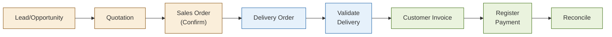

**Yêu cầu kỹ thuật:**

| Mã       | Yêu cầu                                                                                                                     |
| -------- | --------------------------------------------------------------------------------------------------------------------------- |
| SF-01-01 | Hệ thống phải tự động tạo Delivery Order khi SO được confirm                                                                |
| SF-01-02 | Hệ thống phải áp dụng đúng Credit Terms theo Customer Segment (Consumer: immediate, Corporate: Net-30, Home Office: Net-15) |
| SF-01-03 | Hệ thống phải block confirm SO nếu tồn kho không đủ (nếu route = MTO)                                                       |
| SF-01-04 | SO đã confirm phải bị lock — không cho phép sửa order line; chỉ được tạo amendment mới                                      |
| SF-01-05 | Discount áp dụng ở line level (%), hiển thị cột discount trên SO form                                                       |
| SF-01-06 | Hệ thống phải ghi nhận UTM source/medium/campaign cho mỗi lead từ marketing                                                 |
| SF-01-07 | Sales warning phải hiển thị nếu customer có công nợ quá hạn                                                                 |
| SF-01-08 | Hệ thống phải hỗ trợ đơn hủy sau confirm với lý do; đơn hủy tạo reverse entry kế toán                                       |

**Acceptance Criteria:**

- Tạo được SO → xác nhận → tạo Delivery → xác nhận giao hàng → tạo Invoice → đăng ký thanh toán — toàn bộ trong một luồng không bị lỗi
- Discount 15% trên SO line được reflect đúng trong Invoice và kế toán
- SO lock sau khi confirm, không cho edit order line

---

### SF-02 | Marketing & Campaign Management (trace: FRD-02, BO-02)

**Mô tả:** Hệ thống phải hỗ trợ email marketing với tracking UTM và đo lường ROAS.

**Ưu tiên:** Trung bình

**Yêu cầu kỹ thuật:**

| Mã       | Yêu cầu                                                                                   |
| -------- | ----------------------------------------------------------------------------------------- |
| SF-02-01 | Hệ thống phải lưu UTM source, medium, campaign cho mỗi lead được tạo từ campaign          |
| SF-02-02 | Hệ thống phải track email open rate và click rate cho mass mailing campaigns              |
| SF-02-03 | Ad spend data phải được import từ external source (CSV/API) vào hệ thống với format chuẩn |
| SF-02-04 | ROAS = Revenue attributed / Ad spend phải tính được ở cấp độ campaign và channel          |
| SF-02-05 | Mỗi năm phải có ít nhất 1 Facebook campaign với ROAS < 1.5 (imperfection catalog)         |

**Acceptance Criteria:**

- Lead tạo từ email campaign có UTM được ghi đúng source/medium/campaign
- Ad spend import thành công và tính ROAS đúng công thức

---

### SF-03 | Quản lý mua hàng (trace: FRD-03, BO-03)

**Mô tả:** Hệ thống phải hỗ trợ chu trình P2P đầy đủ.

**Ưu tiên:** Cao

**Sequence:**

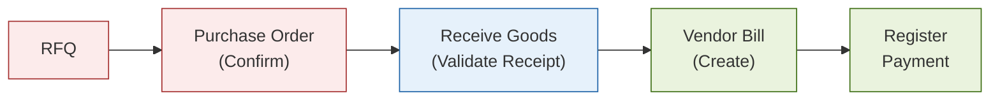

**Yêu cầu kỹ thuật:**

| Mã       | Yêu cầu                                                                                  |
| -------- | ---------------------------------------------------------------------------------------- |
| SF-03-01 | Hệ thống phải tự động tạo Receipt (incoming shipment) khi PO được confirm                |
| SF-03-02 | Giá mua (unit price) trên PO line phải sử dụng `standard_price` từ product               |
| SF-03-03 | Hệ thống phải ghi nhận scheduled_date trên Receipt để tính on-time delivery của NCC      |
| SF-03-04 | 10% PO phải có actual receipt date trễ hơn scheduled date (imperfection — xem Phụ lục D) |
| SF-03-05 | Vendor Bill phải được match với PO receipt trước khi post                                |
| SF-03-06 | Mỗi sub-category sản phẩm phải được gán ít nhất 1 nhà cung cấp                           |

**Acceptance Criteria:**

- PO confirm → Receipt tự động tạo → Validate receipt → Vendor Bill tạo đúng amount
- Cột scheduled_date và actual date đều có giá trị để tính late delivery %

---

### SF-04 | Quản lý kho (trace: FRD-04, BO-04)

**Mô tả:** Hệ thống phải quản lý 4 kho khu vực với đầy đủ tính năng kiểm kê và điều chuyển.

**Ưu tiên:** Cao

**Region → Warehouse Routing:**

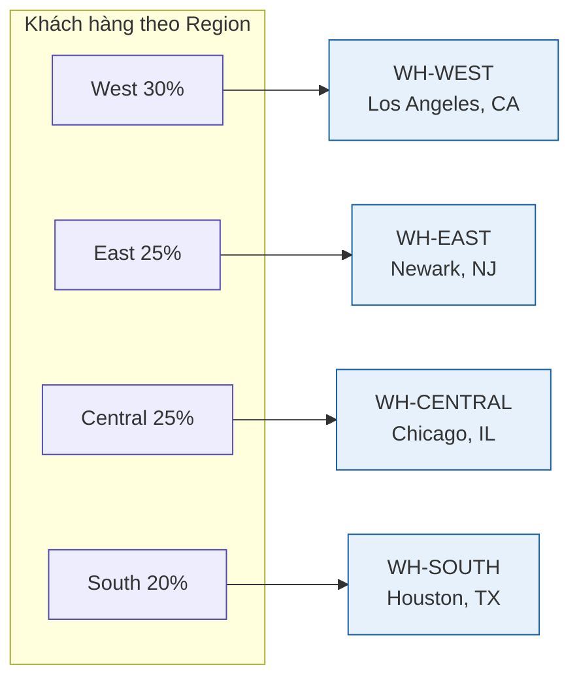

⚠️ Demand-driven replenishment (P2P/Manufacturing) PHẢI route đúng theo Region này — nếu gộp nhu cầu company-wide rồi giao ngẫu nhiên về 1 kho sẽ gây tồn kho âm (xem gotcha Phụ lục G.4).

**Yêu cầu kỹ thuật:**

| Mã       | Yêu cầu                                                                                               |
| -------- | ----------------------------------------------------------------------------------------------------- |
| SF-04-01 | Hệ thống phải có đúng 4 kho: WH-WEST (LA), WH-EAST (Newark), WH-CENTRAL (Chicago), WH-SOUTH (Houston) |
| SF-04-02 | Tồn kho đầu kỳ (Jan 2023) phải được nạp = safety_stock × 4 tuần tiêu thụ trung bình của từng SKU      |
| SF-04-03 | Đơn hàng phải được giao từ đúng kho phục vụ Region (West→WH-WEST, East→WH-EAST, v.v.)                 |
| SF-04-04 | Kiểm kê định kỳ (quarterly) phải tạo inventory adjustment với ±2% sai lệch (WH-CENTRAL cao hơn)       |
| SF-04-05 | Hệ thống phải hỗ trợ stock move giữa các kho (internal transfer)                                      |
| SF-04-06 | Mỗi stock_move (done) phải tạo 1 bản ghi trong Kafka topic để CDC bắt                                 |

**Acceptance Criteria:**

- On-hand quantity tại mỗi kho khớp với tổng stock_move IN - OUT
- Inventory adjustment posting tạo đúng journal entry

---

### SF-05 | Quản lý sản xuất & OEE (trace: FRD-05, BO-04)

**Mô tả:** Hệ thống phải hỗ trợ Manufacturing Order với BOM, Work Order, và đo lường hiệu suất thiết bị (OEE) đầy đủ 3 chiều Availability/Performance/Quality dùng sổ OEE gốc của Odoo (`mrp.workcenter.productivity`) — không tự chế bảng mới.

**Ưu tiên:** Cao

**Sequence (Happy Path, gồm cả OEE):**

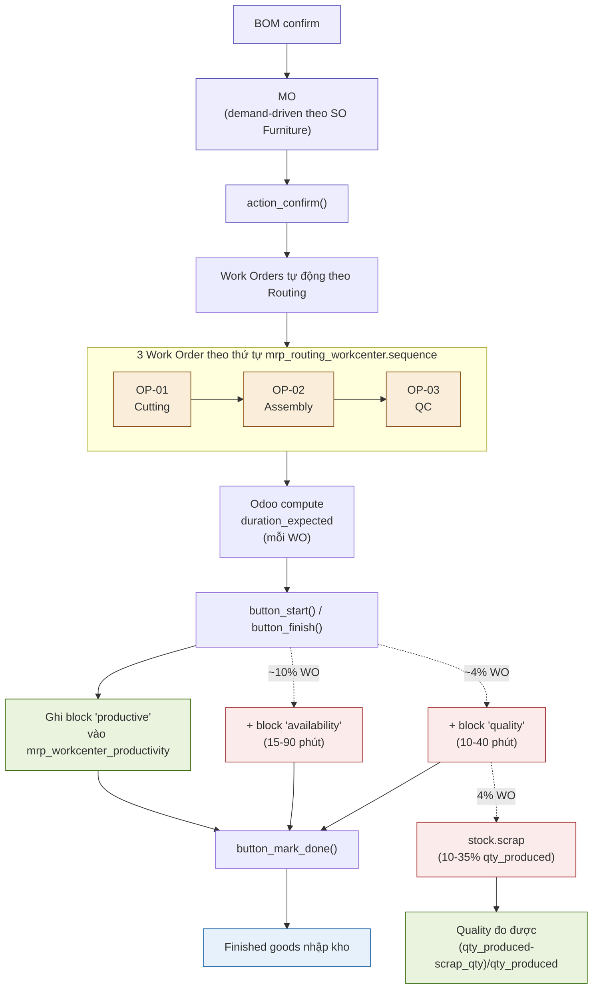

**Yêu cầu kỹ thuật — Manufacturing cơ bản:**

| Mã       | Yêu cầu                                                                                                                                                                 |
| -------- | ----------------------------------------------------------------------------------------------------------------------------------------------------------------------- |
| SF-05-01 | Phải có ít nhất 5 BOM mẫu cho Furniture category, mỗi BOM có 3–6 components                                                                                             |
| SF-05-02 | MO phải được tạo đủ số lượng để fulfill SO Furniture (demand-driven theo sale_order_line đã bán, không lịch cố định)                                                    |
| SF-05-03 | Mỗi MO phải có đúng 3 Work Order theo Routing (OP-01: Cutting → OP-02: Assembly → OP-03: QC), thứ tự theo `mrp_routing_workcenter.sequence`                             |
| SF-05-04 | Khi MO hoàn thành (`button_mark_done()`), finished goods phải được nhập kho tự động                                                                                     |
| SF-05-05 | Component consumption phải tạo stock_move (`raw_material_production_id` liên kết MO), số lượng = `product_qty × BOM ratio` (tuyến tính, không làm tròn theo chu kỳ máy) |
| SF-05-06 | 3 Work Centers phải có capacity cụ thể: WC-CUT (`default_capacity=2`), WC-ASM (`default_capacity=3`), WC-QC (`default_capacity=1`) — xem Phụ lục B                      |

**Yêu cầu kỹ thuật — OEE (Overall Equipment Effectiveness):**

| Mã       | Yêu cầu                                                                                                                                                                                                                                                                                                                                                                                    |
| -------- | ------------------------------------------------------------------------------------------------------------------------------------------------------------------------------------------------------------------------------------------------------------------------------------------------------------------------------------------------------------------------------------------ |
| SF-05-07 | `mrp_workorder.duration_expected` PHẢI là compute field của Odoo (KHÔNG set tay): `CEIL(qty_producing / workcenter.default_capacity) × operation.time_cycle_manual × 100/workcenter.time_efficiency` — tự động chạy lúc `action_confirm()` tạo work order                                                                                                                                  |
| SF-05-08 | `mrp_workorder.duration` (thời gian thực tế) PHẢI mô phỏng đúng cơ chế "bấm giờ tại xưởng" của Odoo (tổng các block `mrp_workcenter_productivity` loss_type='productive') — KHÔNG được tính bằng `date_finished − date_start` (2 giá trị này LỆCH nhau khi WO có block sự cố trước productive, ~14% WO)                                                                                    |
| SF-05-09 | Hệ thống phải ghi Availability-loss block (~10% work order, 15–90 phút/lần, chọn ngẫu nhiên 1 trong 3 lý do native của Odoo: Material Availability / Equipment Failure / Setup and Adjustments) vào `mrp_workcenter_productivity` loss_type='availability'                                                                                                                                 |
| SF-05-10 | Hệ thống phải ghi Quality-loss block (~4% work order, 10–40 phút/lần, lý do Process Defect / Reduced Yield) vào `mrp_workcenter_productivity` loss_type='quality', VÀ tạo kèm bản ghi `stock.scrap` (scrap_qty = 10–35% qty_produced của WO đó) để Quality đo được theo SỐ LƯỢNG, không chỉ theo thời gian                                                                                 |
| SF-05-11 | Performance PHẢI cap tại 100% khi work order chạy nhanh hơn kế hoạch (`duration < duration_expected`) — không để OEE tổng vượt 100% (verify: cap kéo trung bình Performance từ 90.0%→87.7%, chênh lệch có ý nghĩa thống kê, bắt buộc giữ)                                                                                                                                                  |
| SF-05-12 | Availability PHẢI tính theo `SUM(productive)/SUM(productive+availability_loss)` — CHỈ 2/4 `loss_type`, KHÔNG cộng `quality`/`performance` vào mẫu số, và KHÔNG dùng giả định lịch ca cố định (`planned_time = số_ca × 480 phút` chỉ đúng nếu số_ca xác định đúng theo tháng nhu cầu cao nhất từng work center — nếu sai sẽ ra Availability >100%, đã từng xảy ra với giả định "1 ca/ngày") |
| SF-05-13 | Defect rate tổng công ty (`SUM(scrap_qty)/SUM(qty_produced)`) phải đạt target < 1.5%                                                                                                                                                                                                                                                                                                       |

**Acceptance Criteria:**

- MO confirm → Work Orders tạo đúng sequence 3 bước → Validate → Finished goods tăng tồn kho
- Component stock giảm đúng với BOM quantity khi MO hoàn thành
- `duration_expected` tính tay bằng công thức SF-05-07 phải khớp 100% với giá trị Odoo lưu (đã verify thực tế trên MO mẫu: `CEIL(26/2)×45×100/100 = 585` phút, khớp đúng cột DB)
- Availability tính theo SF-05-12 phải nằm trong khoảng 95–100% (phản ánh đúng ~10% WO có downtime theo thiết kế, verify thực tế: 98.5–99.2%)
- Defect rate thực đo phải < 1.5% (verify thực tế: 0.96%)
- `stock_scrap` KHÔNG được nhầm với `mrp_scrap` (bảng này không tồn tại trong Odoo 18)

---

### SF-06 | Kế toán & Tài chính (trace: FRD-06, BO-06)

**Mô tả:** Hệ thống phải ghi nhận đầy đủ journal entries theo US GAAP cho mọi giao dịch.

**Ưu tiên:** Cao

**Yêu cầu kỹ thuật:**

| Mã       | Yêu cầu                                                                                   |
| -------- | ----------------------------------------------------------------------------------------- |
| SF-06-01 | COA phải dùng US GAAP chart of accounts (import từ localization hoặc CSV)                 |
| SF-06-02 | Mỗi Invoice posted phải tạo journal entry: DR Accounts Receivable / CR Revenue            |
| SF-06-03 | Mỗi Payment registered phải reconcile với Invoice và tạo entry: DR Cash / CR AR           |
| SF-06-04 | COGS phải được ghi nhận tự động khi Delivery validate (DR COGS / CR Inventory)            |
| SF-06-05 | Debit phải luôn bằng Credit trên mỗi journal entry (invariant)                            |
| SF-06-06 | 10% hóa đơn B2B phải có payment overdue > due date (bad payers — tập trung 5–6 Corporate) |
| SF-06-07 | Hệ thống phải lock posted journal entries (hash lock)                                     |
| SF-06-08 | Fiscal year: January → December                                                           |

**Acceptance Criteria:**

- `assert_debit_equals_credit.sql` (dbt test) pass cho toàn bộ `fact_journal_entries`
- AR aging report hiển thị đúng số ngày quá hạn cho các bad payer accounts

---

### SF-07 | Nhân sự & Lương (trace: FRD-07, BO-07)

**Mô tả:** Hệ thống phải quản lý 45 nhân viên với hợp đồng và lịch sử tăng lương.

**Ưu tiên:** Thấp

**Yêu cầu kỹ thuật:**

| Mã       | Yêu cầu                                                                                                |
| -------- | ------------------------------------------------------------------------------------------------------ |
| SF-07-01 | Phải có đúng 45 hồ sơ nhân viên (tên US giả lập), phân theo phòng ban và kho                           |
| SF-07-02 | Mỗi nhân viên phải có ít nhất 1 hợp đồng lao động với lương cơ bản                                     |
| SF-07-03 | Mỗi nhân viên phải có 1–2 lần tăng lương trong 4 năm (để test SCD2 dim_employee)                       |
| SF-07-04 | Dữ liệu lương phải lưu lịch sử đầy đủ — SCD2 snapshot phải bắt được salary change                      |
| SF-07-05 | Phòng ban phải bao gồm: Sales, Purchasing, Warehouse (4 kho), Manufacturing, Accounting, Marketing, IT |

**Acceptance Criteria:**

- `dim_employee` SCD2 snapshot có đúng 2 bản ghi cho nhân viên có 1 lần tăng lương
- Tổng headcount by department có thể query từ Gold layer

---

### SF-08 | BI & Analytics — Power BI Dashboard (trace: FRD-08, BO-08)

**Mô tả:** Hệ thống phải cung cấp dashboards phân tích TOÀN DIỆN 7 mảng nghiệp vụ: Sales, Production/OEE, Inventory, Customer, Accounting, HR, Marketing — phục vụ CEO, Operations, Marketing, Finance. Danh mục KPI đầy đủ từng mảng xem **Phụ lục G**.

**Ưu tiên:** Cao

**Yêu cầu kỹ thuật — nền tảng chung:**

| Mã       | Yêu cầu                                                                              |
| -------- | ------------------------------------------------------------------------------------ |
| SF-08-01 | Power BI kết nối trực tiếp với Snowflake Gold layer qua DirectQuery hoặc Import mode |
| SF-08-02 | Toàn bộ RFM scoring logic phải là DAX measures (không dùng calculated columns)       |
| SF-08-03 | Dashboard phải có Time Intelligence: MTD, YTD, MoM%, YoY% cho Revenue và Profit      |
| SF-08-04 | Hệ thống phải hỗ trợ slicer: Region, Category, Time Period, Customer Segment         |
| SF-08-05 | ROAS phải hiển thị ở cấp channel (Google/Facebook/Email) và campaign                 |
| SF-08-06 | RFM segment migration Sankey chart: hiển thị customer segment shift YoY              |
| SF-08-07 | Dashboard load time phải < 5 giây với full 4-năm data từ Snowflake                   |

**Yêu cầu kỹ thuật — theo từng mảng phân tích (chi tiết đầy đủ tại Phụ lục G):**

| Mã       | Mảng           | Yêu cầu                                                                                                                                                                                     |
| -------- | -------------- | ------------------------------------------------------------------------------------------------------------------------------------------------------------------------------------------- |
| SF-08-08 | Sales          | Dashboard phải phân tích được Revenue/AOV/số đơn theo Region×Category×Time, và Pareto (top 20% khách/SKU)                                                                                   |
| SF-08-09 | Customer       | RFM 13-profile lifecycle (Champions→Lost→Reactivated...) phải tính được từ `sale_order` + `res_partner.ref`, KHÔNG dựa vào nhãn có sẵn — phải tự tính R/F/M bằng NTILE(5) trên dữ liệu thật |
| SF-08-10 | Production/OEE | Dashboard phải tính đủ 3 chỉ số Availability × Performance × Quality theo đúng công thức SF-05-07 đến SF-05-13, hiển thị theo Work Center × Tháng                                           |
| SF-08-11 | Inventory      | Dashboard phải phát hiện được tồn kho âm (physically impossible) — dbt test `assert_no_negative_stock` bắt buộc chạy sau mỗi lần build                                                      |
| SF-08-12 | Accounting     | Dashboard phải có AR Aging, P&L, Debit=Credit invariant check theo SF-06                                                                                                                    |
| SF-08-13 | HR             | Dashboard phải có Headcount by Department, Salary trend (SCD2) theo SF-07                                                                                                                   |

**Acceptance Criteria:**

- MTD Revenue tính đúng với `VAR _SnapDate = TODAY()` pattern
- ALLEXCEPT filter context không làm sai per-customer metric khi cross-filter
- Conditional Formatting hiển thị đúng màu theo threshold

---

### SF-09 | CDC Data Pipeline (trace: BRD BO-01 đến BO-08)

**Mô tả:** Hệ thống phải bắt real-time changes từ 9 Odoo tables và đưa vào data platform.

**Ưu tiên:** Cao

**Sequence:**

```mermaid
flowchart LR
    A["PostgreSQL<br/>WAL"] --> B["Debezium<br/>(Kafka Connect)"]
    B --> C["Kafka<br/>Topics"]
    C --> D["Consumer<br/>(Python/Airflow)"]
    D --> E["MinIO<br/>Bronze (JSON)"]
    E --> F["dbt Staging"]
    F --> G["dbt Silver<br/>(SCD2)"]
    G --> H["dbt Gold<br/>(Fact Tables)"]
    H --> I["Snowflake"]

    style A fill:#e6f1fb,stroke:#185FA5
    style B fill:#faeeda,stroke:#854F0B
    style C fill:#faeeda,stroke:#854F0B
    style D fill:#faeeda,stroke:#854F0B
    style E fill:#e8ddd0,stroke:#854F0B
    style F fill:#eeece7,stroke:#5f5e5a
    style G fill:#eeece7,stroke:#5f5e5a
    style H fill:#faf3d0,stroke:#a68b1f
    style I fill:#eaf3de,stroke:#3B6D11
```

**Yêu cầu kỹ thuật:**

| Mã       | Yêu cầu                                                                                                                                                                                     |
| -------- | ------------------------------------------------------------------------------------------------------------------------------------------------------------------------------------------- |
| SF-09-01 | Debezium phải capture đúng 9 bảng: `sale_order`, `sale_order_line`, `res_partner`, `product_product`, `stock_move`, `account_move`, `account_move_line`, `purchase_order`, `mrp_production` |
| SF-09-02 | Mỗi CDC event phải được ghi vào MinIO với path: `s3://bronze/{table_name}/year={YYYY}/month={MM}/day={DD}/`                                                                                 |
| SF-09-03 | dbt staging models phải cast đúng types, rename theo convention snake_case, lọc bỏ `is_deleted = true`                                                                                      |
| SF-09-04 | SCD2 snapshot phải dùng `dbt_valid_from` / `dbt_valid_to` với `dbt_valid_to = NULL` cho current record                                                                                      |
| SF-09-05 | Grain của mỗi fact table phải được định nghĩa rõ ràng (xem Phụ lục E)                                                                                                                       |
| SF-09-06 | dbt tests phải chạy sau mỗi lần build: `not_null` trên PK, `unique` trên surrogate keys, `assert_debit_equals_credit`                                                                       |
| SF-09-07 | Airflow DAG phải có retry = 2, email on failure, và dependency: Staging → Silver → Gold (sequential)                                                                                        |

**Acceptance Criteria:**

- Insert 1 SO mới vào Odoo → Kafka nhận event trong < 2 giây → MinIO Bronze file được tạo
- `dbt run --select gold` chạy xong không có model failure
- `dbt test` pass tất cả tests

---

### SF-10 | RAG Chatbot (trace: BO-08)

**Mô tả:** Hệ thống chatbot phải trả lời câu hỏi nội bộ từ corpus tài liệu được index.

**Ưu tiên:** Trung bình

**Query Pipeline:**

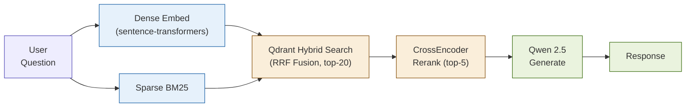

**Yêu cầu kỹ thuật:**

| Mã       | Yêu cầu                                                                                             |
| -------- | --------------------------------------------------------------------------------------------------- |
| SF-10-01 | Qdrant collection `superstore_knowledge` phải có cả dense vector (768 dims) và sparse vector (BM25) |
| SF-10-02 | Chunking strategy: split theo `##`/`###` heading, mỗi chunk 200–600 characters                      |
| SF-10-03 | Mỗi chunk phải có metadata: `doc_id`, `section`, `source_file`                                      |
| SF-10-04 | Hybrid search phải dùng RRF (Reciprocal Rank Fusion) — không dùng weighted average đơn thuần        |
| SF-10-05 | CrossEncoder reranking phải chạy trên top-20 kết quả, trả về top-5 cho LLM                          |
| SF-10-06 | API endpoint `/query` phải trả về response trong < 5 giây (local LLM)                               |
| SF-10-07 | Corpus phải bao gồm: company profile, BRD, FRD-01 đến FRD-08, Use Cases, SRS (file này)             |

**Acceptance Criteria:**

- Query "Chính sách chiết khấu tối đa của Superstore là bao nhiêu?" → trả về đúng câu trả lời từ FRD-01
- Không có double-IDF bug trong SparseEmbedder (IDF chỉ apply 1 lần khi index)

---

### SF-11 | Data Simulation Engine

**Mô tả:** Script Python phải tạo dữ liệu lịch sử 4 năm với đúng phân phối thống kê.

**Ưu tiên:** Cao (prerequisite cho mọi thứ khác)

**Timeline:**

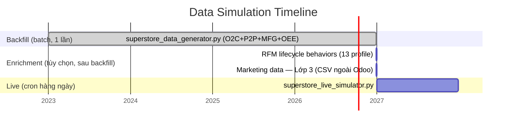

⚠️ Lưu ý thực tế: nếu chạy `live_simulator.py` khi ngày hệ thống thật vẫn còn trong khoảng đã backfill (chưa tới 2027), dữ liệu mới sẽ chồng lên ngày đã có — không lỗi nhưng lệch ý đồ thiết kế gốc (xem thảo luận vận hành thực tế).

**Yêu cầu kỹ thuật:**

| Mã       | Yêu cầu                                                                              |
| -------- | ------------------------------------------------------------------------------------ |
| SF-11-01 | Generator phải giao tiếp với Odoo chỉ qua XML-RPC — không direct SQL INSERT          |
| SF-11-02 | Scale factor: ×50 so với Superstore dataset gốc (~44.000 SO/năm, ~4.900 khách hàng)  |
| SF-11-03 | Phân phối Pareto: Top 20% khách hàng tạo 80% doanh thu                               |
| SF-11-04 | Seasonality: Tháng 8–9 và 11–12 volume cao hơn 40–50% baseline                       |
| SF-11-05 | Region split: West 30%, East 25%, Central 25%, South 20%                             |
| SF-11-06 | Toàn bộ Imperfection Catalog (10 loại) phải được giả lập đúng tỷ lệ (xem Phụ lục D)  |
| SF-11-07 | Generator phải support idempotent re-run (không tạo duplicate khi chạy lại một ngày) |
| SF-11-08 | Live simulator từ 2027 phải chạy được qua cron job/n8n hàng ngày                     |

**Acceptance Criteria:**

- Sau backfill: `SELECT COUNT(*) FROM sale_order` trả về ~176.000 SO (44.000 × 4 năm)
- Regional split từ fact_sales khớp ±2% với target West/East/Central/South
- Imperfection rates (trễ SLA, hủy đơn, trả hàng) khớp với catalog trong ±1%

---

## 4. Yêu cầu giao diện ngoài (External Interface Requirements)

### 4.1. Giao diện người dùng (User Interfaces)

**Odoo Web UI:**

- Browser: Chrome 120+, Firefox 120+, Edge 120+ (Chromium-based)
- Responsive: Odoo 18 hỗ trợ mobile view nhưng không bắt buộc optimize cho mobile trong scope này
- Language: English (US) — UI không cần tiếng Việt
- Không có custom CSS/theme — dùng default Odoo 18 theme

**Power BI:**

- Power BI Desktop (Windows) cho development
- Power BI Service (web) cho sharing
- Không yêu cầu custom visual ngoài marketplace

**RAG Chatbot:**

- Interface: FastAPI `/docs` (Swagger UI) cho testing
- Production interface: TBD (có thể integrate vào web app sau)

**Airflow UI:**

- Browser-based, port 8080
- Dùng để monitor DAG runs, trigger manual, xem logs

### 4.2. Giao diện phần cứng (Hardware Interfaces)

- Không có yêu cầu hardware interface đặc biệt
- Toàn bộ chạy trong Docker containers trên commodity hardware
- GPU không bắt buộc (Qwen 2.5 7B chạy CPU inference với Apple Silicon M-series)

### 4.3. Giao diện phần mềm (Software Interfaces)

| Giao diện                      | Protocol / Format      | Mục đích                           |
| ------------------------------ | ---------------------- | ---------------------------------- |
| Odoo ↔ Data Generator          | XML-RPC over HTTP      | Script Python tạo dữ liệu vào Odoo |
| PostgreSQL ↔ Debezium          | WAL (pgoutput)         | CDC bắt thay đổi                   |
| Debezium ↔ Kafka               | Kafka Producer API     | Publish CDC events                 |
| Kafka ↔ MinIO Consumer         | Kafka Consumer API     | Consume và lưu Bronze              |
| MinIO ↔ dbt                    | S3-compatible API      | dbt đọc Bronze làm external source |
| dbt ↔ Snowflake                | Snowflake connector    | Write Staging/Silver/Gold          |
| Snowflake ↔ Power BI           | ODBC / Direct Query    | BI query Warehouse                 |
| FastAPI ↔ Qdrant               | Qdrant Python SDK      | Vector search                      |
| FastAPI ↔ LM Studio (Qwen)     | OpenAI-compatible REST | LLM generation                     |
| Qdrant ↔ sentence-transformers | Python SDK             | Dense embedding                    |

### 4.4. Giao diện truyền thông (Communications Interfaces)

- **Kafka:** TCP, port 9092, plaintext (dev); TLS (production)
- **Debezium REST API:** HTTP, port 8083
- **Qdrant REST API:** HTTP, port 6333, JSON
- **LM Studio:** HTTP, port 1234, OpenAI-compatible JSON API
- **MinIO:** HTTP/HTTPS, S3-compatible API, port 9000
- **Airflow:** HTTP, port 8080
- **Odoo:** HTTP, port 8069, XML-RPC

---

## 5. Yêu cầu phi chức năng (Non-Functional Requirements)

### 5.1. Hiệu năng (Performance Requirements)

| Mã      | Yêu cầu                                                                                  | Đo lường                      |
| ------- | ---------------------------------------------------------------------------------------- | ----------------------------- |
| NFR-P01 | CDC latency: Thay đổi trong PostgreSQL phải xuất hiện trong Kafka topic trong < 2 giây   | Kafka consumer lag monitor    |
| NFR-P02 | dbt `gold` layer build time phải < 30 phút cho full 4-năm data                           | Airflow task duration         |
| NFR-P03 | Power BI dashboard load < 5 giây với Import mode (full 4-năm Gold data)                  | Power BI Performance Analyzer |
| NFR-P04 | RAG Chatbot response time < 5 giây (E2E: query → Qdrant → CrossEncoder → LLM → response) | FastAPI response time log     |
| NFR-P05 | Odoo Web UI load < 3 giây cho list view với 1.000+ records (paginated)                   | Browser DevTools Network tab  |
| NFR-P06 | Data Generator: hoàn thành backfill 4 năm (176.000 SO) trong < 8 giờ                     | Script execution time         |

### 5.2. Bảo mật (Security Requirements)

| Mã      | Yêu cầu                                                                                                                 |
| ------- | ----------------------------------------------------------------------------------------------------------------------- |
| NFR-S01 | PostgreSQL chỉ accept connections từ localhost và Kafka Connect container — không expose public                         |
| NFR-S02 | Kafka trong dev environment: no-auth (PLAINTEXT). Production: SASL/SCRAM hoặc TLS                                       |
| NFR-S03 | MinIO: bucket policy phải restrict write chỉ cho Kafka consumer service account                                         |
| NFR-S04 | Snowflake: IP whitelist (dev machine + VPS IP); role-based access (TRANSFORMER role cho dbt, ANALYST role cho Power BI) |
| NFR-S05 | Odoo Admin account: password phức tạp ≥ 12 ký tự; 2FA enable trên production                                            |
| NFR-S06 | Qdrant: không expose ra ngoài internet trong dev; production cần authentication token                                   |
| NFR-S07 | LM Studio (Qwen): chỉ bind localhost — không expose API ra ngoài                                                        |
| NFR-S08 | Không lưu credentials trong source code — dùng `.env` file (gitignored) hoặc Docker secrets                             |

### 5.3. Khả dụng (Availability Requirements)

| Mã      | Yêu cầu                                                                          |
| ------- | -------------------------------------------------------------------------------- |
| NFR-A01 | Dev environment: best-effort, không có SLA cứng                                  |
| NFR-A02 | Production VPS: Odoo và Kafka phải có Docker restart policy = `always`           |
| NFR-A03 | Kafka: single-broker setup (dev/portfolio) — không yêu cầu multi-broker HA       |
| NFR-A04 | Airflow DAG phải có retry = 2 với exponential backoff trước khi báo fail         |
| NFR-A05 | MinIO data phải được backup định kỳ (có thể dùng `mc mirror` sang cloud storage) |

### 5.4. Khả năng mở rộng (Scalability Requirements)

| Mã       | Yêu cầu                                                                                                                                                           |
| -------- | ----------------------------------------------------------------------------------------------------------------------------------------------------------------- |
| NFR-SC01 | Pipeline architecture phải có khả năng handle ×10 data volume (880.000 SO) mà không cần re-architect — chỉ cần scale Kafka partitions và Snowflake warehouse size |
| NFR-SC02 | Qdrant collection phải có khả năng thêm corpus mới (file JSON) mà không cần rebuild toàn bộ collection                                                            |
| NFR-SC03 | dbt models phải dùng incremental strategy cho fact tables (không full refresh mỗi ngày sau backfill)                                                              |
| NFR-SC04 | Data Generator live mode phải có thể chạy parallel cho nhiều ngày nếu có backlog                                                                                  |

### 5.5. Chất lượng dữ liệu (Data Quality Requirements)

| Mã       | Yêu cầu                                                                                  |
| -------- | ---------------------------------------------------------------------------------------- |
| NFR-DQ01 | PK uniqueness: mỗi fact table PK phải unique (dbt test `unique`)                         |
| NFR-DQ02 | Referential integrity: mọi `customer_id` trong `fact_sales` phải có trong `dim_customer` |
| NFR-DQ03 | Accounting invariant: SUM(debit) = SUM(credit) cho mỗi journal entry (dbt test)          |
| NFR-DQ04 | Revenue phải > 0 cho mọi completed SO line (dbt test `assert_sales_positive`)            |
| NFR-DQ05 | Imperfection rates phải nằm trong tolerance ±1% so với catalog đã định nghĩa             |
| NFR-DQ06 | Không có NULL trên PK columns của fact tables và dimension tables                        |

### 5.6. Khả năng bảo trì (Maintainability Requirements)

| Mã      | Yêu cầu                                                                                     |
| ------- | ------------------------------------------------------------------------------------------- |
| NFR-M01 | Toàn bộ source code phải được version control trên Git với commit message rõ ràng           |
| NFR-M02 | dbt models phải có `description` field trong YAML schema cho mỗi model và column quan trọng |
| NFR-M03 | Data Generator script phải có logging rõ ràng: số records tạo, errors, skip duplicates      |
| NFR-M04 | Docker Compose files phải tách biệt dev vs production profile                               |
| NFR-M05 | Pipeline phải có minimal test coverage: ít nhất `dbt test` + basic pytest cho RAG API       |
| NFR-M06 | README phải đủ để developer mới có thể setup môi trường từ đầu trong < 2 giờ                |

---

## 6. Ma trận truy vết (Traceability Matrix)

### 6.1. Business Objectives → System Features

| Business Objective (BRD)               | FRD Tham chiếu | System Feature (SRS) |
| -------------------------------------- | -------------- | -------------------- |
| BO-01: Vận hành O2C hiệu quả           | FRD-01         | SF-01, SF-09, SF-11  |
| BO-02: Marketing data-driven           | FRD-02         | SF-02, SF-08, SF-09  |
| BO-03: Quản lý chuỗi cung ứng          | FRD-03, FRD-04 | SF-03, SF-04, SF-09  |
| BO-04: Tối ưu sản xuất & đo lường OEE  | FRD-05         | SF-05, SF-08, SF-09  |
| BO-05: Minh bạch tài chính             | FRD-06         | SF-06, SF-08, SF-09  |
| BO-06: Quản lý nhân sự                 | FRD-07         | SF-07, SF-09         |
| BO-07: BI & Analytics                  | FRD-08         | SF-08, SF-09         |
| BO-08: AI-powered knowledge management | FRD-08 (AI)    | SF-10                |

### 6.2. System Features → Non-Functional Requirements

| System Feature         | Performance  | Security     | Availability | Scalability  | Data Quality |
| ---------------------- | ------------ | ------------ | ------------ | ------------ | ------------ |
| SF-01 (Sales)          | NFR-P05      | NFR-S01, S05 | NFR-A02      | —            | NFR-DQ01–04  |
| SF-09 (CDC Pipeline)   | NFR-P01, P02 | NFR-S02, S03 | NFR-A04      | NFR-SC01, 03 | NFR-DQ01–06  |
| SF-08 (BI Dashboard)   | NFR-P03      | NFR-S04      | —            | NFR-SC01     | NFR-DQ01–04  |
| SF-10 (RAG Chatbot)    | NFR-P04      | NFR-S06, S07 | NFR-A02      | NFR-SC02     | —            |
| SF-11 (Data Generator) | NFR-P06      | NFR-S08      | NFR-A04      | NFR-SC04     | NFR-DQ05     |

### 6.3. System Feature → Acceptance Criteria tóm tắt

| SF    | Tên Feature         | Acceptance Criteria Key                                                                                              | Kiểm tra bằng                        |
| ----- | ------------------- | -------------------------------------------------------------------------------------------------------------------- | ------------------------------------ |
| SF-01 | Sales & CRM         | O2C flow không lỗi; SO lock sau confirm                                                                              | Manual test Odoo                     |
| SF-02 | Marketing           | UTM ghi đúng; ROAS tính đúng                                                                                         | Manual test + dbt mart               |
| SF-03 | Purchase            | PO → Receipt → Bill flow đúng                                                                                        | Manual test Odoo                     |
| SF-04 | Inventory           | On-hand balance khớp stock_move; KHÔNG có quant âm                                                                   | SQL check (assert_no_negative_stock) |
| SF-05 | Manufacturing & OEE | MO → WO → Finished goods flow đúng; Availability/Performance/Quality đúng công thức (Phụ lục G.3), defect rate <1.5% | Manual test Odoo + SQL verify        |
| SF-06 | Accounting          | Debit = Credit; AR aging đúng                                                                                        | dbt test                             |
| SF-07 | HR                  | SCD2 dim_employee đúng lịch sử lương                                                                                 | dbt query                            |
| SF-08 | BI Dashboard        | MTD/YTD đúng; load < 5s; đủ KPI 7 mảng theo Phụ lục G                                                                | Power BI Analyzer + SQL check        |
| SF-09 | CDC Pipeline        | End-to-end: Odoo → Kafka < 2s; dbt tests pass                                                                        | Integration test                     |
| SF-10 | RAG Chatbot         | Trả lời đúng câu hỏi từ corpus; response < 5s                                                                        | pytest RAG API                       |
| SF-11 | Data Generator      | ~176.000 SO sau backfill; imperfection rates đúng ±1%                                                                | SQL count + ratio check              |

---

## Phụ lục A: Kiến trúc & Stack công nghệ

### A.1. Stack công nghệ

| Layer          | Công nghệ                  | Phiên bản     | Vai trò                                     |
| -------------- | -------------------------- | ------------- | ------------------------------------------- |
| ERP            | Odoo Community             | 18.0          | Phần mềm ERP nguồn mở                       |
| OLTP Database  | PostgreSQL                 | 16            | Database của Odoo, nguồn CDC                |
| CDC            | Debezium (Kafka Connect)   | Latest stable | Bắt WAL log PostgreSQL → Kafka              |
| Message Queue  | Apache Kafka               | 3.x           | Trung chuyển CDC events                     |
| Data Lake      | MinIO                      | Latest        | Object storage tương thích S3, Bronze layer |
| Orchestration  | Apache Airflow             | 2.x           | Lên lịch pipeline                           |
| Transformation | dbt Core                   | 1.x           | Staging → Silver → Gold                     |
| Data Warehouse | Snowflake                  | —             | OLAP, lưu Gold layer                        |
| BI             | Power BI Desktop / Service | —             | Dashboard                                   |
| RAG Vector DB  | Qdrant                     | —             | Embedding storage cho chatbot               |
| LLM            | Qwen 2.5 (via LM Studio)   | —             | LLM local cho RAG chatbot                   |
| Embedding      | sentence-transformers      | —             | Dense embedding cho Qdrant                  |
| Runtime (dev)  | MacBook Pro M-series       | —             | Môi trường phát triển                       |
| Runtime (prod) | VPS Contabo / Cloud        | —             | Deployment                                  |

### A.2. Network & Port Map (Dev Environment)

| Service                  | Port | Ghi chú                     |
| ------------------------ | ---- | --------------------------- |
| Odoo Web                 | 8069 | `http://localhost:8069`     |
| PostgreSQL               | 5432 | Odoo + DBeaver kết nối      |
| Kafka Broker             | 9092 | Broker                      |
| Kafka Connect (Debezium) | 8083 | REST API register connector |
| MinIO Console            | 9001 | Web UI quản lý bucket       |
| MinIO API                | 9000 | boto3/mc client             |
| Airflow                  | 8080 | Web UI                      |
| Qdrant                   | 6333 | REST API                    |
| FastAPI (RAG)            | 8000 | Chatbot API endpoint        |
| LM Studio                | 1234 | Local LLM server            |

---

## Phụ lục B: Cấu hình Odoo (Configuration Spec)

### B.1. Database khởi tạo

```
Database name : superstore_erp
Country       : United States
Currency      : USD  ← PHẢI thiết lập TRƯỚC KHI có journal entry nào
Language      : English (US)
Admin email   : admin@superstore-inc.com
```

### B.2. Modules cần cài (theo thứ tự dependency)

```bash
python odoo-bin -c odoo.conf -d superstore_erp \
  -i base,sale_management,crm,purchase,stock,mrp,account,hr,mass_mailing
```

| Module          | Odoo Name                                          | SF Reference |
| --------------- | -------------------------------------------------- | ------------ |
| Base            | `base`                                             | All          |
| Sales & CRM     | `sale_management`, `crm`                           | SF-01        |
| Email Marketing | `mass_mailing`                                     | SF-02        |
| Purchase        | `purchase`                                         | SF-03        |
| Inventory       | `stock`                                            | SF-04        |
| Manufacturing   | `mrp`                                              | SF-05        |
| Accounting      | `account`                                          | SF-06        |
| HR              | `hr`, `hr_contract`, `hr_attendance`, `hr_payroll` | SF-07        |

### B.3. Settings quan trọng sau khi cài

**Inventory settings:**

- Multi-Warehouse: ON → tạo 4 kho (WH-WEST, WH-EAST, WH-CENTRAL, WH-SOUTH)
- Storage Locations: ON
- Routes: ON
- Units of Measure: ON

**Sales settings:**

- Discounts: ON (hiển thị cột discount trên order line)
- Lock Confirmed Sales: ON (không sửa SO đã confirm)
- Sales Warnings: ON

**Manufacturing settings:**

- Work Orders: ON (bật Work Center, Routing, Work Order)
- Bill of Materials: ON

**Accounting settings:**

- Lock Posted Entries with Hash: ON
- Fiscal Year: January → December

### B.4. Master Data cần tạo

**Warehouses (4):**

```
WH-WEST:    Los Angeles, CA  — Short name: WEST
WH-EAST:    Newark, NJ       — Short name: EAST
WH-CENTRAL: Chicago, IL      — Short name: CNTL
WH-SOUTH:   Houston, TX      — Short name: SOUT
```

**Work Centers (3, tại WH-WEST):**

```
WC-CUT:  Cutting Station   — Capacity: 2 workers, 480 min/day
WC-ASM:  Assembly Line     — Capacity: 3 workers, 480 min/day
WC-QC:   Quality Control   — Capacity: 1 inspector, 480 min/day
```

**UTM Sources & Mediums:**

```
Sources : google, facebook, instagram, email, direct, referral, organic
Mediums : cpc, email, social, organic, referral, none
```

---

## Phụ lục C: Data Dictionary

**Sơ đồ 2 — ERD (Entity Relationship Diagram):**

> File: [`superstore-erd.drawio`](../superstore-erd.drawio) (mở bằng [draw.io](https://app.diagrams.net) hoặc extension Draw.io trong VS Code)

ERD đầy đủ **42 bảng** (đã audit lại và bổ sung 5 bảng thiếu — xem ghi chú dưới), phân theo 6 nhóm màu (domain): Sales (cam), Inventory (xanh dương), Accounting (xanh lá), Purchase (đỏ), Manufacturing (tím, gồm cả `mrp_workcenter_productivity` — sổ OEE), HR/Resource (cyan), Marketing + CRM (hồng — `utm_source`/`utm_medium`/`utm_campaign`/`crm_stage`/`crm_lost_reason`/`crm_lead`). Mỗi bảng hiển thị đầy đủ field + kiểu dữ liệu thật, quan hệ FK vẽ bằng edge nối trực tiếp giữa 2 bảng.

✅ **Đã bổ sung (trước đây thiếu so với `data_dictionary.md`):** `crm_lead`, `crm_stage`, `crm_lost_reason` (nhóm hồng, cạnh `utm_campaign` — cùng cụm CRM/Marketing attribution) và `mrp_workcenter_productivity_loss`, `stock_scrap` (cùng tông màu hổ phách với `mrp_workcenter_productivity`/`mrp_workorder` — nhóm Transaction-Manufacturing, KHÔNG phải tông tím dùng cho Manufacturing master data Tầng 4; xem màu thật trong file, đoạn mô tả màu ở trên chỉ mang tính tương đối). Đã nối đủ edge FK, kể cả `mrp_workcenter_productivity.loss_id → mrp_workcenter_productivity_loss` — quan hệ này tồn tại từ trước nhưng chưa từng có edge vì bảng đích chưa được vẽ.

Không nhúng trực tiếp nội dung drawio (định dạng XML riêng, không render trong Markdown) — xem chi tiết đầy đủ field/FK trong Phụ lục C.1–C.2 bên dưới, hoặc mở trực tiếp file `.drawio`.

### C.1. Mapping Superstore Dataset → Odoo

| Cột Superstore gốc | Bảng Odoo          | Cột Odoo                                  | Ghi chú                                   |
| ------------------ | ------------------ | ----------------------------------------- | ----------------------------------------- |
| Order ID           | `sale_order`       | `name`                                    | VD: S-2024-00001                          |
| Order Date         | `sale_order`       | `date_order`                              | Dịch +9 năm (2014→2023)                   |
| Ship Date          | `stock_picking`    | `scheduled_date`                          | ⚠️ [SỬA 2026-07-22] KHÔNG phải SLA theo ship mode (Standard/Second/First/Same) như dòng dưới từng ghi — thực tế theo công thức chuẩn Odoo: `commitment_date = date_order + sale_delay + stock_rule.delay` (sale_delay=3, stock_rule.delay=2 WEST/EAST · 3 CNTL/SOUT → +5/+6 ngày), `scheduled_date = commitment_date − security_lead` (security_lead=2 → +3/+4 ngày). Chi tiết công thức + giới hạn dữ liệu cũ xem `data_dictionary.md` mục `stock_picking.scheduled_date` |
| Ship Mode          | `stock_picking`    | `carrier_id`                              | ⚠️ [SỬA 2026-07-22] Module `delivery`+`stock_delivery` đã cài, cột `carrier_id` đã tồn tại thật, nhưng **KHÔNG có dữ liệu** (NULL 100%, `delivery_carrier` chỉ có 1 dòng mặc định) — mức SLA theo mode (Standard=7d/Second=5d/First=2d/Same=0d) trong dòng này KHÔNG được implement, generator không phân biệt ship mode |
| Customer ID        | `res_partner`      | `id`                                      | Unique per customer                       |
| Customer Name      | `res_partner`      | `name`                                    |                                           |
| Segment            | `res_partner`      | `category_id`                             | Consumer / Corporate / Home Office        |
| Country/City/State | `res_partner`      | `country_id`, `city`, `state_id`          | US states                                 |
| Postal Code        | `res_partner`      | `zip`                                     | 2% missing (imperfection)                 |
| Region             | `stock_warehouse`  | → Warehouse phục vụ vùng                  | West/East/Central/South                   |
| Product ID         | `product_product`  | `default_code`                            | SKU                                       |
| Product Name       | `product_template` | `name`                                    |                                           |
| Category           | `product_category` | `name`                                    | Furniture/Technology/Office Supplies      |
| Sub-Category       | `product_category` | `name` (child)                            | 17 sub-categories                         |
| Sales              | `sale_order_line`  | `price_subtotal`                          | Revenue                                   |
| Quantity           | `sale_order_line`  | `product_uom_qty`                         |                                           |
| Discount           | `sale_order_line`  | `discount`                                | %                                         |
| Profit             | Tính toán          | `price_subtotal - (standard_price × qty)` | Profit = Revenue - COGS                   |

### C.2. Dữ liệu thêm (không có trong Superstore gốc)

| Dữ liệu         | Mô tả                      | Logic giả lập                                                                |
| --------------- | -------------------------- | ---------------------------------------------------------------------------- |
| NCC (Suppliers) | 15–20 nhà cung cấp         | Mỗi sub-category có 1–3 NCC; NCC Furniture là NCC nguyên liệu                |
| Giá mua (Cost)  | Giá vốn thực tế            | `cost = Sales × (1 - target_margin)` → Furniture 30%, Tech 25%, Supplies 35% |
| BOM             | Định mức NVL cho Furniture | 5 BOM mẫu × 3–6 components/BOM                                               |
| Tồn kho đầu kỳ  | Tháng 1/2023               | safety_stock = 4 tuần tiêu thụ trung bình                                    |
| Nhân viên       | 45 hồ sơ                   | Tên giả lập US, phân theo phòng/kho                                          |
| Hợp đồng        | 45 + lịch sử tăng lương    | 1–2 tăng lương/người trong 4 năm                                             |
| UTM campaigns   | Chiến dịch marketing       | 8–10 campaign/năm, 3 kênh: google/facebook/email                             |
| Ad spend        | Chi tiêu quảng cáo         | ~$8K–15K/tháng, biến động theo mùa                                           |
| Credit terms    | Điều khoản khách B2B       | Corporate: Net-30; Home Office: Net-15; Consumer: immediate                  |

---

## Phụ lục D: Simulation Specification

### D.1. Phạm vi thời gian

| Giai đoạn      | Thời gian               | Cách tạo                                 |
| -------------- | ----------------------- | ---------------------------------------- |
| Backfill       | 2023-01-01 → 2026-12-31 | Script Python batch (một lần)            |
| Live simulator | 2027-01-01 → ongoing    | Cron job / n8n workflow (chạy hàng ngày) |

### D.2. Scale Parameters

| Tham số                   | Giá trị                       |
| ------------------------- | ----------------------------- |
| Scale factor              | ×50 so với dataset gốc        |
| Đơn hàng/ngày (2023–2026) | ~170 đơn/ngày (business days) |
| Đơn hàng/năm              | ~44.000 SO/năm                |
| Order lines/năm           | ~115.000 lines/năm            |
| Khách hàng active         | ~4.900 (×50 từ 793 gốc)       |
| SKU active                | ~1.800                        |

### D.3. Phân phối Pareto (Realistic)

- **Khách hàng:** Top 20% khách tạo 80% doanh thu. Nhóm "whale": ~50 Corporate accounts chiếm 35% revenue
- **Sản phẩm:** Top 20% SKU chiếm 80% doanh số. Copiers = highest margin; Tables = lowest/negative khi discount cao
- **Mùa vụ:** Tháng 8–9 (back-to-school) và 11–12 (year-end) volume cao hơn 40–50% baseline; tháng 1–2 thấp nhất
- **Region:** West 30%, East 25%, Central 25%, South 20%

### D.4. Imperfection Catalog (Dữ liệu bẩn có chủ đích)

| Loại                | Tỷ lệ           | Logic áp dụng                                                 |
| ------------------- | --------------- | ------------------------------------------------------------- |
| Giao trễ SLA        | 8% đơn          | Tập trung WH-CENTRAL; Same Day trễ 3%, Standard Class trễ 10% |
| Đơn hủy sau confirm | 3%              | Nhiều hơn ở B2C; discount > 15% có tỷ lệ hủy thấp hơn         |
| Trả hàng            | 2.5%            | Technology category cao hơn (3.5%); Furniture thấp (1%)       |
| Margin âm           | Giữ pattern gốc | Tables + discount > 15% → margin < 0; Copiers luôn dương      |
| Khách trùng lặp     | ~1%             | Tên hơi khác (Robert Smith vs Rob Smith) → bài data cleaning  |
| Missing postal code | 2% khách        | Khách mới tạo nhanh, thiếu thông tin                          |
| HĐ NCC giao trễ     | 10% PO          | Một số NCC có lead time thực tế dài hơn cam kết               |
| Công nợ quá hạn     | 10% HĐ B2B      | Tập trung 5–6 corporate account "bad payers"                  |
| Sai lệch kiểm kê    | ±2% tồn kho     | Mỗi quý; WH-CENTRAL có tỷ lệ cao hơn (shrinkage)              |
| ROAS thấp           | 1 campaign/năm  | 1 chiến dịch Facebook mỗi năm có spend cao nhưng ROAS < 1.5   |

---

## Phụ lục E: Data Pipeline Spec

### E.1. Debezium Connector Config

> Mở rộng từ 9 bảng (bản v2.0) lên 46 bảng, bao phủ đủ 8 domain nghiệp vụ. ⚠️ Đã kiểm chứng TỪNG bảng với schema Odoo 18 thật (`information_schema.tables`) trước khi đưa vào — sửa 2 tên sai (`mrp_scrap`→`stock_scrap`, `mailing_statistics`→`mailing_trace`), bổ sung `stock_location`/`hr_department` (thiếu so với các staging model cần chúng ở Phụ lục E.2), ghi chú 3 bảng cần cài thêm module.

```json
{
  "name": "superstore-postgres-connector",
  "config": {
    "connector.class": "io.debezium.connector.postgresql.PostgresConnector",
    "database.hostname": "localhost",
    "database.port": "5432",
    "database.user": "odoo",
    "database.password": "",
    "database.dbname": "superstore_erp",
    "database.server.name": "superstore_erp",
    "plugin.name": "pgoutput",
    "slot.name": "debezium_superstore",
    "publication.name": "dbz_superstore_pub",
    "snapshot.mode": "initial",
    "decimal.handling.mode": "double",
    "time.precision.mode": "connect",

    "table.include.list": [
      "public.sale_order",
      "public.sale_order_line",
      "public.purchase_order",
      "public.purchase_order_line",

      "public.account_move",
      "public.account_move_line",
      "public.account_payment",
      "public.account_partial_reconcile",
      "public.account_account",
      "public.account_journal",
      "public.account_tax",
      "public.account_bank_statement",
      "public.account_bank_statement_line",

      "public.stock_picking",
      "public.stock_picking_type",
      "public.stock_move",
      "public.stock_move_line",
      "public.stock_quant",
      "public.stock_location",
      "public.stock_valuation_layer",
      "public.stock_landed_cost",
      "public.stock_landed_cost_lines",
      "public.delivery_carrier",

      "public.res_partner",
      "public.res_partner_category",
      "public.crm_lead",

      "public.utm_campaign",
      "public.utm_source",
      "public.utm_medium",
      "public.mailing_mailing",
      "public.mailing_trace",

      "public.product_product",
      "public.product_template",
      "public.product_category",
      "public.product_supplierinfo",
      "public.product_pricelist",
      "public.product_pricelist_item",

      "public.mrp_production",
      "public.mrp_workorder",
      "public.mrp_workcenter_productivity",
      "public.stock_scrap",

      "public.hr_employee",
      "public.hr_contract",
      "public.hr_department",
      "public.stock_warehouse",
      "public.mrp_workcenter"
    ],

    "column.exclude.list": [
      "public.res_users.password",
      "public.res_users.totp_secret"
    ]
  }
}
```

**⚠️ Đã sửa so với bản đề xuất gốc (kiểm chứng thật trên `information_schema.tables`, không phải giả định):**

| Vấn đề                                                                                  | Sửa                                                                                                                                                                                                                                                                                                                                                                                                                                       |
| --------------------------------------------------------------------------------------- | ----------------------------------------------------------------------------------------------------------------------------------------------------------------------------------------------------------------------------------------------------------------------------------------------------------------------------------------------------------------------------------------------------------------------------------------- |
| `public.mrp_scrap` — bảng này KHÔNG TỒN TẠI trong Odoo 18                               | → `public.stock_scrap` (model `stock.scrap`) — đúng bug đã gặp nhiều lần trong dự án này                                                                                                                                                                                                                                                                                                                                                  |
| `public.mailing_statistics` — tên cũ, Odoo 18 đã đổi                                    | → `public.mailing_trace`                                                                                                                                                                                                                                                                                                                                                                                                                  |
| Thiếu nguồn OEE                                                                         | Thêm `public.mrp_workcenter_productivity` — sổ OEE gốc của Odoo (Availability/Performance/Quality), bắt buộc để `mart_oee` (xem E.3) hoạt động                                                                                                                                                                                                                                                                                            |
| `public.delivery_carrier`, `public.stock_landed_cost`, `public.stock_landed_cost_lines` | ⚠️ 3 bảng này **chưa tồn tại trong DB hiện tại** — cần cài thêm module `delivery` và `stock_landed_costs` vào danh sách Phụ lục B.2 (hiện chỉ có `base,sale_management,crm,purchase,stock,mrp,account,hr,hr_contract,mass_mailing`) trước khi Debezium có thể bắt các bảng này. Giữ lại trong config vì đây là mở rộng dự kiến, KHÔNG xóa — nhưng phải cài module trước khi enable connector, nếu không Debezium sẽ lỗi "table not found" |

### E.1b. Sơ đồ nguồn dữ liệu → đích Gold layer (theo domain)

```
PostgreSQL (46 bảng)
│
├── ACCOUNTING
│   ├── account_move + account_move_line    → fact_journal_entries
│   ├── account_payment
│   │   + account_partial_reconcile        → fact_payments + AR_aging
│   ├── account_bank_statement_line        → fact_bank_transactions
│   └── account_account + account_journal  → dim_coa
│
├── SHIPPING / INVENTORY
│   ├── stock_picking + stock_move
│   │   + stock_move_line                  → fact_inventory_movement
│   ├── stock_picking + delivery_carrier   → mart_delivery_performance (cần module delivery)
│   ├── stock_valuation_layer              → fact_inventory_valuation
│   ├── stock_quant                        → fact_inventory_balance (snapshot hằng ngày — ⚠️ bổ sung: trước đây stg_stock_quant khai báo ở Staging nhưng chưa từng dùng ở Gold)
│   └── stock_landed_cost_lines            → fact_landed_cost (cần module stock_landed_costs)
│
├── SALES
│   ├── sale_order_line + sale_order       → fact_sales (grain)
│   └── crm_lead                           → fact_crm_funnel
│
├── PURCHASING
│   └── purchase_order_line + purchase_order → fact_purchase (grain)
│
├── MARKETING
│   ├── utm_* + sale_order.campaign_id     → mart_roas
│   └── mailing_mailing + mailing_trace    → mart_email_performance
│
├── PRODUCT
│   ├── product_product + product_template → dim_product (SCD2 cost)
│   ├── product_supplierinfo               → dim_supplier_price
│   └── product_pricelist_item             → dim_pricelist
│
├── CUSTOMER
│   └── res_partner + res_partner_category → dim_customer (SCD2)
│
├── MANUFACTURING & OEE
│   ├── mrp_production + stock_scrap       → fact_manufacturing (Quality: qty_produced−scrap_qty)
│   ├── mrp_workorder + mrp_production
│   │   + stock_scrap                      → fact_workorder (tổng hợp thực thi WO, KHÔNG phải fact OEE)
│   └── mrp_workcenter_productivity
│       + mrp_workorder (JOIN ngược lấy duration_expected)
│                                           → fact_manufacturing_oee (grain=1 block, ĐÚNG theo cảnh báo E.3)
│                                           → mart_oee_by_workcenter_monthly (Availability/Performance/Quality — xem Phụ lục G.3)
│
└── HR
    └── hr_employee + hr_contract          → dim_employee (SCD2)
```

**Sơ đồ 3 — Data Flow đúng theo cấu trúc dbt 4-layer thật (Phụ lục E.2):**

> File: [`superstore-pipeline-3layer.drawio`](../superstore-pipeline-3layer.drawio) (mở bằng [draw.io](https://app.diagrams.net) hoặc extension Draw.io trong VS Code) — bản vẽ đầy đủ của mermaid bên dưới, gộp trực quan thành 3 khối màu Bronze/Silver/Gold (đúng tên "Sơ đồ 3" ở Mục lục), bên trong khối Silver vẫn tách rõ 3 lớp kỹ thuật Staging → Snapshot(SCD2) → Silver theo đúng thứ tự phụ thuộc thực thi, kèm bảng "Nguyên tắc từng lớp" (Phụ lục E.1b) ở cuối trang.

> Đánh số layer giữ nguyên theo thứ tự khai báo trong E.2 (1, 3, 2, 4) — phản ánh đúng thứ tự PHỤ THUỘC thực thi: Staging chạy trước tiên (`dbt run`), Snapshot chạy riêng lệnh (`dbt snapshot`) đọc từ Staging, sau đó Silver (`dbt run`) đọc CẢ Staging LẪN Snapshot output để dựng SCD2 dimension, cuối cùng Gold đọc từ Silver.

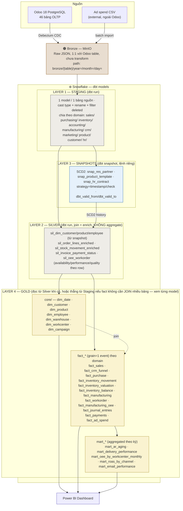

**Nguyên tắc từng lớp:**

| Lớp | Vai trò | KHÔNG được làm |
| --- | --- | --- |
| Bronze | Lưu nguyên trạng CDC event (JSON), append-only, không sửa | Không transform, không lọc bỏ dữ liệu |
| Staging | Cast type + rename cột — vẫn 1:1 grain với bảng nguồn | Không JOIN nhiều bảng, không tính toán business logic |
| Silver | SCD2 cho dimension — lưu lịch sử thay đổi | Không dùng cho fact table (fact luôn lấy trực tiếp từ staging) |
| Gold | Star Schema fact + mart tổng hợp — sẵn sàng cho BI | Không lưu raw/duplicate logic đã có ở tầng dưới |

### E.2. dbt Project Structure

````
superstore_dbt/
│
│ ━━━━━━━━━━━━━━━━━━━━━━━━━━━━━━━━━━━━━━━━━━━━━━━━━━━━━
│  LAYER 1 — STAGING
│  Nguyên tắc: 1 file = 1 bảng source. Không join.
│  Chỉ: cast type + rename + filter deleted rows
│ ━━━━━━━━━━━━━━━━━━━━━━━━━━━━━━━━━━━━━━━━━━━━━━━━━━━━━
├── models/staging/
│   ├── _sources.yml          ← ⭐ BẮT BUỘC: khai báo Snowflake schema RAW
│   ├── _staging.yml          ← doc + generic tests tất cả staging models
│   │
│   ├── sales/
│   │   ├── stg_sale_order.sql
│   │   └── stg_sale_order_line.sql
│   │
│   ├── purchasing/
│   │   ├── stg_purchase_order.sql
│   │   └── stg_purchase_order_line.sql
│   │
│   ├── inventory/
│   │   ├── stg_stock_picking.sql
│   │   ├── stg_stock_move.sql
│   │   ├── stg_stock_move_line.sql
│   │   ├── stg_stock_quant.sql
│   │   ├── stg_stock_valuation_layer.sql
│   │   ├── stg_stock_location.sql      ← ⚠️ bổ sung: sil_stock_movement_enriched cần JOIN bảng này để resolve usage IN/OUT/Transfer, trước đây thiếu
│   │   └── stg_stock_warehouse.sql     ← ⚠️ bổ sung: dim_warehouse (Gold core) khai là lấy "từ stg_stock_warehouse" nhưng model này chưa từng được khai báo
│   │
│   ├── accounting/
│   │   ├── stg_account_move.sql
│   │   ├── stg_account_move_line.sql
│   │   ├── stg_account_payment.sql
│   │   ├── stg_account_partial_reconcile.sql
│   │   └── stg_account_bank_statement_line.sql
│   │
│   ├── manufacturing/
│   │   ├── stg_mrp_production.sql
│   │   ├── stg_mrp_workorder.sql
│   │   ├── stg_stock_scrap.sql         ← ⚠️ SỬA: trước ghi stg_mrp_scrap.sql — bảng mrp_scrap KHÔNG TỒN TẠI trong Odoo 18 (xem Phụ lục E.1), tên bảng thật là stock_scrap
│   │   ├── stg_mrp_workcenter_productivity.sql
│   │   └── stg_mrp_workcenter.sql      ← ⚠️ bổ sung: dim_workcenter (Gold core) khai là lấy "từ stg_mrp_workcenter" nhưng model này chưa từng được khai báo
│   │
│   ├── crm/
│   │   └── stg_crm_lead.sql
│   │
│   ├── marketing/
│   │   ├── stg_utm_campaign.sql
│   │   ├── stg_mailing_mailing.sql    ← ⚠️ bổ sung: header chiến dịch email — cần cho mart_email_performance, trước đây thiếu
│   │   ├── stg_mailing_trace.sql      ← ⚠️ SỬA: trước ghi stg_mailing_statistics.sql — Odoo 18 đã đổi tên bảng thành mailing_trace (xem Phụ lục E.1)
│   │   └── stg_ad_spend.sql           ← external CSV, khai báo riêng trong _sources.yml
│   │
│   ├── product/
│   │   ├── stg_product_product.sql
│   │   ├── stg_product_template.sql   ← standard_price SCD2 source
│   │   └── stg_product_category.sql
│   │
│   ├── customer/
│   │   ├── stg_res_partner.sql
│   │   └── stg_res_partner_category.sql
│   │
│   └── hr/
│       ├── stg_hr_employee.sql
│       ├── stg_hr_contract.sql
│       └── stg_hr_department.sql       ← ⚠️ bổ sung: sil_dim_employee cần JOIN bảng này để lấy department_name, trước đây thiếu
│
│ ━━━━━━━━━━━━━━━━━━━━━━━━━━━━━━━━━━━━━━━━━━━━━━━━━━━━━
│  LAYER 3 — SNAPSHOTS (dbt snapshot, riêng thư mục)
│  Nguyên tắc: đọc từ staging, detect thay đổi theo thời gian
│  Output: bảng SCD2 trong Snowflake (có dbt_valid_from/to)
│  Chạy: dbt snapshot (khác với dbt run)
│ ━━━━━━━━━━━━━━━━━━━━━━━━━━━━━━━━━━━━━━━━━━━━━━━━━━━━━
├── snapshots/
│   │
│   ├── snap_res_partner.sql
│   │   -- unique_key: partner_id
│   │   -- strategy: timestamp
│   │   -- updated_at: write_date      ← Odoo tự điền khi có thay đổi
│   │   -- source: stg_res_partner
│   │   -- Bắt: đổi địa chỉ, segment, tên
│   │
│   ├── snap_product_template.sql
│   │   -- unique_key: product_tmpl_id
│   │   -- strategy: timestamp
│   │   -- updated_at: write_date
│   │   -- source: stg_product_template
│   │   -- Bắt: thay đổi standard_price (giá vốn)
│   │
│   └── snap_hr_contract.sql
│       -- unique_key: contract_id
│       -- strategy: check
│       -- check_cols: [wage, date_start, date_end, state]
│       -- source: stg_hr_contract
│       -- Bắt: tăng lương (wage thay đổi = contract mới)
│
│ ━━━━━━━━━━━━━━━━━━━━━━━━━━━━━━━━━━━━━━━━━━━━━━━━━━━━━
│  LAYER 2 — SILVER
│  Nguyên tắc: đọc từ staging + snapshot output
│  Làm: join, enrich, business logic, chuẩn bị cho Gold
│  KHÔNG aggregate — đó là việc của Gold
│ ━━━━━━━━━━━━━━━━━━━━━━━━━━━━━━━━━━━━━━━━━━━━━━━━━━━━━
├── models/silver/
│   ├── _silver.yml
│   │
│   ├── customer/
│   │   └── sil_dim_customer.sql
│   │       -- SELECT từ snap_res_partner (SCD2 history)
│   │       -- JOIN stg_res_partner_category (tags)
│   │       -- Thêm: segment label, region, is_active_customer
│   │
│   ├── product/
│   │   └── sil_dim_product.sql
│   │       -- SELECT từ snap_product_template (giá vốn theo thời gian)
│   │       -- JOIN stg_product_product (SKU, barcode)
│   │       -- JOIN stg_product_category (full path: All > Furniture > Tables)
│   │       -- Thêm: category_level_1/2/3, is_manufactured
│   │
│   ├── hr/
│   │   └── sil_dim_employee.sql
│   │       -- SELECT từ snap_hr_contract (lịch sử lương SCD2)
│   │       -- JOIN stg_hr_employee (tên) + stg_hr_department (tên phòng ban — trước ghi nhầm là JOIN thẳng qua stg_hr_employee, thật ra department_id chỉ là FK, phải JOIN thêm bảng department mới lấy được tên)
│   │       -- Thêm: wage_band, department_name, tenure_years
│   │
│   ├── sales/
│   │   └── sil_order_lines_enriched.sql
│   │       -- JOIN stg_sale_order_line + stg_sale_order
│   │       -- Thêm: order_date, campaign_id, warehouse_code, customer_segment
│   │       -- Tính: revenue_net = price_subtotal × (1 - discount/100)
│   │       -- Filter: state IN ('sale','done') — bỏ draft/cancel
│   │
│   ├── inventory/
│   │   └── sil_stock_movement_enriched.sql
│   │       -- JOIN stg_stock_move + stg_stock_picking
│   │       -- JOIN stg_stock_location để resolve: usage IN/OUT/Transfer (trước ghi "JOIN stock_location" — tên staging model đúng phải có tiền tố stg_)
│   │       -- Thêm: movement_type (sale_out/purchase_in/transfer/mfg_consume)
│   │       -- Filter: state = 'done'
│   │
│   ├── accounting/
│   │   └── sil_invoice_payment_status.sql
│   │       -- JOIN stg_account_move + stg_account_partial_reconcile
│   │       -- Tính: days_outstanding = payment_date - invoice_date
│   │       -- Thêm: is_overdue, aging_bucket (0-30/31-60/61-90/>90)
│   │
│   └── manufacturing/
│       └── sil_oee_workorder.sql
│           -- JOIN stg_mrp_workorder + stg_mrp_production
│           -- JOIN stg_stock_scrap (LEFT JOIN theo production_id) — trước ghi nhầm stg_mrp_scrap, xem sửa ở LAYER 1 STAGING phía trên
│           -- Tính từng row:
│           --   availability_ratio = duration / planned_time_per_wo
│           --   performance_ratio  = MIN(duration_expected / duration, 1.0)
│           --   quality_ratio      = (qty_produced - scrap_qty) / qty_produced
│           -- KHÔNG aggregate ở đây — Gold sẽ GROUP BY
│
│ ━━━━━━━━━━━━━━━━━━━━━━━━━━━━━━━━━━━━━━━━━━━━━━━━━━━━━
│  LAYER 4 — GOLD
│  Nguyên tắc: đọc từ Silver (không đọc thẳng staging)
│  dim_* = từ silver dimensions (SCD2-aware)
│  fact_* = grain-level (1 row = 1 event)
│  mart_* = aggregated (1 row = 1 tổng hợp theo kỳ)
│ ━━━━━━━━━━━━━━━━━━━━━━━━━━━━━━━━━━━━━━━━━━━━━━━━━━━━━
└── models/gold/
    ├── _gold.yml
    │
    ├── core/                    ← Shared dimensions — mọi fact đều join vào đây
    │   ├── dim_date.sql         ← ⭐ Generate calendar 2020–2030, week/month/quarter/year
    │   ├── dim_customer.sql     ← SELECT từ sil_dim_customer (current record)
    │   ├── dim_product.sql      ← SELECT từ sil_dim_product (current record)
    │   ├── dim_employee.sql     ← SELECT từ sil_dim_employee (current contract)
    │   ├── dim_warehouse.sql    ← SELECT từ stg_stock_warehouse (static)
    │   ├── dim_workcenter.sql   ← SELECT từ stg_mrp_workcenter (static)
    │   └── dim_campaign.sql     ← SELECT từ stg_utm_campaign (static)
    │
    ├── sales/
    │   ├── fact_sales.sql
    │   │   -- grain: 1 row = 1 sale_order_line
    │   │   -- FROM sil_order_lines_enriched
    │   │   -- JOIN dim_customer, dim_product, dim_date, dim_warehouse, dim_campaign
    │   │
    │   └── fact_crm_funnel.sql
    │       -- grain: 1 row = 1 crm_lead
    │       -- FROM stg_crm_lead
    │       -- Tính: days_to_close, win_rate, pipeline_value
    │
    ├── purchasing/
    │   └── fact_purchase.sql
    │       -- grain: 1 row = 1 purchase_order_line
    │       -- FROM stg_purchase_order_line JOIN stg_purchase_order
    │       -- JOIN dim_product, dim_date
    │       -- Tính: qty_received/qty_ordered = fill_rate, days_late
    │
    ├── inventory/
    │   ├── fact_inventory_movement.sql
    │   │   -- grain: 1 row = 1 stock_move (done)
    │   │   -- FROM sil_stock_movement_enriched
    │   │   -- JOIN dim_product, dim_date, dim_warehouse
    │   │
    │   ├── fact_inventory_valuation.sql
    │   │   -- grain: 1 row = 1 stock_valuation_layer event
    │   │   -- FROM stg_stock_valuation_layer
    │   │   -- Tích lũy: running inventory value theo thời gian
    │   │
    │   ├── fact_inventory_balance.sql      ← ⚠️ bổ sung: stg_stock_quant khai báo ở Staging nhưng trước đây chưa từng được dùng
    │   │   -- grain: 1 row = 1 product × 1 location × 1 ngày snapshot (snapshot_date = ngày dbt run)
    │   │   -- FROM stg_stock_quant
    │   │   -- JOIN dim_product, dim_date, JOIN stg_stock_location để resolve warehouse
    │   │   -- Tính: quantity, reserved_quantity, quantity_available = quantity − reserved_quantity
    │   │   -- ⚠️ stock_quant là bảng LIVE (Odoo không giữ lịch sử) → model này PHẢI materialized='incremental'
    │   │   --   (mỗi lần dbt run chỉ INSERT thêm snapshot_date hôm đó), KHÔNG được full-refresh — nếu không sẽ
    │   │   --   ghi đè mất lịch sử tồn kho các ngày trước, không dựng được biểu đồ tồn kho theo thời gian
    │   │   -- Test đối chiếu: SUM(quantity) mỗi ngày nên khớp với tồn kho suy ra từ Σ fact_inventory_movement
    │   │
    │   └── mart_delivery_performance.sql
    │       -- agg: picking × month × ship_mode
    │       -- Tính: on_time_rate, avg_days_late, late_count
    │       -- FROM stg_stock_picking GROUP BY month, carrier, warehouse
    │
    ├── accounting/
    │   ├── fact_journal_entries.sql
    │   │   -- grain: 1 row = 1 account_move_line
    │   │   -- FROM stg_account_move_line JOIN stg_account_move
    │   │   -- JOIN dim_date, dim_customer
    │   │   -- Verify: Σdebit = Σcredit per move_id (test)
    │   │
    │   ├── fact_payments.sql
    │   │   -- grain: 1 row = 1 account_payment
    │   │   -- FROM stg_account_payment
    │   │   -- Tính: DSO = payment_date - invoice_date
    │   │
    │   └── mart_ar_aging.sql
    │       -- agg: customer × snapshot_date
    │       -- bucket: 0-30 | 31-60 | 61-90 | >90 ngày
    │       -- FROM sil_invoice_payment_status WHERE payment_state != 'paid'
    │
    ├── manufacturing/
    │   ├── fact_manufacturing.sql
    │   │   -- grain: 1 row = 1 mrp_production (done)
    │   │   -- FROM stg_mrp_production
    │   │   -- JOIN dim_product, dim_date
    │   │   -- Tính: yield_rate, scrap_rate, cycle_time
    │   │
    │   ├── fact_workorder.sql
    │   │   -- grain: 1 row = 1 mrp_workorder (done)
    │   │   -- FROM sil_oee_workorder
    │   │   -- JOIN dim_workcenter, dim_date
    │   │   -- Fields: duration_expected, duration, performance_ratio
    │   │   -- ⚠️ Bảng này KHÔNG PHẢI fact OEE — chỉ tổng hợp thực thi ở mức 1 WO. Muốn Availability/
    │   │   --   Performance/Quality đúng chuẩn 3 chỉ số tách biệt, dùng fact_manufacturing_oee bên dưới
    │   │
    │   ├── fact_manufacturing_oee.sql       ← ⚠️ bổ sung: đúng grain theo cảnh báo E.3, trước đây THIẾU — mart_oee
    │   │   │                                   phía dưới bị tính sai vì gộp nhầm về grain "1 workorder"
    │   │   -- grain: 1 row = 1 block mrp_workcenter_productivity (productive/availability/performance/quality)
    │   │   -- PK: mrp_workcenter_productivity_id
    │   │   -- FROM stg_mrp_workcenter_productivity (khai báo ở Staging nhưng trước đây chưa từng được dùng)
    │   │   -- JOIN dim_workcenter, dim_date (theo date_start)
    │   │   -- LEFT JOIN stg_mrp_workorder (theo workorder_id) để lấy duration_expected — bắt buộc cho Performance
    │   │   -- Fields: loss_type, duration, duration_expected, workcenter_id, workorder_id
    │   │
    │   └── mart_oee_by_workcenter_monthly.sql
    │       -- agg: workcenter × month
    │       -- FROM fact_manufacturing_oee GROUP BY workcenter_id, month, loss_type   ← ⚠️ SỬA: trước đây FROM
    │       --   sil_oee_workorder (grain=1 WO, sai theo cảnh báo E.3) — giờ đọc đúng nguồn OEE gốc theo block
    │       -- Tính (đúng công thức data_dictionary.md — mrp_workcenter_productivity_loss):
    │       --   availability = SUM(duration WHERE loss_type='productive')
    │       --                  / SUM(duration WHERE loss_type IN ('productive','availability'))   -- CHỈ 2/4 loại
    │       --   performance  = MIN(SUM(duration_expected) / SUM(duration WHERE loss_type='productive'), 1.0)
    │       --   quality      = (qty_produced − scrap_qty) / qty_produced   -- lấy từ fact_manufacturing theo production_id
    │       --   oee          = availability × performance × quality
    │
    └── marketing/
        ├── fact_ad_spend.sql
        │   -- grain: 1 row = 1 campaign × date × channel
        │   -- FROM stg_ad_spend (external CSV)
        │   -- JOIN dim_campaign, dim_date
        │
        ├── mart_roas_by_channel.sql
        │   -- agg: channel × month
        │   -- ROAS = revenue_attributed / spend
        │   -- CAC  = spend / new_customers
        │
        └── mart_email_performance.sql   ← ⚠️ bổ sung: có trong sơ đồ domain Phụ lục E.1b nhưng trước đây thiếu ở đây
            -- agg: mailing × month — FROM stg_mailing_mailing JOIN stg_mailing_trace
            -- Tính: open_rate, click_rate, bounce_rate
            -- ⏳ PHỤ THUỘC Lớp 2 Email marketing (master-plan PHẦN 4) — mailing_mailing/mailing_trace CHƯA có dữ liệu thật trong Odoo, model này chưa chạy được cho tới khi Lớp 2 triển khai
            -- FROM fact_ad_spend JOIN fact_sales ON campaign_id

──────────────────────────────────────────────
seeds/
└── dim_date_seed.csv    ← optional, hoặc generate bằng SQL macro

tests/
├── generic/
│   ├── assert_debit_equals_credit.sql   ← Σdebit = Σcredit per move
│   └── assert_no_negative_stock.sql     ← stock_quant.quantity >= 0
└── singular/
    ├── assert_sales_positive.sql        ← price_subtotal > 0
    └── assert_oee_between_0_and_1.sql   ← 0 <= oee <= 1
````

### E.3. dbt Grain Definition

| Fact Table                | Grain (1 row = )                    | Primary Key                      |
| ------------------------- | ------------------------------------ | ---------------------------------- |
| `fact_sales`              | 1 sale_order_line                   | `sale_order_line_id`              |
| `fact_purchase`           | 1 purchase_order_line               | `purchase_order_line_id`          |
| `fact_inventory_movement` | 1 stock_move (done)                 | `stock_move_id`                   |
| `fact_inventory_balance`  | 1 product × 1 location × 1 ngày snapshot | `product_id + location_id + snapshot_date` |
| `fact_manufacturing`      | 1 mrp_production                    | `mrp_production_id`               |
| `fact_manufacturing_oee`  | 1 mrp_workcenter_productivity block | `mrp_workcenter_productivity_id`  |
| `fact_journal_entries`    | 1 account_move_line                 | `account_move_line_id`            |
| `fact_ad_spend`           | 1 campaign × 1 ngày                 | `campaign_id + date`              |

**⚠️ Lưu ý grain `fact_manufacturing_oee`**: KHÔNG dùng grain "1 mrp_workorder" — vì 1 work order có thể có NHIỀU block (`productive` + `availability` và/hoặc `quality`), gộp về 1 dòng/WO sẽ làm mất khả năng phân tách 3 chỉ số Availability/Performance/Quality riêng biệt. Grain đúng phải là 1 dòng/block, JOIN ngược `mrp_workorder` để lấy `duration_expected` cho Performance.

**⚠️ Lưu ý grain `fact_inventory_balance`**: nguồn `stock_quant` là bảng LIVE — Odoo tự tính lại `quantity` mỗi khi có `stock_move` mới, KHÔNG giữ lịch sử. Nếu build fact này bằng `materialized='table'` (full-refresh) thì mỗi lần `dbt run` sẽ XÓA mất bức tranh tồn kho của các ngày trước — chỉ còn đúng số dư tại thời điểm chạy. Bắt buộc `materialized='incremental'`, mỗi lần chạy INSERT thêm 1 lát cắt `snapshot_date` mới, mới dựng được biểu đồ tồn kho theo thời gian cho Power BI.

---

## Phụ lục F: RAG Chatbot Spec

**Mục tiêu:** Chatbot trả lời câu hỏi nội bộ về chính sách, quy trình, sản phẩm, nhân sự của Superstore Inc.

### F.1. Corpus (Nguồn tài liệu)

| File JSON                          | Số chunks (ước tính) | Nội dung                      |
| ---------------------------------- | -------------------- | ----------------------------- |
| `superstore-ho-so-cong-ty-vi.json` | 17                   | Company profile, về chúng tôi |
| `BRD-superstore.json`              | ~30                  | Business objectives, scope    |
| `FRD-01.json` → `FRD-08.json`      | ~20 each             | Functional requirements       |
| `UC-superstore.json`               | ~25                  | Use cases                     |
| `SRS-superstore.json`              | ~40                  | Technical spec (file này)     |
| `MASTER-PLAN.json`                 | ~15                  | Project overview              |

### F.2. Qdrant Collection Config

```python
collection_name = "superstore_knowledge"
vector_size     = 768          # sentence-transformers/all-MiniLM-L6-v2
distance        = Cosine
sparse_vectors  = True         # BM25 hybrid search
````

### F.3. Chunk Strategy

- Split theo heading `##` / `###`
- Mỗi chunk: 200–600 characters
- Metadata bắt buộc cho mỗi chunk: `doc_id`, `section`, `source_file`
- Overlap: 50 characters (để không mất context tại ranh giới chunk)

### F.4. Query Pipeline

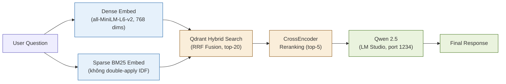

### F.5. API Endpoints (FastAPI)

| Endpoint       | Method | Mô tả                                 |
| -------------- | ------ | ------------------------------------- |
| `/query`       | POST   | Nhận câu hỏi, trả về answer + sources |
| `/ingest`      | POST   | Nạp JSON corpus mới vào Qdrant        |
| `/health`      | GET    | Health check                          |
| `/collections` | GET    | List Qdrant collections và stats      |

---

## Phụ lục G: Analytics & KPI Catalog

> Danh mục đầy đủ các chỉ số phân tích theo từng mảng nghiệp vụ, trace về SF-08-08 đến SF-08-13. Mọi công thức trong phụ lục này đã được **kiểm chứng trên dữ liệu thật** của hệ thống (không phải giả định lý thuyết) — kèm ghi chú các "bẫy" (gotcha) đã phát hiện thực tế trong quá trình xây dựng.

**Sơ đồ tổng quan — 7 mảng phân tích, nguồn dữ liệu chính, output BI:**

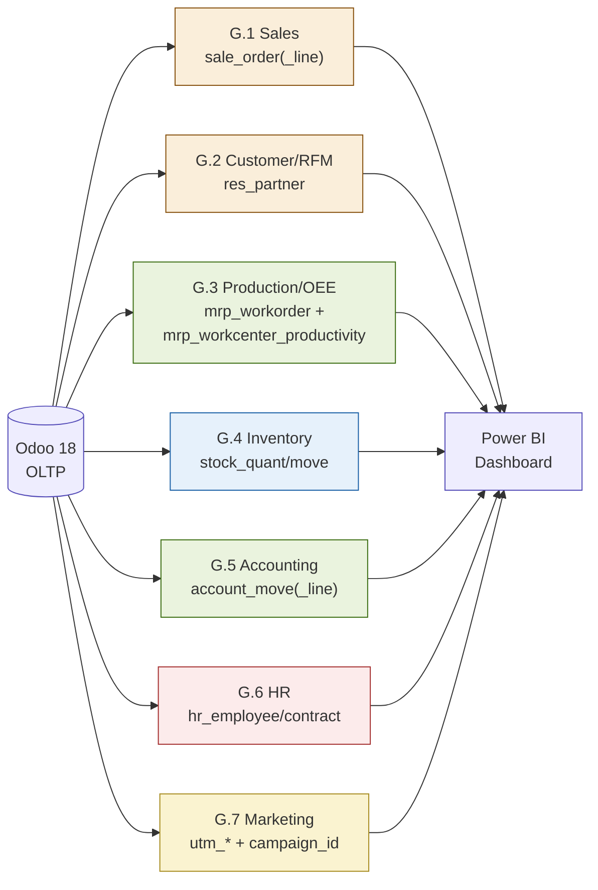

### G.1. Sales Analytics (trace: SF-01, SF-08-08)

| KPI                       | Công thức                                                                                                          | Nguồn bảng.field                |
| ------------------------- | ------------------------------------------------------------------------------------------------------------------ | ------------------------------- |
| Revenue                   | `SUM(sale_order_line.price_subtotal)` WHERE `sale_order.state='sale'`                                              | `sale_order_line`, `sale_order` |
| AOV (Average Order Value) | `SUM(amount_total) / COUNT(DISTINCT so.id)`                                                                        | `sale_order`                    |
| Order count theo Region   | JOIN `sale_order.warehouse_id` → `stock_warehouse` → suy ra Region (WEST/EAST/CNTL/SOUT)                           | `sale_order`, `stock_warehouse` |
| Pareto khách hàng         | Top 20% `partner_id` theo `SUM(amount_total)` DESC phải chiếm ~80% tổng revenue                                    | `sale_order`                    |
| Cancel rate               | `COUNT(*) FILTER (WHERE state='cancel') / COUNT(*)` — target ~3%, xảy ra SAU KHI confirm (không phải hủy từ draft) | `sale_order`                    |
| Late delivery %           | `COUNT(*) FILTER (WHERE date_done > scheduled_date) / COUNT(*)` — target ~8%, tập trung WH-CENTRAL cao hơn         | `stock_picking`                 |

**⚠️ Gotcha đã phát hiện thực tế:**

- `sale_order.state` KHÔNG có giá trị `done` — chỉ có `draft→sent→sale|cancel`. Đơn hoàn tất (đã giao + đã xuất hóa đơn) vẫn giữ `state='sale'` mãi mãi. Độ hoàn tất phải đọc qua `invoice_status='invoiced'` AND `delivery_status='full'`, KHÔNG dựa vào `state`.
- `date_order` bị Odoo tự ghi đè thành `now()` khi confirm SO — phải backfill lại ngày lịch sử SAU KHI confirm nếu cần phân tích theo mùa vụ.
- 1 hóa đơn (`account_move`) có thể gộp NHIỀU `sale_order` của cùng 1 khách (Odoo native `_create_invoices()` batching) — join `account_move.invoice_origin` với `sale_order.name` phải dùng `LIKE`, không dùng `=`.

### G.2. Customer Analytics — RFM Lifecycle Segmentation (trace: SF-08-09)

**13 profile hành vi thiết kế sẵn** (dùng để SINH dữ liệu thực tế đa dạng, KHÔNG dùng để PHÂN LOẠI khách hàng khi phân tích):

| Nhóm                | Profile                                       | Đặc điểm hành vi                                               |
| ------------------- | --------------------------------------------- | -------------------------------------------------------------- |
| Active & High Value | Champions, Loyal Customers                    | Mua đều, tần suất cao, giá trị cao, hoạt động xuyên suốt 4 năm |
| Growing/Potential   | Potential Loyalists, Promising, New Customers | Khách mới, đang tăng trưởng tần suất                           |
| At Risk/Declining   | At Risk, Cant Lose Them, Need Attention       | Từng tích cực, đang giảm dần                                   |
| Sleeping/Lost       | About to Sleep, Hibernating, Lost             | Đang ngủ đông hoặc đã ngừng mua hẳn                            |
| Special Pattern     | Reactivated, Seasonal                         | Có gap rồi quay lại (churn-winback) / chỉ mua theo mùa cố định |

**Công thức RFM THẬT (tính từ dữ liệu, không dựa vào nhãn `res_partner.ref`):**

```sql
WITH rfm_raw AS (
    SELECT partner_id,
        MAX(date_order::date)   AS last_order_date,
        COUNT(*)                AS frequency,
        SUM(amount_total)       AS monetary
    FROM sale_order WHERE state='sale' GROUP BY partner_id
)
SELECT partner_id,
    NTILE(5) OVER (ORDER BY last_order_date DESC) AS r_score,
    NTILE(5) OVER (ORDER BY frequency)             AS f_score,
    NTILE(5) OVER (ORDER BY monetary)              AS m_score
FROM rfm_raw;
```

**⚠️ Gotcha đã phát hiện thực tế:**

- `res_partner.ref` (nhãn `rfm:champion`, `rfm:loyal`...) chỉ nên gắn cho khách hàng THỰC SỰ có đơn hàng khớp hành vi thiết kế — nếu gán nhãn cho toàn bộ customer base rồi chỉ sinh đơn cho 1 subset, nhãn sẽ SAI LỆCH (đã xảy ra: gán nhãn 2,000 khách nhưng chỉ 200 có đơn thật, phải dọn lại nhãn cho 1,800 khách còn lại).
- Lấy mẫu ngẫu nhiên theo dict insertion order (`dict(items)[:N]`) KHÔNG đại diện đủ 13 profile — vì profile được gán tuần tự (Champions trước, Lost sau...), cắt N phần tử đầu chỉ lấy trúng 1-2 profile đầu tiên. Phải sample theo tỷ lệ mỗi profile riêng.
- DAX/SQL phân tích RFM nên tính R/F/M trực tiếp từ `sale_order` (như công thức trên), KHÔNG nên trust nhãn `ref` làm nguồn phân loại chính — nhãn chỉ dùng để validate xem generator có tạo đúng ý đồ thiết kế hay không.

### G.3. Production & OEE Analytics (trace: SF-05-07 → SF-05-13, SF-08-10)

**3 công thức OEE đầy đủ, đã verify trên dữ liệu thật:**

```sql
-- Performance (cap 100% bắt buộc)
Performance = LEAST(duration_expected / duration, 1.0)   -- verify thật: 87.7% (có cap) vs 90.0% (không cap)

-- Availability (CHỈ 2/4 loss_type: productive + availability — KHÔNG cộng quality/performance)
WITH blocks AS (
    SELECT workorder_id, workcenter_id,
        SUM(duration) FILTER (WHERE loss_type='productive')   AS productive_min,
        SUM(duration) FILTER (WHERE loss_type='availability') AS avail_loss_min
    FROM mrp_workcenter_productivity GROUP BY workorder_id, workcenter_id
)
SELECT wc.name,
    SUM(productive_min) / NULLIF(SUM(productive_min)+SUM(COALESCE(avail_loss_min,0)),0) * 100 AS availability_pct
FROM blocks b JOIN mrp_workcenter wc ON wc.id=b.workcenter_id GROUP BY wc.name;
-- verify thật: WC-ASM=99.2% · WC-CUT=98.5% · WC-QC=99.0%

-- Quality (dùng stock_scrap, KHÔNG phải mrp_scrap — bảng đó không tồn tại)
Quality = (SUM(qty_produced) - SUM(scrap_qty)) / SUM(qty_produced)   -- verify thật: 99.04% (defect rate 0.96%)

-- OEE tổng
OEE = Availability × Performance × Quality   -- verify thật: ~85.9% (world-class ngưỡng ≥85%)
```

**`duration_expected` — công thức đầy đủ + ví dụ thật:**

```
duration_expected = CEIL(qty_producing / default_capacity) × time_cycle_manual × 100/time_efficiency
Ví dụ (MO id=1, WC-CUT sản xuất 26 SP, capacity=2, time_cycle_manual=45): CEIL(26/2)×45×100/100 = 585 phút
→ khớp 100% với giá trị Odoo lưu trong DB
```

**Ý nghĩa 4 loss_type trong `mrp_workcenter_productivity`:**

| loss_type      | Ý nghĩa                           | Máy có đang chạy? | Dùng cho chỉ số nào                                                                            |
| -------------- | --------------------------------- | ----------------- | ---------------------------------------------------------------------------------------------- |
| `productive`   | Chạy tốt, hiệu quả                | Có                | Tử số chung của cả 3 chỉ số                                                                    |
| `availability` | Dừng hẳn (máy hỏng/chờ NVL/setup) | Không             | Availability                                                                                   |
| `performance`  | Chạy chậm hơn chuẩn               | Có (chậm)         | Performance — KHÔNG tạo block riêng trong dự án này, đo qua tỷ lệ `duration_expected/duration` |
| `quality`      | Xử lý lỗi/hàng hỏng               | Có                | Quality                                                                                        |

**⚠️ Gotcha đã phát hiện thực tế:**

- `default_capacity` là số THÀNH PHẨM xử lý song song/chu kỳ — KHÔNG liên quan đến định mức NVL (`mrp_bom_line.product_qty`). 2 khái niệm hoàn toàn độc lập, chỉ tình cờ dùng chung input `product_qty` của MO.
- `duration` KHÔNG bằng `date_finished − date_start` khi work order có block sự cố trước productive (~14% WO) — luôn lấy thẳng cột `duration`, không tự tính lại từ 2 mốc ngày.
- `mrp_workorder.date_planned_start` KHÔNG TỒN TẠI trong Odoo 18 — chỉ có `date_start` (dùng chung cho cả kế hoạch lẫn thực tế, bị ghi đè sau khi WO chạy xong).
- Availability tính theo giả định lịch ca cố định (`planned_time = số_ca×480×ngày`) RẤT DỄ SAI nếu chọn số ca không khớp nhu cầu thực — từng ra kết quả 358% (vô lý) khi giả định sai "1 ca/ngày". Công thức khuyến nghị (trên) dùng trực tiếp block downtime thật, không cần giả định lịch ca.

### G.4. Inventory Analytics (trace: SF-04, SF-08-11)

| KPI                | Công thức                                                                                  | Nguồn                                          |
| ------------------ | ------------------------------------------------------------------------------------------ | ---------------------------------------------- |
| Tồn kho hiện tại   | `SUM(stock_quant.quantity)` theo `product_id`+`location_id` (usage='internal')             | `stock_quant`, `stock_location`                |
| Inventory turnover | `COGS / Average Inventory Value`                                                           | `stock_move`, `product_product.standard_price` |
| Stockout risk      | Sản phẩm có `qty_available` < `safety_stock` (4 tuần tiêu thụ TB)                          | `stock_quant`                                  |
| Late receipt NCC   | `COUNT(*) FILTER (WHERE date_done > scheduled_date) / COUNT(*)` trên Receipt — target ~10% | `stock_picking`                                |

**⚠️ Gotcha đã phát hiện thực tế (nghiêm trọng — đã fix):**

- **Tồn kho âm (physically impossible)**: nếu demand-driven replenishment (P2P/Manufacturing) gộp nhu cầu THEO TOÀN CÔNG TY rồi giao ngẫu nhiên về 1 kho (thay vì đúng kho phát sinh nhu cầu), sẽ khiến 1 số kho bị âm tồn kho. Đã phát hiện thực tế: 161/1,807 quant âm (tới -223 đơn vị) do bug này ở cả `p3_purchasing` VÀ `p4_manufacturing`. **Bắt buộc**: mọi query demand phải `GROUP BY product_id, warehouse_code` (không chỉ `product_id`), và route replenishment về ĐÚNG kho phát sinh nhu cầu đó.
- **dbt test bắt buộc**: `assert_no_negative_stock` — `SELECT count(*) FROM stock_quant sq JOIN stock_location sl ON sl.id=sq.location_id WHERE sl.usage='internal' AND sq.quantity < 0` phải luôn = 0.

### G.5. Accounting Analytics (trace: SF-06, SF-08-12)

| KPI                          | Công thức                                                            | Nguồn                                  |
| ---------------------------- | -------------------------------------------------------------------- | -------------------------------------- |
| Revenue                      | `SUM(account_move_line.credit)` WHERE `account_type='income'`        | `account_move_line`, `account_account` |
| AR Aging                     | `CURRENT_DATE - invoice_date` cho hóa đơn có `amount_residual > 0`   | `account_move`                         |
| DSO (Days Sales Outstanding) | `AVG(payment.date - invoice.invoice_date)` cho hóa đơn đã thanh toán | `account_payment`, `account_move`      |
| P&L                          | Revenue − COGS − OpEx, theo `account_account.account_type`           | `account_move_line`                    |

**⚠️ Gotcha đã phát hiện thực tế:**

- Setup này dùng **Standard Cost, KHÔNG bật real-time valuation** — nghĩa là validate delivery **KHÔNG tự động** tạo bút toán `DR COGS / CR Inventory`. Hóa đơn bán hàng chỉ có 2 dòng: `DR Accounts Receivable / CR Revenue` (đã kiểm chứng thật trên `account_move_line`, không phải giả định). Nếu SRS/BRD mô tả có bút toán COGS/Inventory tự động, cần sửa lại cho khớp thực tế.
- `account_account.company_id` KHÔNG PHẢI cột thật trong Odoo 18 — company liên kết qua Many2many `company_ids` (bảng trung gian `account_account_res_company_rel`), do kiến trúc multi-company đổi từ bản cũ.
- `res_currency.rate` không phải cột thật — tỷ giá theo ngày nằm ở bảng riêng `res_currency_rate` (time-series).

### G.6. HR Analytics (trace: SF-07, SF-08-13)

| KPI                     | Công thức                                                              | Nguồn                          |
| ----------------------- | ---------------------------------------------------------------------- | ------------------------------ |
| Headcount by Department | `COUNT(*)` GROUP BY `department_id`                                    | `hr_employee`, `hr_department` |
| Salary trend (SCD2)     | Snapshot theo `write_date` mỗi lần `hr_contract.wage` thay đổi         | `hr_contract`                  |
| Contract count          | `COUNT(*)` theo `employee_id` — kỳ vọng 1-2 lần tăng lương/người/4 năm | `hr_contract`                  |

**⚠️ Gotcha đã phát hiện thực tế:**

- Bảng thật là `hr_contract` — module này (`hr_contract`) PHẢI được cài kèm lúc khởi tạo Odoo (`-i base,...,hr_contract,...`), không tự động cài theo `hr`. Thiếu module này sẽ crash toàn bộ pipeline ở bước tạo nhân viên.

### G.7. Marketing / Cross-Domain Attribution (trace: SF-02, SF-08-05)

| KPI                 | Công thức                                    | Nguồn                                             |
| ------------------- | -------------------------------------------- | ------------------------------------------------- |
| Revenue by Campaign | `SUM(amount_total)` GROUP BY `campaign_id`   | `sale_order.campaign_id` → `utm_campaign`         |
| ROAS                | `Revenue attributed / Ad spend` theo channel | `sale_order.campaign_id`, ad spend CSV ngoài Odoo |

**⚠️ Gotcha đã phát hiện thực tế:**

- `campaign_id` được gắn ở CẢ 2 bảng: `sale_order.campaign_id` (~45% đơn có, ngẫu nhiên) VÀ `account_move.campaign_id` (kế thừa tự động từ SO khi tạo hóa đơn, ~49% hóa đơn có — tỷ lệ gần khớp SO vì kế thừa trực tiếp). Không phải mọi đơn/hóa đơn đều có attribution — đây là thiết kế có chủ đích (không phải 100% traffic có nguồn UTM xác định, giống thực tế).

---

_Kết thúc tài liệu SRS — Superstore ERP & Data Platform v2.0_
