# SRS — Superstore ERP & Data Platform

## 1. Mục đích và trạng thái

| Thuộc tính | Giá trị |
|---|---|
| Hệ thống | Odoo 18 + Data Platform |
| Phiên bản tài liệu | 3.0 |
| Trạng thái | Khớp code hiện tại |
| Đối tượng đọc | BA, Data Engineer, Data Analyst, QA, vận hành |
| Mục tiêu | Chuyển yêu cầu nghiệp vụ thành data contract và tiêu chí nghiệm thu |

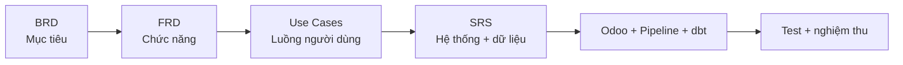

## 2. Phạm vi hệ thống

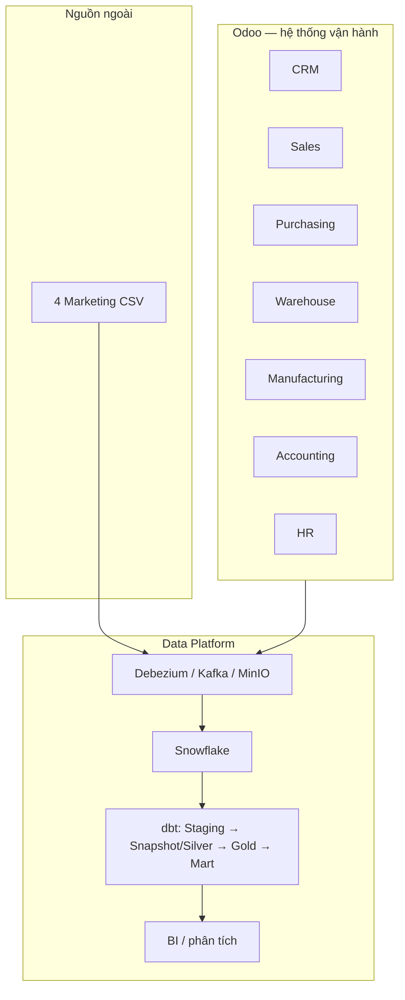

### Trong phạm vi

- Nghiệp vụ Odoo: CRM, bán hàng, mua hàng, kho, sản xuất, kế toán và hồ sơ HR.
- CDC read-only cho 44 bảng Odoo.
- Batch ingest cho 4 file marketing production.
- Snowflake + dbt gồm Staging, Snapshot, Silver, Gold và Mart.
- Dashboard/KPI được tạo từ Gold/Mart đã qua test.

### Ngoài phạm vi hiện tại

- Ghi trực tiếp từ FastAPI vào PostgreSQL Odoo.
- Đồng bộ web identity vào Odoo khi chưa có phê duyệt API/ORM riêng.
- HR Attendance/Payroll analytics.
- Odoo Mass Mailing, landed cost và stock move line analytics.
- Hai nguồn synthetic `customer_acquisition` và `marketing_funnel_monthly`.

## 3. Actor và quyền truy cập

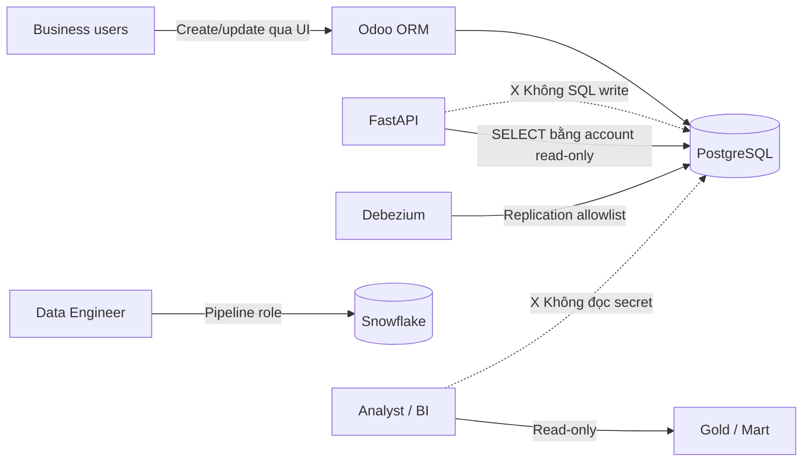

| Actor | Được phép | Không được phép |
|---|---|---|
| Business user | Ghi nghiệp vụ qua Odoo UI/ORM | Ghi SQL trực tiếp |
| FastAPI | Query vận hành bằng account read-only; lọc theo JWT | Tin `partner_id` do client tự gửi; ghi SQL |
| Debezium | Đọc 44 bảng qua replication allowlist | Thu thập credential/TOTP của user |
| Data Engineer | Vận hành pipeline, model và test | Sửa tay dữ liệu Gold để “chữa số” |
| Analyst/BI | Đọc Gold/Mart | Dùng Bronze làm số liệu chính thức |

## 4. Yêu cầu chức năng theo domain

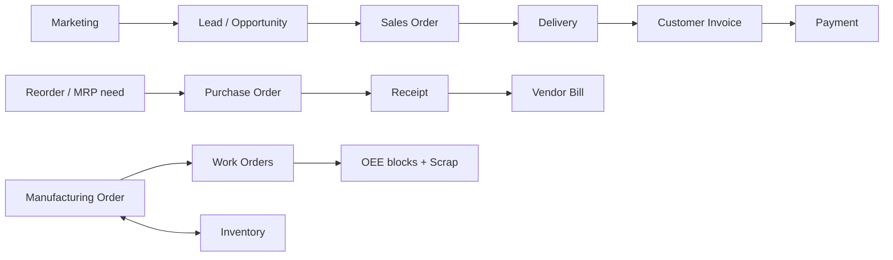

| Mã | Domain | Hệ thống phải hỗ trợ | Dữ liệu phân tích chính |
|---|---|---|---|
| SR-SAL-01 | Sales/CRM | Lead → opportunity → quotation → confirmed order | `fact_crm_funnel`, `fact_sales` |
| SR-MKT-01 | Marketing | Đối chiếu campaign Odoo với Ads/Email/A-B; tính funnel, ROAS, CAC | Marketing facts và marts |
| SR-PUR-01 | Purchasing | RFQ/PO, nhận hàng, theo dõi planned vs received | `fact_purchase`, `mart_vendor_performance` |
| SR-WH-01 | Warehouse | Receipt, delivery, transfer và tồn theo SKU/location/ngày | Inventory facts, delivery mart |
| SR-MFG-01 | Manufacturing | MO, work order, productivity block, scrap và OEE | Manufacturing facts, OEE mart |
| SR-ACC-01 | Accounting | Journal, customer invoice, allocation payment, P&L/AR/DSO | Finance facts và marts |
| SR-HR-01 | HR | Hồ sơ, tổ chức, user link và lịch sử hợp đồng | `dim_employee` SCD2 |
| SR-DATA-01 | DataOps | Ingest, transform, test, publish theo DAG hằng ngày | Toàn bộ platform |

## 5. Luồng nghiệp vụ trọng yếu

### 5.1 Order-to-Cash

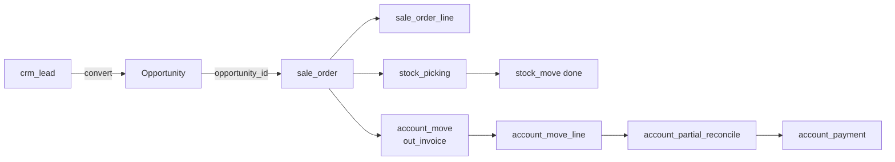

Điểm kiểm soát:

- `sale_order.opportunity_id` phải trỏ đến CRM record hợp lệ và cùng khách hàng.
- Revenue chỉ tính order không hủy, trạng thái `sale`/`done`.
- Thanh toán được nối với hóa đơn qua move lines và partial reconcile, không nối bằng tên.

### 5.2 Procure-to-Pay

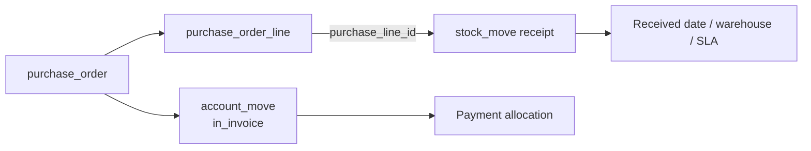

Điểm kiểm soát:

- Vendor là `res_partner` có `supplier_rank > 0`; project dùng chung `dim_customer` với vai trò vendor.
- Delivery KPI của vendor lấy từ done receipt gắn `purchase_order_line_id`.
- Nếu chưa có planned/received date, late status là “chưa đủ dữ liệu”, không mặc định `false`.

### 5.3 Inventory và Delivery

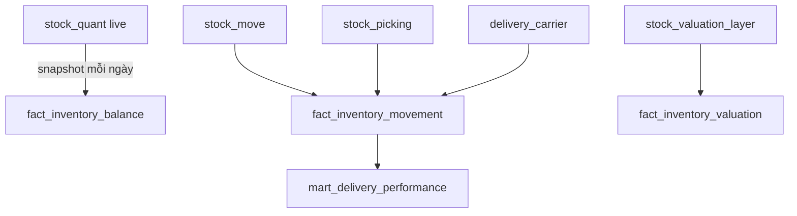

- `stock_quant.quantity` là tồn hệ thống; `inventory_quantity` chỉ là số đếm khi kiểm kê.
- `quantity_available = quantity - reserved_quantity`.
- Delivery được đếm theo `picking_id`, không đếm mỗi product move thành một lần giao.
- Trễ lịch và trễ deadline dùng ngày dự kiến/deadline so với `date_done` thực tế.

### 5.4 Manufacturing và OEE

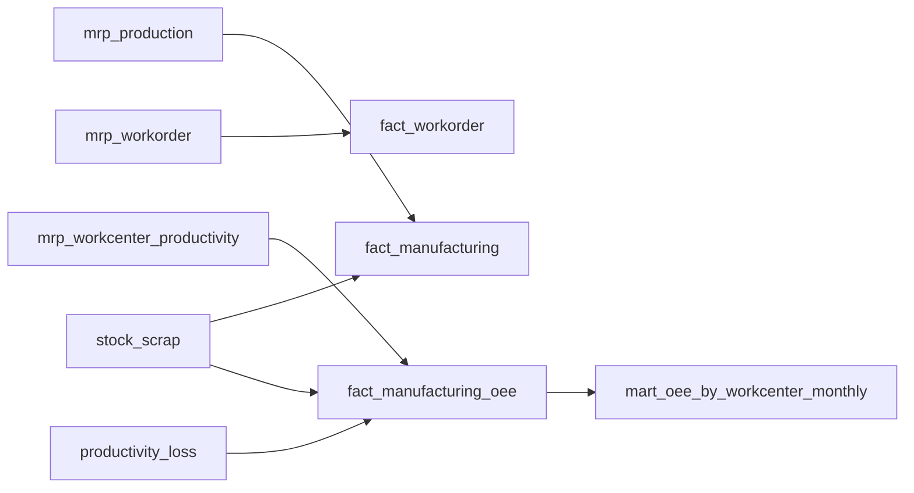

```text
Availability = productive / (productive + availability loss)
Performance  = min(estimated productive time / productive time, 1)
Quality      = (produced - scrap) / produced
OEE          = Availability × Performance × Quality
```

Quantity và scrap từ parent MO có thể lặp trên nhiều block; phải deduplicate theo work order/MO
trước khi tổng hợp Quality.

### 5.5 Accounting

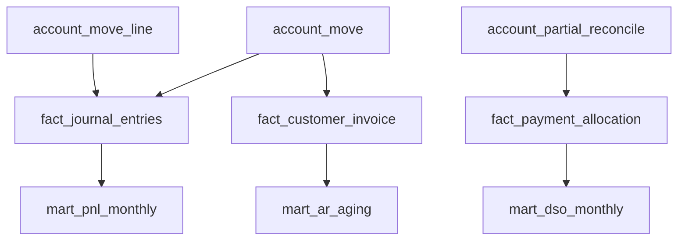

- P&L dùng dấu từ `dim_account.is_debit_normal`.
- AR Aging là daily snapshot của hóa đơn còn dư; không suy ra từ một allocation đại diện.
- DSO là số ngày từ invoice đến payment, weighted theo số tiền phân bổ.

### 5.6 Marketing funnel

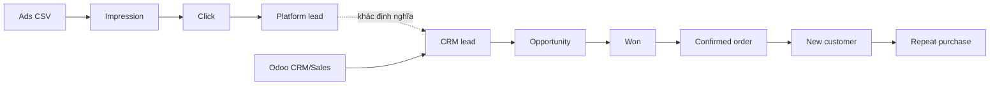

Platform lead/conversion và Odoo lead/order phải giữ thành metric riêng. Không ép hai hệ thống
có cùng số lượng khi không có event-level identity bridge.

## 6. Kiến trúc dữ liệu

### 6.1 Luồng vật lý

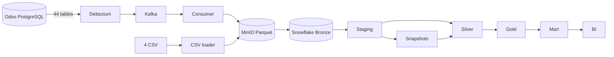

### 6.2 Nguồn CDC — 44 bảng

| Nhóm | Bảng |
|---|---|
| Sales | `sale_order`, `sale_order_line` |
| Accounting | `account_move`, `account_move_line`, `account_account`, `account_journal`, `account_payment`, `account_partial_reconcile` |
| Purchasing | `purchase_order`, `purchase_order_line` |
| Inventory | `stock_picking`, `delivery_carrier`, `stock_move`, `stock_location`, `stock_valuation_layer`, `stock_quant`, `stock_warehouse` |
| Manufacturing | `mrp_production`, `mrp_workorder`, `mrp_workcenter`, `mrp_workcenter_productivity`, `mrp_workcenter_productivity_loss`, `stock_scrap`, `mrp_bom` |
| CRM/UTM | `crm_lead`, `crm_stage`, `crm_lost_reason`, `utm_campaign`, `utm_source`, `utm_medium` |
| Partner/Product reference | `res_partner`, partner category tables, country/state, product template/variant/category, UOM |
| HR/User | `hr_employee`, `hr_contract`, `hr_department`, `hr_job`, `res_users` |

Allowlist thực thi nằm trong `data_platform/Debezium_producer/Debezium.py`.

### 6.3 Nguồn CSV — 4 file

| File | Grain | Khóa |
|---|---|---|
| `marketing_campaigns_master.csv` | 1 campaign | `campaign_id` |
| `ad_performance_daily.csv` | 1 campaign × date × channel | `campaign_id,date,channel` |
| `email_campaigns.csv` | 1 email blast | `email_id` |
| `ab_test_results.csv` | 1 variant | `variant_id` |

File không đổi được bỏ qua bằng whole-file hash. Record version được nhận diện bằng metadata
batch và `record_hash` của từng record trong Staging.

## 7. Data model và grain

### 7.1 Conformed dimensions

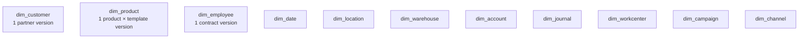

SCD2 dimensions: `dim_customer`, `dim_product`, `dim_employee`. Các dimension còn lại là latest
known state theo CDC hiện tại.

### 7.2 Facts

| Fact | Grain |
|---|---|
| `fact_sales` | 1 `sale_order_line` |
| `fact_crm_funnel` | 1 `crm_lead` |
| `fact_purchase` | 1 `purchase_order_line` |
| `fact_inventory_movement` | 1 `stock_move` |
| `fact_inventory_valuation` | 1 `stock_valuation_layer` |
| `fact_inventory_balance` | 1 product × location × snapshot date |
| `fact_manufacturing` | 1 `mrp_production` |
| `fact_workorder` | 1 `mrp_workorder` |
| `fact_manufacturing_oee` | 1 productivity block |
| `fact_journal_entries` | 1 `account_move_line` |
| `fact_customer_invoice` | 1 customer invoice |
| `fact_payment_allocation` | 1 `account_partial_reconcile` |
| `fact_ad_spend` | 1 campaign × date × channel |
| `fact_email_campaign` | 1 email blast |
| `fact_ab_test` | 1 A/B variant |
| `fact_customer_acquisition` | 1 commercial customer có confirmed order |
| `fact_marketing_funnel` | 1 month × channel |

### 7.3 Marts

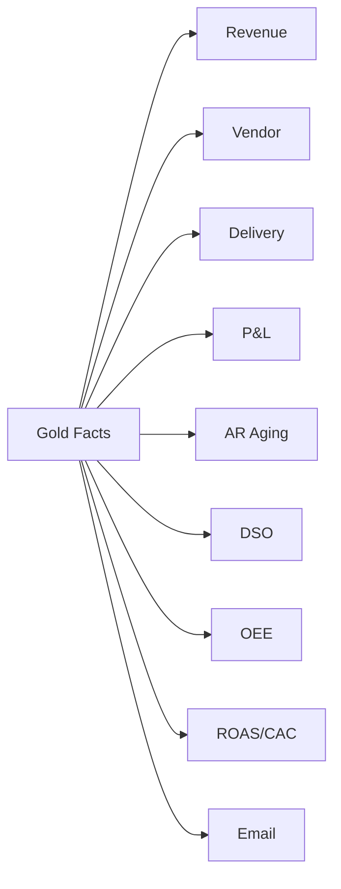

Mart chỉ được `ref()` Gold. Correction/backfill lịch sử ở Fact phải được phản ánh khi Mart chạy lại.

## 8. SCD2 và temporal join

### 8.1 Vòng đời version

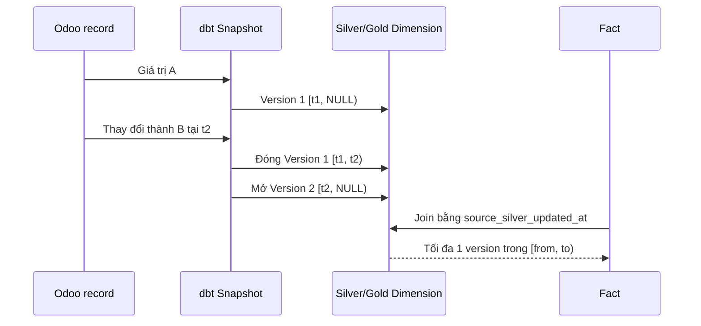

Quy tắc:

```sql
fact.business_id = dim.business_id
and fact.source_silver_updated_at >= dim.dbt_valid_from
and fact.source_silver_updated_at < coalesce(
    dim.dbt_valid_to,
    '9999-12-31'::timestamp
)
```

- Không kẹp fact cũ vào dimension version đầu tiên.
- Không dùng `gold_refreshed_at` để chọn business version.
- Silver/Gold SCD2 merge theo version key (`dbt_scd_id`; product dùng
  `product_version_id = product_id × dbt_scd_id`), không merge theo business ID.
- Khi Snapshot đóng version cũ, changed-business-key logic phải reload toàn bộ version của key đó.

## 9. Incremental và idempotency

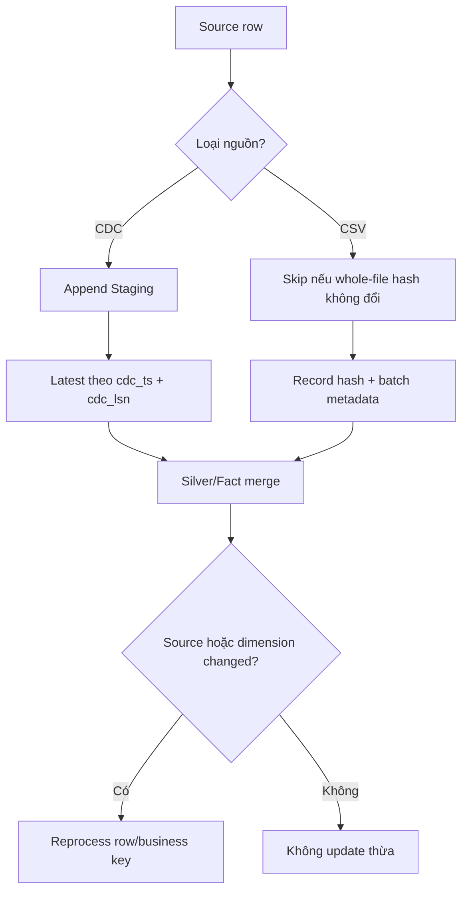

- CDC order dùng `_cdc_ts_ms`, sau đó `_cdc_lsn`; `ingested_at` không đại diện thứ tự WAL.
- Fact merge theo natural grain key và phải re-key khi dimension SK liên quan thay đổi.
- Periodic snapshot facts dùng khóa có ngày để chạy lại cùng ngày vẫn idempotent.
- Mart hiện tại ưu tiên full recompute từ Gold khi correction lịch sử có thể làm thay đổi aggregate.

## 10. Bảo mật và dữ liệu nhạy cảm

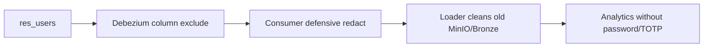

- `res_users.password` và `res_users.totp_secret` không được đi vào Kafka, MinIO hoặc Snowflake.
- Secret nằm trong `.env` local; không commit vào Git.
- Credential của Odoo, FastAPI, CDC và BI phải tách riêng theo least privilege.
- Analytical state có độ trễ và không thay thế live operational state.

## 11. Yêu cầu phi chức năng

| Nhóm | Yêu cầu |
|---|---|
| Lịch chạy | DAG `batching_pipeline_snowflake` chạy 09:00 Asia/Ho_Chi_Minh, tối đa một run active. |
| Độ trễ | Mart sẵn sàng trong ngày; mục tiêu nghiệp vụ < 24 giờ. |
| Reliability | Mỗi task retry 1 lần; downstream không chạy nếu upstream/test lỗi. |
| Data quality | PK unique/not null, FK relationships, accepted values, accounting balance và grain tests. |
| SCD2 | Tối đa một current version, không overlap, `valid_to > valid_from`. |
| Fact joins | Mỗi fact match tối đa một dimension version; không duplicate sau join. |
| Audit | Giữ CDC/batch metadata và source version key ở các lớp cần truy vết. |
| Schema change | Đồng bộ cột có kiểm soát; model/test/docs phải cập nhật cùng thay đổi nguồn. |
| Recovery | Có thể chạy lại idempotent; backfill bảng CDC mới bằng incremental snapshot signal. |

## 12. DAG và điều kiện publish

```mermaid
flowchart LR
    DBZ[Configure] --> HEALTH[Health]
    HEALTH --> REC[Campaign reconcile]
    REC --> RAW[Load raw]
    RAW --> BRONZE[Snowflake Bronze]
    BRONZE --> STG[Staging + test]
    STG --> SNAP[Snapshot + test]
    SNAP --> SIL[Silver + test]
    SIL --> GOLD[Gold + test]
    GOLD --> MART[Mart + test]
    MART --> READY[BI ready]
```

Điều kiện publish: mọi task và test phía trước phải thành công. `dbt parse` chỉ xác nhận cấu trúc;
không thay thế `dbt run/test` trên Snowflake thật.

## 13. Bộ test tối thiểu

| Nhóm | Test bắt buộc |
|---|---|
| Grain | Unique business/fact key; fact không duplicate sau join. |
| SCD2 | Một current/key; không overlap; valid interval dương. |
| Temporal | Fact match tối đa một dimension version. |
| Accounting | Tổng debit = credit theo move; dấu P&L đúng account type. |
| Inventory | Snapshot unique product × location × date; quantities không bị nhân do join. |
| Marketing | Campaign ID tồn tại trong Odoo; ratio tính từ tổng tử/mẫu. |
| Security | Không có password/TOTP trong connector payload, raw và Bronze. |
| Mart | Không tham chiếu Staging/Silver/Snapshot; unique đúng grain. |

## 14. Tiêu chí nghiệm thu cuối

- [ ] Odoo nghiệp vụ chạy qua UI/ORM và các khóa quan hệ đúng.
- [ ] 44 bảng CDC và 4 CSV đi qua pipeline đúng sơ đồ.
- [ ] Ba dimension SCD2 giữ lịch sử đúng và Fact temporal join không duplicate.
- [ ] Facts/Marts đúng grain, đủ dữ liệu cho KPI đã công bố và không che giấu `NULL`/N/A.
- [ ] Campaign reconciliation, accounting balance và security tests thành công.
- [ ] Airflow hoàn tất toàn DAG; dbt run/test thành công trên Snowflake thật.
- [ ] Hai Draw.io và tài liệu BA khớp model hiện có.

## 15. Tài liệu tham chiếu

- `docs/business/README.md`
- `docs/business/BRD-superstore.md`
- `docs/business/FRD-01-sales-crm.md` đến `FRD-07-08-hr-dataops.md`
- `docs/business/UC-superstore.md`
- `docs/odoo/entity_map.md`
- `docs/odoo/access_strategy.md`
- `docs/data_platform/operation.md`
- `docs/data_platform/superstore-pipeline-3layer.drawio`
- `docs/data_platform/superstore_pipeline_lineage.drawio`
