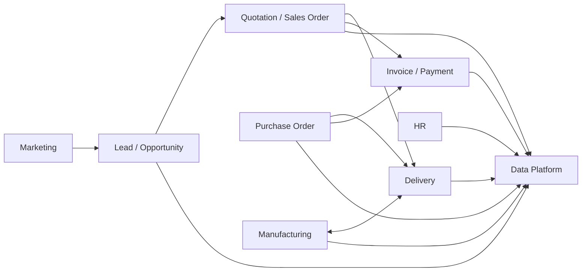

# UC — USE CASES & USER STORIES
## Superstore ERP · Tất cả phòng ban · Phiên bản 1.0 · 2026

> **Lưu ý kép:** Mỗi Use Case là (1) tài liệu kiểm thử hệ thống và (2) kịch bản mà **data generator phải mô phỏng** để sinh dữ liệu giống thật.

---

## 1. Danh mục Use Cases

| Mã UC | Tên | Phòng ban | Value Stream | Trace về |
|---|---|---|---|---|
| UC-SAL-01 | Tạo lead từ chiến dịch marketing | Sales/CRM | O2C | FR-SAL-01, FR-MKT-01 |
| UC-SAL-02 | Tạo và gửi báo giá cho khách B2B | Sales | O2C | FR-SAL-01, BR-SAL-01 |
| UC-SAL-03 | Xin duyệt chiết khấu đặc biệt | Sales | O2C | BR-SAL-02, BR-SAL-03 |
| UC-SAL-04 | Confirm đơn hàng B2C | Sales | O2C | FR-SAL-01 |
| UC-SAL-05 | Xử lý đơn hủy sau confirm | Sales | O2C | Exception SAL-1 |
| UC-SAL-06 | Theo dõi đơn hàng đang giao | Customer Service | O2C | FR-SAL-01 |
| UC-MKT-01 | Tạo chiến dịch Google Ads có UTM | Marketing | — | FR-MKT-01 |
| UC-MKT-02 | Gửi email campaign tháng | Marketing | — | FR-MKT-02 |
| UC-MKT-03 | Phân tích ROAS cuối tháng | Marketing/Data | — | FR-MKT-02, FR-DATA-01 |
| UC-PUR-01 | Tạo RFQ và gửi cho NCC | Purchasing | P2P | FR-PUR-01 |
| UC-PUR-02 | Confirm PO và theo dõi giao hàng NCC | Purchasing | P2P | FR-PUR-01 |
| UC-PUR-03 | Thực hiện 3-way match | Purchasing | P2P | BR-PUR-04 |
| UC-WH-01 | Nhận hàng từ NCC vào kho | Warehouse | P2P | FR-WH-01 |
| UC-WH-02 | Xuất hàng giao cho khách | Warehouse | O2C | FR-WH-01 |
| UC-WH-03 | Chuyển hàng giữa kho vùng | Warehouse | — | FR-WH-02 |
| UC-WH-04 | Thực hiện kiểm kê định kỳ | Warehouse | — | BR-WH-04 |
| UC-MFG-01 | Lập kế hoạch sản xuất tháng | Manufacturing | P2P | FR-MFG-01 |
| UC-MFG-02 | Tạo và vận hành Manufacturing Order | Manufacturing | P2P | FR-MFG-01, FR-MFG-02 |
| UC-MFG-03 | Kiểm tra chất lượng và nhập kho thành phẩm | Manufacturing/QC | P2P | BR-MFG-04 |
| UC-MFG-04 | Xử lý sản phẩm lỗi (scrap/rework) | Manufacturing | — | Exception MFG-2 |
| UC-ACC-01 | Tạo và ghi sổ hóa đơn bán hàng | Accounting | O2C | FR-ACC-01 |
| UC-ACC-02 | Ghi nhận thanh toán từ khách hàng | Accounting | O2C | FR-ACC-01 |
| UC-ACC-03 | Theo dõi và xử lý công nợ quá hạn | Accounting | O2C | BR-ACC-04 |
| UC-ACC-04 | Thanh toán hóa đơn nhà cung cấp | Accounting | P2P | FR-ACC-02 |
| UC-ACC-05 | Đóng sổ kế toán cuối tháng | Accounting | — | SOP 5.3 |
| UC-HR-01 | Onboard nhân viên mới | HR | — | FR-HR-01 |
| UC-HR-02 | Cập nhật tăng lương | HR | — | BR-HR-01 |
| UC-DATA-01 | Kiểm tra pipeline CDC hằng ngày | Data Ops | — | FR-DATA-01 |
| UC-DATA-02 | Tạo báo cáo tháng cho ban lãnh đạo | Data Ops | — | FR-DATA-02 |
| UC-DATA-03 | Xử lý data quality alert | Data Ops | — | BR-DATA-05 |

---

## 2. Use Cases chi tiết

### UC-SAL-02 — Tạo và gửi báo giá cho khách B2B

**Actor chính:** Inside Sales Representative
**Actor phụ:** Sales Director (nếu cần duyệt), Khách hàng

**Điều kiện trước (Precondition):**
- Khách hàng đã tồn tại trong res.partner với customer_rank > 0
- Opportunity đang ở stage "Proposition" trở lên
- Sản phẩm có trong catalog với giá niêm yết

**Luồng chính (Main Flow):**
1. Sales Rep mở Opportunity trong CRM
2. Bấm "New Quotation" → Odoo tạo sale.order (state=draft) liên kết với opportunity
3. Thêm sản phẩm: chọn product, nhập qty, điều chỉnh price_unit nếu cần
4. Áp dụng discount theo bậc: nhập % discount trên từng line
5. Hệ thống tính tự động: price_subtotal = price_unit × qty × (1 - discount/100)
6. Kiểm tra tổng đơn:
   - Nếu tổng > $10K: Sales Rep ghi chú và gửi cho Sales Director duyệt (UC-SAL-03)
   - Nếu tổng ≤ $10K: tiếp tục trực tiếp
7. Bấm "Send by Email" → Odoo tạo PDF và gửi qua mail với template chuẩn
8. SO chuyển state = "sent"

**Luồng thay thế (Alternate Flow):**
- 4a: Khách yêu cầu discount > 15% → xem UC-SAL-03
- 7a: Khách yêu cầu gửi lại báo giá khác → điều chỉnh rồi gửi lại; tạo revision mới

**Điều kiện sau (Postcondition):**
- SO tồn tại với state="sent", đầy đủ lines và discount
- Khách đã nhận email báo giá với PDF đính kèm
- Lịch sử gửi mail ghi trên chatter của SO

**Acceptance Criteria (tiêu chí chấp nhận):**
- ✓ SO tạo thành công với đúng partner_id và order_lines
- ✓ Discount đúng theo bậc sản lượng (BR-SAL-01)
- ✓ SO > $10K không gửi được khi chưa Director duyệt
- ✓ Email đến mailbox khách trong 2 phút

---

### UC-PUR-03 — Thực hiện 3-way match

**Actor:** AP Specialist, Purchasing Manager
**Điều kiện trước:** PO ở state "purchase" (confirmed), Goods Receipt đã validated, Vendor Bill đã nhận từ NCC

**Luồng chính:**
1. AP Specialist nhận vendor bill từ NCC (email/mail)
2. Mở PO liên quan trong Odoo (Purchase → Orders → tìm theo số PO)
3. Bấm "Create Bill" → Odoo tạo account.move (in_invoice) prefill từ PO
4. So sánh 3 chiều:
   - PO: qty đặt, price đặt
   - Goods Receipt: qty thực nhận (stock.move.done_qty)
   - Vendor Bill: qty và price NCC ghi trên hóa đơn
5. Nếu 3 chiều khớp nhau: AP báo Purchasing Mgr "Match OK"
6. Purchasing Mgr xác nhận → Bill sẵn sàng Post
7. AP Post bill → bút toán Nợ COGS/Có AP

**Alternate Flow:**
- 4a: Qty bill > qty received → Không Post → Liên hệ NCC → chờ credit note
- 4b: Price bill ≠ price PO → Không Post → Purchasing điều tra → tạo PO amendment hoặc NCC gửi corrected invoice
- 4c: Bill cho hàng chưa nhận → Từ chối; không tạo bill đến khi có goods receipt

**Postcondition:** Bill posted, bút toán kế toán đúng, `amount_residual` = giá trị bill

---

### UC-MFG-02 — Tạo và vận hành Manufacturing Order

**Actor:** Production Planner, Assembly Workers, QC Inspector
**Điều kiện trước:** BOM cho sản phẩm đã được duyệt, tồn nguyên liệu đủ hoặc PO nguyên liệu đã confirmed

**Luồng chính:**
1. Production Planner vào Manufacturing → Manufacturing Orders → New
2. Chọn product (ví dụ: Standard Desk), qty cần sản xuất, ngày cần hoàn thành
3. Hệ thống tự load BOM → hiển thị danh sách components cần và Routing 3 Work Orders
4. Check Availability → xác nhận NVL đủ
5. Confirm MO → state = "confirmed"; Work Orders tạo: OP-01, OP-02, OP-03
6. Operator WC-CUT: mở Work Order OP-01 → Set as Started → thực hiện cắt vật liệu → Mark as Done
7. Hệ thống: xuất NVL từ WH-WEST/Stock → Production location (stock.move consume)
8. Operator WC-ASM: mở OP-02 → lắp ráp → Mark as Done
9. QC Inspector: mở OP-03 → kiểm tra → nếu đạt: Mark as Done; nếu không đạt: xem UC-MFG-04
10. Production Planner: Produce → nhập qty produced → Validate Production
11. Hệ thống: nhập thành phẩm vào WH-WEST/Stock (stock.move produce)
12. MO state = "done"; tính giá thành thực tế

**Postcondition:**
- WH-WEST tồn kho tăng đúng qty sản phẩm
- NVL giảm theo BOM thực tế
- MO state = done với giá thành ghi nhận

---

### UC-ACC-03 — Theo dõi và xử lý công nợ quá hạn

**Actor:** AR Specialist, Sales Rep (thông báo), Khách hàng
**Điều kiện trước:** Customer invoice đã posted, due date đã qua

**Luồng chính:**
1. AR Specialist chạy AR Aging Report hằng ngày sáng sớm
2. Xác định HĐ quá hạn > 15 ngày (danh sách theo bucket: 15–30, 31–60, >60)
3. Với HĐ 15–30 ngày: gửi email nhắc tự động (Odoo Follow-up)
4. Với HĐ 31–60 ngày: AR Specialist gọi điện trực tiếp; ghi log cuộc gọi lên chatter
5. Với HĐ > 60 ngày: báo CFO và Sales Director → cân nhắc credit hold
6. Khi nhận được tiền: Register Payment → reconcile với HĐ → amount_residual = 0

**Alternate Flow:**
- 5a: Khách xin gia hạn thêm 15 ngày → Sales Director approve → ghi note, không credit hold ngay
- 5b: Khách tranh chấp HĐ → Stop collection → AR + Sales làm việc với khách giải quyết → tạo Credit Note nếu cần

---

### UC-HR-02 — Cập nhật tăng lương

**Actor:** HR Generalist, Department Manager (đề xuất)
**Điều kiện trước:** Nhân viên đang có contract state=open, có quyết định tăng lương được Manager và CFO duyệt

**Luồng chính:**
1. HR nhận email đề xuất tăng lương từ Dept Manager (kèm approval CFO)
2. Mở hr.contract hiện tại → đặt date_end = ngày hiệu lực tăng lương - 1 ngày → Save → state tự chuyển = close
3. Tạo hr.contract mới cho cùng nhân viên: wage mới, date_start = ngày hiệu lực
4. Confirm contract mới → state = open
5. Ghi note lý do tăng lương trên chatter

**Postcondition:**
- Nhân viên có 2 contract trong lịch sử: contract cũ (close, date_end set) và contract mới (open)
- Payslip tháng hiện tại tính theo contract mới
- Đây là SCD2 Type 2 tự nhiên: lịch sử lương đầy đủ, không xóa

---

## 3. User Stories tổng hợp (Agile format)

| Mã | As a... | I want to... | So that... |
|---|---|---|---|
| US-SAL-01 | Sales Rep | Tạo báo giá từ opportunity chỉ với vài click | Không phải nhập lại thông tin khách đã có |
| US-SAL-02 | Sales Rep | Thấy cảnh báo ngay khi discount > 15% | Tôi không vô tình vi phạm chính sách |
| US-SAL-03 | Sales Director | Duyệt hoặc từ chối SO lớn từ điện thoại | Không phải vào office mới duyệt được |
| US-MKT-01 | Marketing Mgr | Thấy ROAS từng kênh trong 1 màn hình | Tôi cắt ngân sách kênh kém ngay trong tháng |
| US-PUR-01 | Buyer | Hệ thống tự cảnh báo khi tồn NVL dưới reorder point | Tôi không bỏ sót việc mua hàng |
| US-PUR-02 | Purchasing Mgr | Xem 3-way match status ngay trên PO | Không phải đối chiếu bằng tay Excel |
| US-WH-01 | Warehouse Operator | Thấy danh sách picking cần làm ngay khi vào hệ thống | Ưu tiên đúng đơn gấp nhất |
| US-WH-02 | Warehouse Supervisor | Biết tồn kho từng kho trong thời gian thực | Quyết định chuyển kho ngay khi thiếu |
| US-MFG-01 | Production Planner | MRP tự tính cần mua thêm bao nhiêu NVL | Không phải tính tay từng sản phẩm |
| US-ACC-01 | AR Specialist | Nhận alert tự động khi HĐ quá hạn 15 ngày | Tôi nhắc nợ đúng lúc, không bỏ sót |
| US-ACC-02 | CFO | Xem P&L tháng ngay sau ngày 5 | Họp ban lãnh đạo có số liệu chính xác |
| US-HR-01 | HR Generalist | Tạo hồ sơ nhân viên mới trong 10 phút | Nhân viên có thể đăng nhập hệ thống ngay ngày đầu |
| US-DATA-01 | Data Analyst | Nhận Slack alert ngay khi pipeline fail | Tôi fix lỗi trước khi dashboard sai số |
| US-DATA-02 | CEO | Dashboard đã có số liệu mới mỗi sáng | Ra quyết định với dữ liệu hôm nay, không phải tuần trước |

---

## 4. Kịch bản test tích hợp (Integration Test Scenarios)

**Kịch bản IT-01 — Full O2C B2B:**
Lead (campaign Google) → Opportunity → Quotation (chiết khấu 10%) → SO confirm → Delivery (WH-EAST giao cho khách East) → Invoice post (Dr 1200 / Cr 4010) → Payment sau 25 ngày → amount_residual = 0 → Data: fact_sales có 1 record đúng UTM campaign_id.

**Kịch bản IT-02 — Full P2P với 3-way match:**
Reorder point trigger → RFQ gửi 2 NCC → Chọn NCC giá thấp → PO confirm → Goods Receipt validate (qty đủ) → Vendor Bill nhận → 3-way match OK → Bill post (Dr 5010 / Có 2000) → Payment ngày 28 (Net-30) → amount_residual = 0.

**Kịch bản IT-03 — Manufacturing → Inventory:**
MO created (Standard Desk × 50) → Check availability (NVL đủ) → OP-01 done → OP-02 done → OP-03 QC passed → Validate Production → WH-WEST tồn Standard Desk +50 → MO done với giá thành thực tế.

**Kịch bản IT-04 — Exception: giao thiếu + return:**
SO confirm 10 chairs → Kho chỉ còn 7 → Giao 7 (partial) → Backorder 3 → SX thêm (MO) → Giao 3 còn lại → Invoice tạo sau khi giao đủ.

**Kịch bản IT-05 — Marketing attribution:**
Lead tạo với UTM Google và campaign ID hợp lệ → Lead converted → SO confirm với
`sale_order.opportunity_id` → `fact_sales.campaign_sk`/`channel_sk` được resolve →
`mart_roas_by_channel` ghi nhận đúng doanh thu attributed theo kênh.
