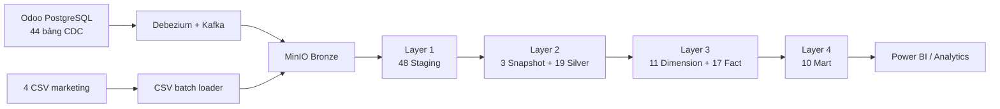

# Tài liệu Data Platform

Thư mục này mô tả cách dữ liệu đi từ Odoo/CSV đến Snowflake và cách vận hành pipeline hằng ngày.

## Nên đọc theo thứ tự nào?

| Nhu cầu | Tài liệu |
|---|---|
| Hiểu kiến trúc và trách nhiệm của từng lớp | [System_Architecture_Lineage.md](System_Architecture_Lineage.md) |
| Xem baseline và kết quả validation pipeline | [discovery_result.md](discovery_result.md) |
| Khởi động, theo dõi và xử lý sự cố | [operation.md](operation.md) |
| Xem nhanh luồng xử lý 4 lớp | [logic_structure.png](logic_structure.png) |
| So sánh trách nhiệm từng lớp | [warehouse_structure.png](warehouse_structure.png) |
| Xem lineage chi tiết theo từng bảng | [superstore-pipeline-3layer.drawio](superstore-pipeline-3layer.drawio) |
| Xem pipeline end-to-end theo domain | [superstore_pipeline_lineage.drawio](superstore_pipeline_lineage.drawio) |
| Xem cột, test và quan hệ thực tế | Chạy `dbt docs generate` và `dbt docs serve` trong `data_platform/superstore_db` |

> Tên file `superstore-pipeline-3layer.drawio` được giữ để không làm hỏng liên kết cũ. Nội dung hiện tại đã mô tả đủ **4 lớp dbt**.

## Kiến trúc hiện tại



Snapshot là nhánh hỗ trợ SCD2 bên trong Layer 2, không phải một lớp phân tích độc lập. Bronze là vùng landing trước dbt.

## Nguồn sự thật

Khi tài liệu và code khác nhau, ưu tiên theo thứ tự:

1. SQL/YAML trong `data_platform/superstore_db`.
2. `dbt_project.yml` và DAG Airflow.
3. Hai file Draw.io hiện hành.
4. Tài liệu Markdown trong thư mục này.

`logic_structure.png` và `warehouse_structure.png` là ảnh tóm tắt hiện hành. Các file `ERD_*.svg`, `flow.drawio.png`, `pipeline-schema-map.html` và `star-schema-da.html` là bản xuất/tham khảo cũ; chúng không thay thế dbt docs hoặc hai file Draw.io hiện hành.

## Kiểm tra tài liệu và pipeline

Chạy tại thư mục gốc dự án:

```bash
python3 scripts/check_de_pipeline_contract.py
```

Lệnh này kiểm tra model count, source contract và hai sơ đồ Draw.io. Kiểm tra cú pháp dbt bằng `dbt parse` trong `data_platform/superstore_db`.

**Cập nhật:** 2026-09-15
