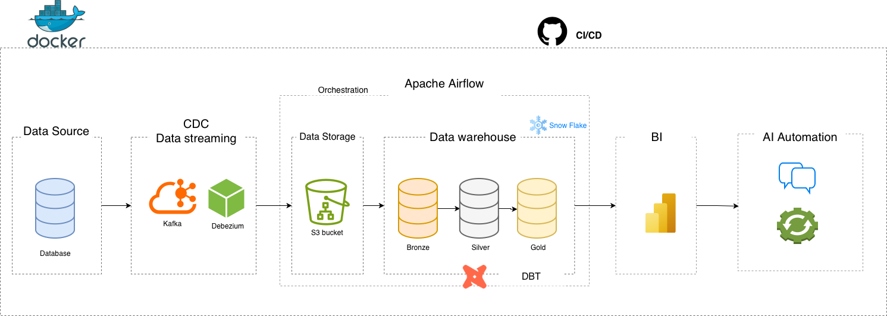
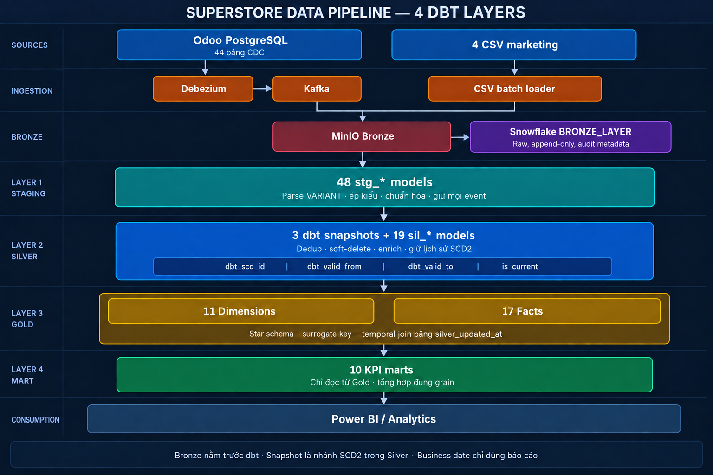
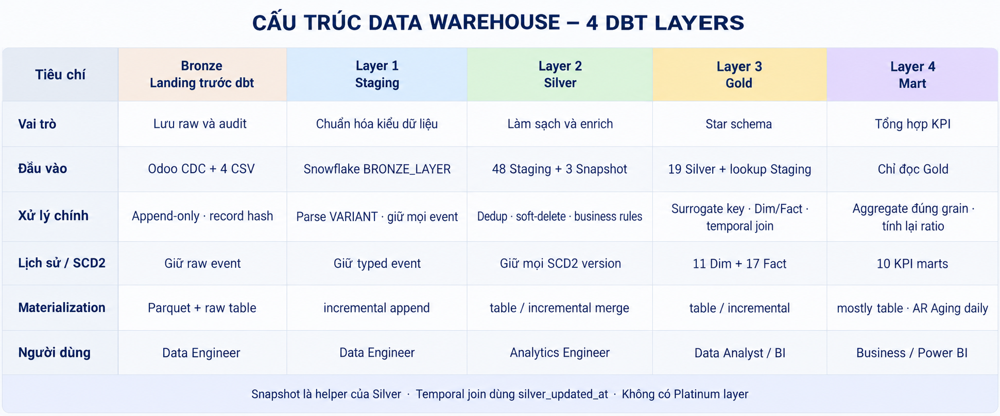



# Kiến trúc và lineage Data Platform

Tài liệu giải thích dữ liệu đi từ nguồn đến báo cáo như thế nào. SQL và YAML dbt là nguồn sự thật cho model, cột, test và dependency.

# Phần 1 — Dữ liệu đi qua pipeline như thế nào?

## 1. Bức tranh tổng thể



```text
Odoo PostgreSQL → Debezium → Kafka ─┐
                                    ├→ MinIO → Snowflake Bronze → dbt → Power BI
4 CSV marketing → CSV loader ──────┘
```

Airflow điều phối việc nạp dữ liệu, chạy từng lớp dbt và dừng pipeline khi test lỗi.

## 2. Nguồn dữ liệu và luồng xử lý

| Nguồn           | Cách nạp                               | Quy mô production |
| --------------- | -------------------------------------- | ----------------: |
| Odoo PostgreSQL | CDC từ WAL qua Debezium và Kafka       |           44 bảng |
| Marketing CSV   | Batch loader, không qua Debezium/Kafka |            4 file |

Bốn file CSV gồm `marketing_campaigns_master.csv`, `ad_performance_daily.csv`, `email_campaigns.csv` và `ab_test.csv`.

`marketing_funnel_monthly.csv` và `customer_acquisition_source.csv` là legacy, không thuộc production pipeline.



## 3. Nạp, kiểm soát và lưu trữ



| Công đoạn       | Dữ liệu được thêm hoặc xử lý                                     |
| --------------- | ---------------------------------------------------------------- |
| Debezium/Kafka  | Ghi loại sự kiện, timestamp CDC, LSN, topic, partition và offset |
| MinIO/Bronze    | Lưu raw event, thời điểm ingest, batch/file hash và record hash  |
| Staging         | Parse `VARIANT`, ép kiểu và giữ toàn bộ event CDC                |
| Snapshot/Silver | Chọn event mới nhất, xử lý delete, SCD2, join và enrich          |
| Gold            | Tạo surrogate key, Dimension/Fact và temporal join               |
| Mart            | Lọc dữ liệu còn hiệu lực, tổng hợp KPI và tính lại ratio         |

Nguyên tắc quan trọng: Staging CDC không deduplicate business key. Snapshot hoặc Silver mới chọn event mới nhất bằng `_cdc_ts_ms DESC, _cdc_lsn DESC`.

| Dữ liệu  | Schema Snowflake                             |
| -------- | -------------------------------------------- |
| Raw      | `SUPERSTORE_DB.BRONZE_LAYER`                 |
| Staging  | `SUPERSTORE_DB.ANALYTIC_LAYER_STAGING_LAYER` |
| Snapshot | `SUPERSTORE_DB.DBT_SNAPSHOTS`                |
| Silver   | `SUPERSTORE_DB.ANALYTIC_LAYER_SILVER_LAYER`  |
| Gold     | `SUPERSTORE_DB.ANALYTIC_LAYER_GOLD_LAYER`    |
| Mart     | `SUPERSTORE_DB.ANALYTIC_LAYER_MART_LAYER`    |

`ANALYTIC_LAYER` là tiền tố schema do dbt tạo, không phải một schema nghiệp vụ độc lập.

```
Go deeper -> docs/data_platform/superstore_pipeline_lineage.drawio
```

## 4. Lịch sử SCD2 được xử lý thế nào?

| Entity            | Snapshot                | Silver                  | Gold           | Version key          |
| ----------------- | ----------------------- | ----------------------- | -------------- | -------------------- |
| Customer/vendor   | `snap_res_partner`      | `sil_customer_enriched` | `dim_customer` | `dbt_scd_id`         |
| Product           | `snap_product_template` | `sil_product_enriched`  | `dim_product`  | `product_version_id` |
| Employee/contract | `snap_hr_contract`      | `sil_employee_enriched` | `dim_employee` | `dbt_scd_id`         |

Fact chọn phiên bản Dimension theo processing time:

```sql
source.business_id = dim.business_id
and source.silver_updated_at >= dim.dbt_valid_from
and source.silver_updated_at < coalesce(
    dim.dbt_valid_to,
    '9999-12-31'::timestamp
)
```

- `source_version_key` phát hiện source thực sự thay đổi.
- `dim_updated_at` kích hoạt re-key khi Dimension backfill/correction.
- `gold_refreshed_at` chỉ là thời điểm pipeline chạy.
- Mỗi business key chỉ có một current version và các khoảng hiệu lực không overlap.

# Phần 2 — Các bảng liên kết với nhau như thế nào?

## 1. Cách đọc sơ đồ

Đọc từ trái sang phải:

```text
Staging → Snapshot hoặc Silver → Gold Dimension/Fact → Mart
```

- Dòng có Snapshot là Dimension SCD2.
- Dòng đi thẳng Staging → Silver thường là nguồn Fact hiện hành.
- Lookup nhỏ có thể đi thẳng Staging → Gold.
- Mart chỉ đọc Gold; không đọc trực tiếp Staging hoặc Silver.

## 2. Lineage chi tiết theo bảng


Sơ đồ thể hiện grain, khóa nối và đường đi của từng bảng. Các core Dimension được đặt riêng bên phải vì nhiều Fact cùng sử dụng.

[Mở file Draw.io nguồn](superstore-pipeline-3layer.drawio)

## 3. Các đầu ra phân tích

| Domain            | Fact chính                                                                      | Mart chính                                              |
| ----------------- | ------------------------------------------------------------------------------- | ------------------------------------------------------- |
| Sales/CRM         | `fact_sales`, `fact_crm_funnel`, `fact_customer_acquisition`                    | `mart_revenue_monthly`, `mart_customer_acquisition`     |
| Purchase/Delivery | `fact_purchase`, `fact_inventory_movement`                                      | `mart_vendor_performance`, `mart_delivery_performance`  |
| Inventory         | `fact_inventory_balance`, `fact_inventory_valuation`                            | Phân tích trực tiếp từ Fact                             |
| Accounting        | `fact_journal_entries`, `fact_customer_invoice`, `fact_payment_allocation`      | `mart_pnl_monthly`, `mart_ar_aging`, `mart_dso_monthly` |
| Manufacturing     | `fact_manufacturing`, `fact_workorder`, `fact_manufacturing_oee`                | `mart_oee_by_workcenter_monthly`                        |
| Marketing         | `fact_ad_spend`, `fact_email_campaign`, `fact_ab_test`, `fact_marketing_funnel` | `mart_roas_by_channel`, `mart_email_performance`        |

Core Dimension dùng chung: `dim_date`, `dim_customer`, `dim_product`, `dim_employee`, `dim_warehouse`, `dim_workcenter`, `dim_campaign` và `dim_channel`.

Dimension theo domain: `dim_account`, `dim_journal` và `dim_location`.

## 4. Grain của Mart

| Mart                             | Grain                                    |
| -------------------------------- | ---------------------------------------- |
| `mart_revenue_monthly`           | month × region × category L1             |
| `mart_vendor_performance`        | purchase month × vendor version          |
| `mart_delivery_performance`      | completion month × warehouse × ship mode |
| `mart_customer_acquisition`      | acquisition month × channel              |
| `mart_pnl_monthly`               | accounting month × report line           |
| `mart_ar_aging`                  | snapshot date × customer version         |
| `mart_dso_monthly`               | payment month × customer version         |
| `mart_oee_by_workcenter_monthly` | month × workcenter                       |
| `mart_roas_by_channel`           | month × channel                          |
| `mart_email_performance`         | send month × channel                     |

## 5. Ba ngoại lệ cần nhớ

1. `fact_inventory_balance` đọc trực tiếp `stg_stock_quant` và tự chụp lịch sử theo ngày vì Odoo chỉ giữ số dư live.
2. `fact_customer_acquisition` và `fact_marketing_funnel` được tính từ Gold, không có Staging riêng.
3. Snapshot là nhánh hỗ trợ SCD2 trong Silver, không phải lớp BI độc lập.

## 6. Kiểm soát chất lượng

- Khóa grain/version phải `not_null` và `unique`.
- Một business key chỉ có một current SCD2 version.
- Khoảng SCD2 không overlap và `dbt_valid_to > dbt_valid_from`.
- Temporal join tối đa khớp một Dimension version và không làm tăng grain Fact.
- Fact/Mart có `relationships` test; các quy tắc tài chính, tồn kho và KPI có singular test.

```bash
python3 scripts/check_de_pipeline_contract.py
```

Hướng dẫn chạy và xử lý lỗi: [operation.md](operation.md).

**Cập nhật:** 2026-09-20


