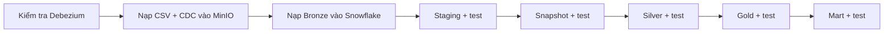

# Hướng dẫn vận hành Data Platform

Tài liệu này dành cho người khởi động, theo dõi và xử lý sự cố pipeline. DAG `batching_pipeline_snowflake` chạy hằng ngày lúc **09:00 — Asia/Ho_Chi_Minh**.

## 1. Luồng chạy hằng ngày



Airflow chạy tuần tự; một bước lỗi thì các bước sau không chạy. Vì vậy hãy sửa lỗi tại bước đầu tiên bị đỏ, sau đó retry từ bước đó.

## 2. Thiết lập lần đầu

### 2.1 Tạo file môi trường

```bash
cd /Users/macos/Desktop/Superstore_ecommerce/data_platform
cp .env.example .env
```

Điền credential thật vào `.env`. Không commit `.env`, mật khẩu hoặc token lên Git.

### 2.2 Bật PostgreSQL logical replication

Odoo PostgreSQL chạy trên máy host, không nằm trong Docker Compose của Data Platform.

Trong `postgresql.conf`:

```ini
wal_level = logical
max_wal_senders = 10
max_replication_slots = 10
```

Trong `pg_hba.conf`, chỉ cho phép đúng user/database và dải mạng Docker cần dùng; dùng `scram-sha-256`, không dùng `trust` trong production. Sau đó restart PostgreSQL và kiểm tra:

```bash
psql -U odoo -h localhost -d superstore_erp -tAc "SHOW wal_level;"
```

Kết quả phải là `logical`.

### 2.3 Khởi tạo Snowflake

Trên macOS, cài SnowSQL và thêm lệnh vào shell:

```bash
brew install --cask snowflake-snowsql
echo 'alias snowsql=/Applications/SnowSQL.app/Contents/MacOS/snowsql' >> ~/.zshrc
source ~/.zshrc
```

Sau đó chạy script khởi tạo một lần bằng quyền `ACCOUNTADMIN`:

```bash
snowsql \
  -a <ACCOUNT_IDENTIFIER> \
  -u <ADMIN_USER> \
  -r ACCOUNTADMIN \
  -f data_platform/setup/01_snowflake_init.sql
```

Script trên tạo database, warehouse, schema, hai role và quyền của từng
role. Nó không thể tự suy ra user thật từ `.env`, vì vậy cần gán role
cho user trực tiếp trong Snowflake bằng `ACCOUNTADMIN`.

Với tài khoản hiện tại là `PHU`, chạy một lần trong SnowSQL:

```sql
USE ROLE ACCOUNTADMIN;
GRANT ROLE SUPERSTORE_LOADER_ROLE TO USER PHU;
GRANT ROLE SUPERSTORE_DBT_ROLE TO USER PHU;
SHOW GRANTS TO USER PHU;
```

- `SUPERSTORE_LOADER_ROLE`: nạp dữ liệu vào `BRONZE_LAYER`.
- `SUPERSTORE_DBT_ROLE`: đọc Bronze và tạo các schema/model dbt.
- Nếu đổi user Snowflake, thay `PHU` trong hai lệnh `GRANT ROLE` bằng user mới.

Pipeline hằng ngày không dùng `ACCOUNTADMIN`.

### 2.4 Khởi động dịch vụ

```bash
cd /Users/macos/Desktop/Superstore_ecommerce/data_platform
docker compose up -d
docker compose ps
```

Các giao diện chính:

| Dịch vụ  | Địa chỉ                 |
| -------- | ----------------------- |
| Airflow  | `http://localhost:8080` |
| Kafka UI | `http://localhost:8081` |
| MinIO    | `http://localhost:9001` |
| n8n      | `http://localhost:5678` |

#### Vì sao dbt dùng virtual environment riêng?

Ba service `airflow-init`, `airflow-webserver` và `airflow-scheduler` vẫn là ba
container riêng. Trong mỗi image, dbt được cài tại `/home/airflow/dbt-venv` để
không làm thay đổi thư viện lõi của Airflow:

- Airflow 2.9.3 dùng `protobuf 4`, `pandas 2.1` và `botocore 1.34`.
- dbt-core 1.11 yêu cầu `protobuf >= 6` và Snowflake connector mới hơn.
- DAG gọi trực tiếp `/home/airflow/dbt-venv/bin/dbt`; các Python task vẫn dùng
  môi trường Airflow ổn định.

`requirements.txt` quản lý thư viện Airflow; `requirements-dbt.txt` chỉ quản lý
dbt. Không nhập hai nhóm dependency này lại với nhau.

### 2.5 Kiểm tra dbt

Kiểm tra đúng phiên bản dbt bên trong container:

```bash
cd /Users/macos/Desktop/Superstore_ecommerce/data_platform
docker compose exec -T airflow-scheduler /home/airflow/dbt-venv/bin/dbt --version
```

Nếu máy local đã cài dbt, có thể kiểm tra kết nối trực tiếp:

```bash
cd /Users/macos/Desktop/Superstore_ecommerce/data_platform/superstore_db
dbt deps --profiles-dir .dbt
dbt debug --profiles-dir .dbt
```

`dbt debug` phải kết thúc bằng `All checks passed`.

## 3. Chạy pipeline

### Cách khuyến nghị: Airflow

1. Mở `http://localhost:8080`.
2. Chọn DAG `batching_pipeline_snowflake`.
3. Chọn **Trigger DAG**.
4. Theo dõi **Grid View**; mở log của task đầu tiên bị lỗi.

DAG tự cấu hình Debezium, kiểm tra connector, ingest dữ liệu và chạy đủ bốn lớp dbt.

### Chạy dbt thủ công

Chỉ dùng khi debug hoặc chạy lại một lớp. Các lệnh phải dùng đúng dbt virtual
environment trong `airflow-scheduler`; không gọi `dbt` local trên máy Mac.

```bash
cd /Users/macos/Desktop/Superstore_ecommerce/data_platform

dbt_in_airflow() {
  docker compose exec -T \
    -w /opt/airflow/superstore_db \
    airflow-scheduler \
    /home/airflow/dbt-venv/bin/dbt "$@"
}

dbt_in_airflow deps --profiles-dir .dbt
dbt_in_airflow debug --profiles-dir .dbt

dbt_in_airflow run --select staging --profiles-dir .dbt
dbt_in_airflow test --select staging --indirect-selection cautious --profiles-dir .dbt

dbt_in_airflow snapshot --profiles-dir .dbt
dbt_in_airflow test --select resource_type:snapshot --indirect-selection cautious --profiles-dir .dbt

dbt_in_airflow run --select silver --profiles-dir .dbt
dbt_in_airflow test --select silver --indirect-selection cautious --profiles-dir .dbt

dbt_in_airflow run --select gold --profiles-dir .dbt
dbt_in_airflow test --select gold --indirect-selection cautious --profiles-dir .dbt

dbt_in_airflow run --select mart --profiles-dir .dbt
dbt_in_airflow test --select mart --indirect-selection cautious --profiles-dir .dbt

# Cross-layer/singular test chỉ chạy sau khi mọi layer đã build xong.
dbt_in_airflow test --select test_type:singular --profiles-dir .dbt

# Tùy chọn: kiểm tra lại toàn bộ 588 test sau cùng.
dbt_in_airflow test --profiles-dir .dbt
```

`--indirect-selection cautious` chỉ chạy test khi toàn bộ dependency của test đã
tồn tại trong layer đang kiểm tra. Nhờ vậy Staging test không gọi sớm các singular
test cần Silver/Gold/Mart.

> Không chạy `--full-refresh` cho `fact_inventory_balance`; bảng này giữ lịch sử snapshot tồn kho theo ngày.

## 4. Checklist sau mỗi lần chạy

| Điểm kiểm tra    | Kết quả mong đợi                                         |
| ---------------- | -------------------------------------------------------- |
| Airflow          | Toàn bộ task màu xanh                                    |
| Debezium         | Connector và task đều `RUNNING`                          |
| Kafka            | Consumer lag không tăng liên tục                         |
| MinIO            | Có Parquet mới đúng table/date partition                 |
| Snowflake Bronze | Có batch mới, không lặp record giống hệt                 |
| dbt tests        | Không có test fail/error                                 |
| Mart             | Dữ liệu có kỳ mới nhất và KPI không biến động bất thường |

MinIO lưu theo dạng:

```text
<table_name>/date=YYYY-MM-DD/<table_name>_<timestamp>_<uuid>.parquet
```

Kafka topic Odoo có dạng `superstore_server.public.<table_name>`. Bốn CSV marketing được nạp batch nên không có Kafka topic.

## 5. Schema Snowflake

Với cấu hình mặc định `DBT_SCHEMA=ANALYTIC_LAYER`, các schema vật lý là:

| Dữ liệu  | Schema                                       |
| -------- | -------------------------------------------- |
| Bronze   | `SUPERSTORE_DB.BRONZE_LAYER`                 |
| Snapshot | `SUPERSTORE_DB.DBT_SNAPSHOTS`                |
| Staging  | `SUPERSTORE_DB.ANALYTIC_LAYER_STAGING_LAYER` |
| Silver   | `SUPERSTORE_DB.ANALYTIC_LAYER_SILVER_LAYER`  |
| Gold     | `SUPERSTORE_DB.ANALYTIC_LAYER_GOLD_LAYER`    |
| Mart     | `SUPERSTORE_DB.ANALYTIC_LAYER_MART_LAYER`    |

Nếu đổi `DBT_SCHEMA`, bốn schema dbt sẽ đổi prefix tương ứng.

Kiểm tra nhanh:

```sql
-- Một business key không được có nhiều current customer version.
select partner_id, count(*) as current_count
from SUPERSTORE_DB.ANALYTIC_LAYER_GOLD_LAYER.DIM_CUSTOMER
where dbt_valid_to is null
group by partner_id
having count(*) > 1;

-- Fact sales không được trùng grain sale order line.
select sale_order_line_id, count(*) as row_count
from SUPERSTORE_DB.ANALYTIC_LAYER_GOLD_LAYER.FACT_SALES
group by sale_order_line_id
having count(*) > 1;

-- Xem các kỳ Mart mới nhất.
select max(month_date_key) as latest_month
from SUPERSTORE_DB.ANALYTIC_LAYER_MART_LAYER.MART_REVENUE_MONTHLY;
```

Các câu kiểm tra trên phải không trả dòng lỗi; `latest_month` phải phù hợp với dữ liệu nguồn hiện có.

## 6. Xử lý lỗi thường gặp

| Hiện tượng              | Kiểm tra trước                                       | Cách xử lý                                              |
| ----------------------- | ---------------------------------------------------- | ------------------------------------------------------- |
| Debezium không chạy     | PostgreSQL `wal_level`, credential, replication slot | Sửa cấu hình nguồn rồi retry task cấu hình/health       |
| Kafka lag tăng          | Log consumer, tài nguyên container                   | Sửa consumer hoặc tài nguyên rồi retry ingest           |
| MinIO không có file mới | Log CSV loader/consumer, endpoint và credential      | Sửa kết nối; không chạy dbt khi Bronze chưa đủ          |
| Snowflake load lỗi      | Role, warehouse, stage, file format                  | Sửa quyền/kết nối rồi retry task load                   |
| dbt compile lỗi         | Tên `ref()`, model hoặc macro                        | Sửa code và chạy `dbt compile` trước                    |
| dbt test fail           | Dòng lỗi trong output test                           | Sửa nguồn hoặc logic; không bỏ test để ép pipeline xanh |
| Mart thiếu dữ liệu      | Gold có kỳ mới chưa, upstream test có pass không     | Chạy lại đúng thứ tự từ lớp lỗi                         |
| Container không start   | Port bị chiếm, thiếu RAM, log service                | Giải phóng port/tài nguyên rồi restart đúng service     |

Xem log một service:

```bash
docker compose logs --tail=200 <service_name>
```

Restart riêng service:

```bash
docker compose restart <service_name>
```

## 7. Recovery an toàn

- Ưu tiên retry task lỗi hoặc rebuild đúng model bị ảnh hưởng.
- Chạy model cùng downstream khi cần:

```bash
dbt run --select <model_name>+ --profiles-dir .dbt
dbt test --select <model_name>+ --profiles-dir .dbt
```

- Không tự `DROP TABLE`, xóa replication slot hoặc xóa Docker volume khi chưa xác định phạm vi ảnh hưởng.
- `docker compose down -v` xóa dữ liệu trong Docker volumes và chỉ dùng khi chủ động reset toàn bộ môi trường.
- Nếu credential Snowflake bị khóa/sai, dừng retry, cập nhật credential rồi chạy lại `dbt debug`.

## 8. Kiểm tra tài liệu và pipeline

Tại thư mục gốc dự án:

```bash
python3 scripts/check_de_pipeline_contract.py
```

Lệnh này kiểm tra hợp đồng pipeline, model count, tài liệu Data Platform và hai sơ đồ Draw.io. Khi có kết nối Snowflake, vẫn phải chạy các dbt tests thật.

Để xem lineage theo model và cột:

```bash
cd /Users/macos/Desktop/Superstore_ecommerce/data_platform/superstore_db

# profiles.yml đọc credential từ environment; .env không tự được shell nạp.
set -a
source ../.env
set +a

dbt docs generate --profiles-dir .dbt
dbt docs serve --profiles-dir .dbt --port 8082
```

Ba lệnh `set -a`, `source ../.env`, `set +a` phải chạy trong cùng terminal với
dbt. Chúng export biến cho process hiện tại nhưng không ghi credential vào Git.

**Cập nhật:** 2026-09-20
