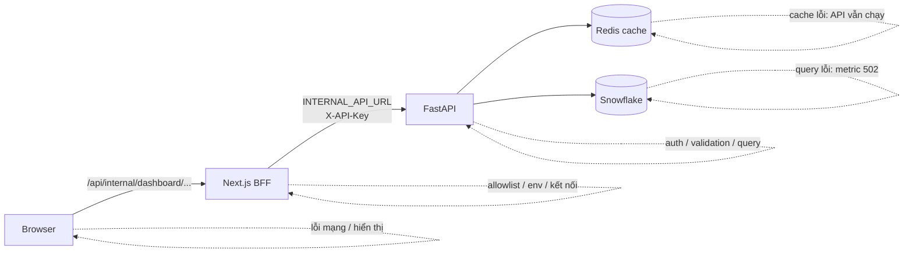
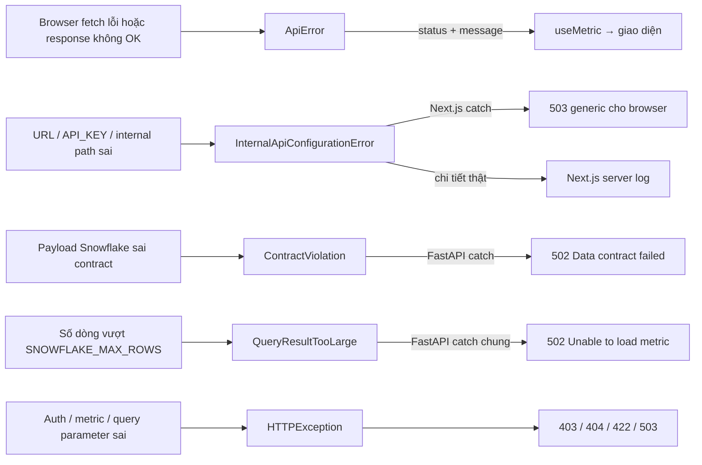
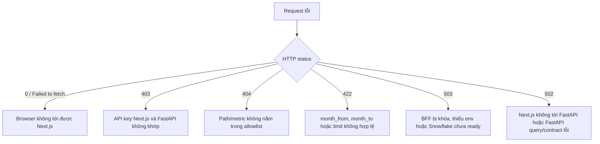
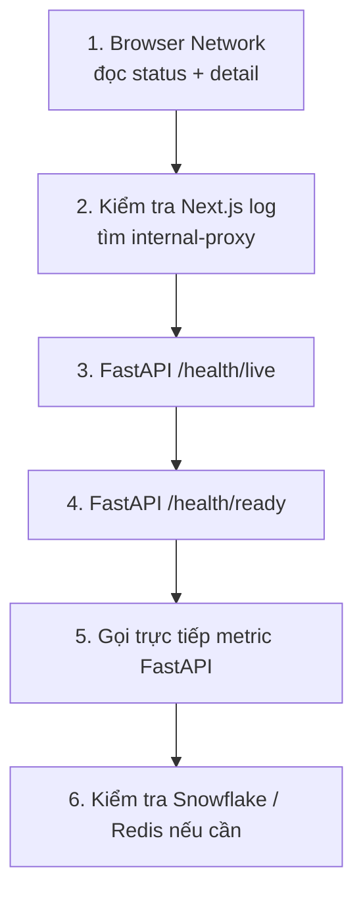

# Truy vết lỗi Client → Next.js BFF → FastAPI -> Redis/Snowflake

## 1. Luồng request



Next.js chỉ proxy `/dashboard` và 5 metric được allowlist. BFF giữ `API_KEY` ở server,
gọi FastAPI rồi trả nguyên HTTP status và response body về browser.

## 2. Error class và cách lỗi được truyền



`InternalApiConfigurationError`, `ContractViolation` và lỗi Snowflake không trả stack trace
cho browser. Muốn thấy nguyên nhân gốc phải xem log đúng tầng.

## 3. Xác định lỗi theo response



| Dấu hiệu                               | Error class/nhóm lỗi             | Kiểm tra đầu tiên                                         | Vị trí lỗi thường gặp                    |
| -------------------------------------- | -------------------------------- | --------------------------------------------------------- | ---------------------------------------- |
| Status `0`, `Failed to fetch`          | `ApiError`                       | Browser Network và Next.js có chạy không                  | Client → Next.js                         |
| `404 Internal API path is not allowed` | Next.js allowlist                | URL metric và `ALLOWED_METRICS`                           | Next.js route proxy                      |
| `403 Invalid or missing API key`       | `HTTPException`                  | `API_KEY` của Next.js và FastAPI phải giống nhau          | Next.js → FastAPI auth                   |
| `422`                                  | `HTTPException`                  | `month_from <= month_to`, dạng `YYYYMM01`, `limit=1..100` | FastAPI validation                       |
| `503 dashboard is locked`              | Next.js access guard             | `ALLOW_UNAUTHENTICATED_INTERNAL_UI=true` khi chạy preview | Next.js BFF                              |
| `503 proxy is not configured`          | `InternalApiConfigurationError`  | `INTERNAL_API_URL`, `API_KEY`                             | Next.js server env                       |
| `503 /health/ready`                    | Snowflake exception              | Chi tiết `services.snowflake`                             | FastAPI → Snowflake                      |
| `502 Cannot connect to backend`        | Fetch/timeout exception          | FastAPI có chạy, URL/port/DNS đúng, timeout 15 giây       | Next.js → FastAPI                        |
| `502 Unable to load metric`            | `QueryResultTooLarge` hoặc query | Snowflake role/schema/table/query, `SNOWFLAKE_MAX_ROWS`   | FastAPI analytics                        |
| `502 Data contract failed`             | `ContractViolation`              | Tên và kiểu cột query trả về                              | FastAPI contract                         |
| Redis unavailable                      | Redis exception                  | `/health/ready.services.redis`                            | Không chặn API; request chạy không cache |

## 4. Thứ tự kiểm tra



```bash
# FastAPI process
curl -i http://localhost:8000/health/live
curl -i http://localhost:8000/health/ready

# Log khi chạy bằng Docker Compose
cd data_platform
docker compose logs --tail=100 frontend api redis

# Gọi FastAPI trực tiếp, bỏ qua Next.js BFF
curl -i \
  -H "X-API-Key: $API_KEY" \
  "http://localhost:8000/api/dashboard/kpi?month_from=20230101&month_to=20231201"
```

## 5. Cách khoanh vùng nhanh

- Gọi FastAPI trực tiếp **thành công**, nhưng qua `/api/internal/...` lỗi: kiểm tra Next.js BFF.
- `/health/live` lỗi: FastAPI chưa chạy hoặc sai port.
- `/health/live` đạt nhưng `/health/ready` lỗi: kiểm tra Snowflake.
- Readiness đạt nhưng metric lỗi `502`: kiểm tra query, schema và data contract.
- Response đúng nhưng giao diện lỗi: kiểm tra browser console và component render.

Không ghi `API_KEY`, Snowflake password hoặc toàn bộ `.env` vào log/ticket.
