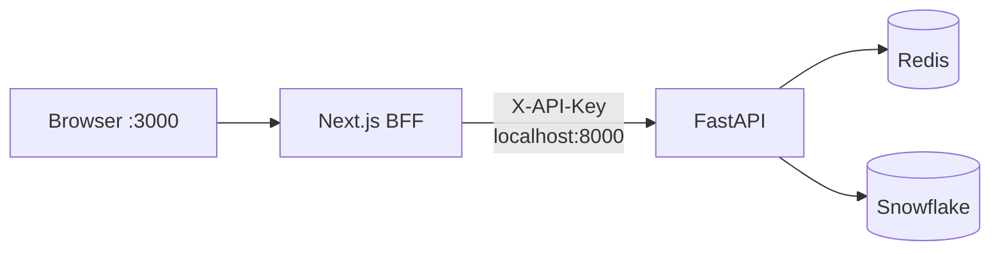

# Frontend Operations

## 1. Chạy local

Điều kiện:

- Đã cài dependencies bằng `npm ci`.
- `RAG_CHATBOT/.env` có cấu hình FastAPI và Snowflake hợp lệ.
- `frontend/.env.local` có `API_KEY` giống FastAPI và bật local preview:

```dotenv
INTERNAL_API_URL=http://localhost:8000
API_KEY=<GIỐNG_API_KEY_CỦA_FASTAPI>
ALLOW_UNAUTHENTICATED_INTERNAL_UI=true
```

Chạy ba terminal song song:

### Terminal 1 — Redis

```bash
cd data_platform
docker compose up -d redis
```

### Terminal 2 — FastAPI

```bash
cd RAG_CHATBOT
source .venv/bin/activate

python -m uvicorn api.app:app \
  --host 0.0.0.0 \
  --port 8000 \
  --reload
```

### Terminal 3 — Next.js

```bash
cd RAG_CHATBOT/frontend
npm run dev
```

Mở dashboard:

```text
http://localhost:3000/dashboard
```

Luồng local:



## 2. Security verification

### Browser không gọi FastAPI trực tiếp

Trong DevTools → Network, request phải có dạng:

```text
/api/internal/dashboard/kpi
/api/internal/dashboard/revenue-trend
/api/internal/dashboard/by-category
/api/internal/dashboard/by-region
/api/internal/dashboard/top-products
```

Không được xuất hiện:

```text
http://localhost:8000/api/dashboard/...
```

### Path ngoài allowlist bị chặn

```bash
curl -i http://localhost:3000/api/internal/health
```

Kỳ vọng: `404 Not Found`.

### Method chưa mở bị chặn

```bash
curl -i \
  -X POST \
  http://localhost:3000/api/internal/dashboard
```

Kỳ vọng: `405 Method Not Allowed`.

### API key không lọt vào browser bundle

Load secret mà không in ra terminal:

```bash
cd RAG_CHATBOT/frontend
set -a
. ./.env.local
set +a
```

Build và quét bundle:

```bash
npm run build

if rg -F "$API_KEY" .next/static; then
  echo "ERROR: API_KEY leaked into browser bundle"
  exit 1
else
  echo "OK: API_KEY is not in browser bundle"
fi
```

Kiểm tra không sử dụng biến public cho internal API:

```bash
rg -n \
  "NEXT_PUBLIC_API_KEY|NEXT_PUBLIC_API_URL" \
  . \
  --glob '!node_modules/**' \
  --glob '!.next/**'
```

Kết quả phải rỗng.

## 3. Smoke test

Sau khi ba service ở Mục 1 đã chạy:

```bash
curl --fail \
  http://localhost:3000/dashboard

curl --fail \
  http://localhost:3000/api/internal/dashboard

curl --fail \
  "http://localhost:3000/api/internal/dashboard/kpi?month_from=20230101&month_to=20231201"
```

Kỳ vọng: cả ba request trả `200` và metric trả JSON đúng contract.

Nếu kiểm tra bản chạy bằng container:

```bash
cd RAG_CHATBOT/frontend

# Compose đọc frontend/.env; file này bị Git ignore.
cp .env.local .env

cd ../../data_platform
docker compose --profile app up -d \
  redis api frontend

docker compose ps

curl --fail http://localhost:3000/dashboard
curl --fail http://localhost:3000/api/internal/dashboard
```

## 4. Quality gate

```bash
cd RAG_CHATBOT/frontend

npm audit --audit-level=high
npm run lint
npm run typecheck
npm run build

docker build -t superstore-frontend:step6 .

cd ../../data_platform
docker compose config --quiet
```

Hoàn thành khi:

- Audit, lint, type-check, build và Docker build đều pass.
- Smoke test local hoặc container trả `200`.
- Path ngoài allowlist trả `404`; method chưa mở trả `405`.
- Browser không gọi FastAPI trực tiếp và không chứa `API_KEY` trong bundle.

Khi có lỗi, xem [error_tracing.md](error_tracing.md).
