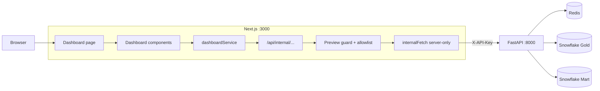
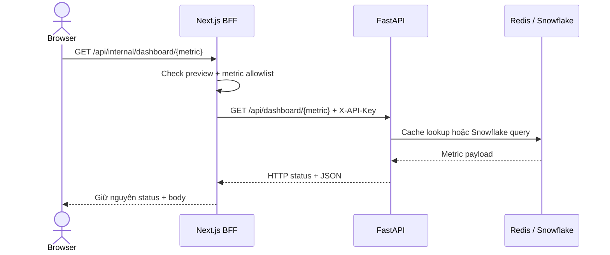
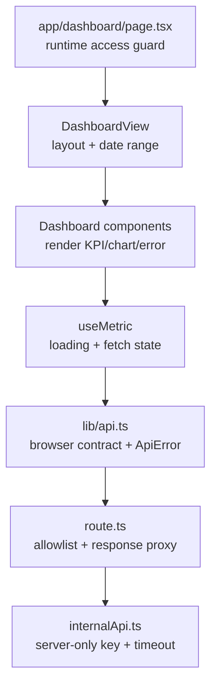

# Frontend System Architecture & Lineage

Frontend là Next.js BFF cho dashboard nội bộ. Browser không giữ `API_KEY` và không kết nối
trực tiếp FastAPI hoặc Snowflake.

## 1. Kiến trúc

## 2. Luồng dữ liệu dashboard

| Giao diện | Metric API | Giá trị business |
|---|---|---|
| KPI cards | `kpi` | Revenue, profit, orders, AOV, margin |
| Revenue trend | `revenue-trend` | Xu hướng doanh thu theo tháng |
| Category breakdown | `by-category` | Hiệu quả theo nhóm hàng |
| Region breakdown | `by-region` | Hiệu quả theo khu vực |
| Top products | `top-products` | Sản phẩm đóng góp doanh thu cao nhất |

## 3. Trách nhiệm module

## 4. Security boundary

- `API_KEY` chỉ được đọc trong Next.js server và gắn vào upstream request.
- Route BFF chỉ cho `/dashboard` và 5 metric đã khai báo.
- Browser chỉ nhận dữ liệu phân tích, không nhận Snowflake credential hoặc API key.
- `ALLOW_UNAUTHENTICATED_INTERNAL_UI=false` là mặc định; `true` chỉ dùng local preview.
- Request không cache tại Next.js; cache dữ liệu được FastAPI quản lý bằng Redis.

Luồng truy vết lỗi chi tiết: [error_tracing.md](error_tracing.md).
